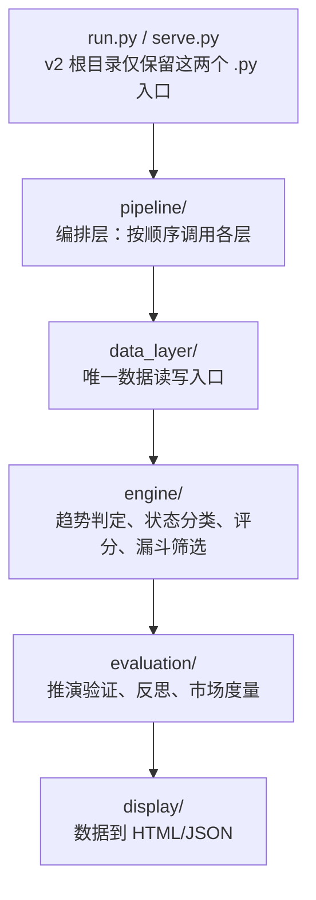

# TFS v2 重构手册

> 本手册是 v2 重构的**总设计文档**。架构决策、目录结构、实施顺序、模块边界全部在此定义。
> 各模块的详细设计放在 `v2/doc/`，总设计负责索引和约束；模块文档负责展开细节。任何代码实现都必须同时遵循本手册和对应模块文档，偏离需先修订文档。
>
> 当前模块文档：
> - [数据管理设计](doc/data_management_design.md) — `data_layer/`、`v2/data/`、行情数据、映射关系、数据源策略、health 准出。
> - [Engine 策略层设计](doc/engine_design.md) — `engine/`、策略信号、状态机、指标、评分、漏斗筛选、旧逻辑复用。
> - [推演评估与自进化层设计](doc/evaluation_evolution_design.md) — `evaluation/`、推演生成、历史验证、回归对比、自进化建议。
> - [Pipeline 编排层设计](doc/pipeline_design.md) — `pipeline/`、每日流程、stage 准出、run manifest、产物编排。
> - [Display 展示层设计](doc/display_design.md) — `display/`、display payload、模板渲染、侧边栏导航、视觉规范、旧兼容输出。

---

## 一、为什么重构

### 1.1 旧系统的根本问题

旧系统不是"代码写得烂"，而是**架构无主**——没有一条贯穿始终的数据主线。具体表现：

**三套数据加载逻辑并存，谁也不权威：**
- `src/data/`（882行）— pipeline 和 tests 在用
- `src/data_mgr/`（2182行，deepseek 加的）— 只有 init_db_safe.py 调用，从不进主流程
- `enhanced_actions.py` 内联的 `os.listdir + pd.read_parquet` — 实际生成看板用的，**把前两套全绕过了**

**enhanced_actions.py 是个"万能文件"，它把三层的事都干了：**
- `pd.read_parquet` + `os.listdir` → 数据层的活
- `StateMachine` 调用 + 指标计算 + 评分 → 趋势判定层的活
- 卡片字段拼接 + JSON 输出 → 展示层的数据准备

一个 2150 行的文件横跨三层，每层大约 700 行。它不是"趋势判定模块"，它是一个**独立的小型系统**，寄生在大系统里，用自己内联的方式绕过了所有其他模块。

**文档与代码脱节，验证形同虚设：**
- 手册说行情缓存在 `data/etf_stocks/`、`data/massive_stocks/`，这俩目录根本不存在（0个pkl）
- 真实数据全堆在 `dashboard/data/` 下 7900 个散装 parquet
- 6.22 和 6.23 的 enhanced_actions 除日期字段外完全相同——系统用过期数据复制改成新日期，"数据真实性最高准则"挂在那里，没有任何机制拦住它

### 1.2 重构策略

**不修旧房子，在旁边盖新房子，盖好了再搬。** 旧系统继续可用，零风险。新系统按理想架构从零搭，不受历史包袱约束。

旧系统里其实有大量可以直接用的好代码，只是被埋在混乱的结构里。v2 的做法是：**从旧系统 copy 可用代码进 v2，同步优化和归位**。

---

## 二、架构分层

### 2.1 总览



> 目录边界：`engine/` 第一阶段使用 flat 文件结构，不再拆 `core/`、`strategies/stock/`、`strategies/etf/`；`evaluation/` 第一阶段也使用 flat 文件结构，不再拆 `projection/`、`market/` 子目录。

### 2.2 各层职责边界

| 层 | 职责 | 禁止 |
|----|------|------|
| **数据层** data_layer | 数据获取、存储、缓存、映射、完整性校验 | 做趋势判定、组装卡片、直接被上层绕过 |
| **趋势判定层** engine | 趋势判定、状态分类、评分排序、筛选 | 获取数据（从 DataLayer 拿）、格式化展示 |
| **评估层** evaluation | 推演生成、历史推演验证、回归对比、自进化建议、市场度量 | 做趋势判定本身、做展示、第一阶段做交易收益回测 |
| **展示层** display | 卡片/面板/页面生成 | 计算趋势指标、获取数据 |
| **编排层** pipeline | 按顺序调用四层 | 实现任何业务逻辑 |

### 2.3 依赖方向（严格单向）

```
display    → engine, evaluation, data_layer
evaluation → engine, data_layer
engine     → data_layer
data_layer → (无下游，是最底层)
```

**铁律：禁止逆向依赖。** 数据层不能 import engine，engine 不能 import display。违反此规则的代码是 bug。

---

## 三、目录结构

### 3.1 完整目录树

```
v2/
│
├── run.py                           ← 入口①：每日一键运行
├── serve.py                         ← 入口②：no-cache HTTP 服务
├── REFACTOR_MANUAL.md               ← 本手册（重构唯一权威）
│
├── data_layer/                      ← 数据层
│   ├── __init__.py                  ← DataLayer 门面类
│   ├── storage.py                   ← LocalDB parquet 存取
│   ├── fetcher.py                   ← DataFetcher 编排 fetch/+providers/
│   ├── relations.py                 ← ConstituentMapping 成分股双向映射
│   ├── lifecycle.py                 ← 完整性校验 + 数据生命周期
│   ├── config.py                    ← 集中配置（DATA_DIR=v2/data）
│   ├── fetch/                       ← 控制平面（防封核心，§8.6）
│   │   ├── __init__.py
│   │   ├── rate_limiter.py          ← 唯一 sleep 点（按上游分桶令牌桶）
│   │   ├── journal.py               ← 持久化进度账本（断点续传）
│   │   ├── circuit_breaker.py       ← 滑动窗口断路器（跳闸即停）
│   │   ├── executor.py              ← 限速门内并发（3 worker）
│   │   ├── registry.py              ← provider 链 + fallback 路由
│   │   └── config.py                ← 桶容量/断路阈值/并发数
│   └── providers/                   ← 数据平面（纯调用，无 sleep）
│       ├── __init__.py
│       ├── base.py                  ← Provider 接口契约（删防封代码）
│       ├── akshare_ths.py           ← 板块/题材日K（同花顺桶，稳定）
│       ├── akshare_em.py            ← 成分股/名称（东财桶，脆弱）
│       └── tickflow.py              ← 个股/ETF批量日K（tickflow桶）
│
├── engine/                          ← 趋势判定层
│   ├── __init__.py                  ← Engine 门面
│   ├── signal.py                    ← StrategySignal / EngineContext 数据结构
│   ├── params.py                    ← StrategyParams，阈值/权重/开关
│   ├── indicators.py                ← 技术指标和指标聚合
│   ├── classifier.py                ← 状态机 classify/transition 封装
│   ├── filters.py                   ← 趋势质量过滤
│   ├── analyzers.py                 ← pullback / second_wave / stage / risk flags
│   ├── levels.py                    ← key levels / support / resistance
│   ├── scoring.py                   ← score / confidence / scenario_estimate / position_hint
│   └── funnel.py                    ← sector/theme/stock 漏斗编排
│
├── evaluation/                      ← 评估层
│   ├── __init__.py                  ← Evaluation 门面
│   ├── projection.py                ← ProjectionEngine，生成推演场景
│   ├── validation.py                ← ProjectionValidation，历史推演验证
│   ├── regression.py                ← RegressionComparator，新旧输出回归对比
│   ├── reflection.py                ← ReflectionEngine，正误反思和错误分类
│   ├── evolution.py                 ← EvolutionAdvisor / RuleDiscovery，自进化建议
│   ├── weights.py                   ← ProjectionWeights，实验权重管理
│   ├── market.py                    ← 市场宽度 / beta 等评估环境因子
│   ├── comparison.py                ← 跨日趋势变化对比
│   ├── metrics.py                   ← AccuracyStats / ErrorPattern 等统计结构
│   └── runner.py                    ← 本层独立运行入口，可被 pipeline 调用
│
├── pipeline/                        ← 编排层
│   ├── __init__.py                  ← Pipeline 门面
│   ├── runner.py                    ← PipelineRunner 主流程
│   ├── stages.py                    ← StageResult / StageStatus / Stage 定义
│   ├── manifest.py                  ← run_manifest 读写
│   ├── modes.py                     ← daily / backfill / eval / display_only 模式
│   ├── payload.py                   ← display_payload 生成编排
│   └── cli.py                       ← 命令行入口逻辑，供 run.py 调用
│
├── display/                         ← 展示层
│   ├── __init__.py                  ← Display 门面
│   ├── adapter.py                   ← display_payload -> 旧 dashboard/data 兼容 JSON
│   ├── renderer.py                  ← 单一渲染入口，生成每日页和 index 壳
│   ├── nav.py                       ← 日期导航数据生成/校验
│   ├── schema.py                    ← DisplayPayload schema 校验
│   ├── compatibility.py             ← 旧 build_final/build_nav_index 兼容层
│   ├── templates/                   ← 展示模板
│   │   ├── index.html               ← 侧边栏 iframe 壳模板
│   │   ├── daily.html               ← 每日报告主模板
│   │   └── partials/                ← 区块模板
│   │       ├── overview.html
│   │       ├── action_panel.html
│   │       ├── funnel.html
│   │       ├── signal_cards.html
│   │       ├── evaluation.html
│   │       └── tables.html
│   └── assets/                      ← 展示层静态资源
│       ├── display.css
│       └── display.js
│
├── data/                            ← v2 独立数据目录
│   ├── stock/                       ← 个股日线 parquet
│   ├── etf/                         ← ETF 日线 parquet
│   ├── sector/                      ← 板块日线 parquet
│   ├── theme/                       ← 题材日线 parquet
│   └── meta/                        ← 映射 JSON
│       ├── stock_names.json
│       ├── etf_names.json
│       ├── stock_sectors.json
│       ├── constituent_map.json
│       ├── sector_list.json
│       └── theme_list.json
│
└── tests/
    ├── test_data_layer.py
    ├── test_engine.py
    ├── test_evaluation.py
    └── test_display.py
```

### 3.2 入口文件规则

**v2 根目录只允许两个 .py 入口文件**：`run.py` 和 `serve.py`。其余所有 `.py` 必须落在明确层级目录中，例如 `data_layer/`、`engine/`、`evaluation/`、`pipeline/`、`display/` 或 `tests/`。

`pipeline` 是编排层，必须归属到 `v2/pipeline/` 目录；根目录不再放 `pipeline.py`。入口文件只能调用各层门面或 `pipeline/cli.py`，不能承载业务逻辑。

例外：`REFACTOR_MANUAL.md`（本手册）在根目录。

---

## 四、个股 vs ETF 的策略差异

这是 v2 架构的核心设计点。旧系统把差异散落在 enhanced_actions 各处的 `if is_etf` 分支里，v2 将其封装到各自策略模块中。

### 4.1 差异清单

| 差异点 | 个股 | ETF |
|--------|------|-----|
| **漏斗路径** | 板块→题材→成分股→个股 | 直筛（A/B类直接跑状态机，C类宽基跳过） |
| **强势追踪阈值** | pct_20d ≥ 30%, score ≥ 110 | pct_20d ≥ 10%, score ≥ 90 |
| **仓位上限** | 10% | 20% |
| **量能规则** | 量能是趋势否决条件（量能❌则不判趋势） | 量能弱→评分惩罚，不否决趋势 |

### 4.2 为什么 ETF 量能规则不同

ETF 量能反映板块资金流向，与个股不同。价格行为（结构）和多空分布（持续性）已证明趋势真实性。量能弱 → 评分惩罚，但不否决趋势。

这条规则在旧系统 `_determine_state` 的规则1中（结构✅+持续✅但量能❌→仍判 state=4），v2 将其封装到 ETF 策略的状态机调用中。

### 4.3 策略组织

```text
engine/funnel.py
├── scan_stock_funnel()   个股漏斗式：板块→题材→个股
├── scan_stock_fullscan() 个股全量式
├── scan_etf_direct()     ETF 直筛式，不走板块→题材
└── scan_etf_fullscan()   ETF 全量式
```

第一阶段不再为 stock/etf 单独拆多级 strategies 目录，避免目录过细导致实现分散；标的差异封装在 `engine/funnel.py` 和 `StrategyParams` 中。

---

## 五、层间接口（门面类）

每层只暴露一个门面类，层间只通过门面通信。门面类的接口定义在各层 `__init__.py` 中。

### 5.1 数据层 DataLayer

```python
class DataLayer:
    def __init__(self, data_dir: str = None)

    # 行情数据
    def load_daily(self, dtype: str, code: str) -> pd.DataFrame | None
    def list_symbols(self, dtype: str) -> list[str]
    def get_date_range(self, dtype: str, code: str) -> tuple

    # 名称/板块映射
    def get_name(self, code: str) -> str              # 代码→中文名
    def get_sector(self, code: str) -> str            # 个股代码→板块名
    def get_constituents(self, code: str) -> list     # 板块/题材→成分股

    # 完整性与更新（A/B 两轨）
    def check_completeness(self) -> dict
    def preflight_check(self) -> dict                # §8.4 机制B：三桶预检探针
    def update_daily(self, date: str = None) -> dict  # A轨：个股+ETF日K（tickflow，有fallback）
    def update_sector_theme_daily(self, date: str = None) -> dict  # A轨：板块+题材日K（ths）
    def update_constituents(self) -> dict           # B轨：成分股映射（em，有断路器，每周五）
    def update_names(self) -> bool                  # B轨：名称映射（每月1号）
```

### 5.2 趋势判定层 TrendEngine

```python
class TrendEngine:
    def __init__(self, data: DataLayer)

    # 单只标的分析
    def analyze(self, daily_df, date_str, symbol_type="stock",
                prev_state=None) -> AnalysisResult | None

    # 个股策略
    def scan_stock_funnel(self, date_str) -> FunnelResult
    def scan_stock_fullscan(self, date_str, top_n=10) -> list[AnalysisResult]

    # ETF 策略
    def scan_etf_direct(self, date_str, top_n=10) -> list[AnalysisResult]
    def scan_etf_fullscan(self, date_str, top_n=10) -> list[AnalysisResult]
```

### 5.3 评估层 Evaluation

```python
class Evaluation:
    def __init__(self, data: DataLayer, engine: TrendEngine)

    def backtest_projection(self, date_str) -> AccuracyStats
    def run_reflection(self) -> list[Rule]
    def calc_market_breadth(self, date_str) -> dict
    def calc_sector_beta(self, sector_code, benchmark="000001") -> float
```

### 5.4 展示层 Display

```python
class Display:
    def validate_payload(self, payload: dict) -> dict
    def build_view_model(self, payload: dict) -> DisplayViewModel
    def render_daily(self, payload_path: str, output_path: str) -> str
    def render_index(self, dates_dir: str, output_path: str) -> str
    def export_legacy_json(self, payload_path: str, dashboard_data_dir: str) -> dict
```

---

## 六、pipeline/ 编排层

每日主流程归属 `v2/pipeline/`，纯编排，不实现任何业务逻辑。`run.py` 只作为入口调用 `pipeline/cli.py` 或 `PipelineRunner`：

```python
def daily_run(date_str):
    data = DataLayer()
    engine = TrendEngine(data)
    evaluation = Evaluation(data, engine)
    display = Display()

    # 1. 数据层：校验 + A/B两轨更新
    data.check_completeness()
    data.preflight_check()                        # 预检探针，~3秒
    data.update_daily(date_str)                   # A轨：个股+ETF
    data.update_sector_theme_daily(date_str)      # A轨：板块+题材
    if date_is_friday(date_str):                  # B轨：成分股（每周五）
        data.update_constituents()
    if is_month_first(date_str):                  # B轨：名称（每月1号）
        data.update_names()

    # 2. 趋势判定层：个股 + ETF 各跑策略
    stock_funnel = engine.scan_stock_funnel(date_str)
    stock_full = engine.scan_stock_fullscan(date_str)
    etf_direct = engine.scan_etf_direct(date_str)
    etf_full = engine.scan_etf_fullscan(date_str)

    # 3. 评估层
    breadth = evaluation.calc_market_breadth(date_str)
    projection = evaluation.backtest_projection(date_str)

    # 4. 编排层生成 display_payload，展示层只消费 payload
    payload_path = build_display_payload(
        date_str,
        signals={
            "stock_funnel": stock_funnel,
            "stock_full": stock_full,
            "etf_direct": etf_direct,
            "etf_full": etf_full,
        },
        evaluation_summary={
            "breadth": breadth,
            "projection": projection,
        },
    )
    run_output_dir = Path("v2/data/derived/display_runs") / run_id
    display.render_daily(payload_path, str(run_output_dir / f"trend_dashboard_{date_str}.html"))
    display.render_index(nav_payload_path, str(run_output_dir / "index.html"))
```

---

## 七、从旧系统搬代码清单

### 7.1 数据层（搬 + 拆 + 剥离防封 + 新写控制平面）

**直接搬，几乎不改的：**

| v2 文件 | 旧来源 | 搬法 |
|---------|--------|------|
| storage.py | `src/data_mgr/storage.py` | 直接搬 |
| relations.py | `src/data_mgr/relations.py` | 直接搬 |
| lifecycle.py | `src/data_mgr/lifecycle.py` | 直接搬，COMPLETENESS 配置对齐 |
| config.py | `src/data_mgr/config.py` | 已创建，DATA_DIR 改 v2/data，删 ANTI_BAN |
| providers/base.py | `src/data_mgr/providers/base.py` | **瘦身**：删 `_rate_limit`/`_batch_cooldown`/`_request_with_retry`/`_req_count`，只留抽象接口 |

**Provider 拆分（一拆为三）：**

| v2 文件 | 旧来源 | 搬法 |
|---------|--------|------|
| providers/akshare_ths.py | `src/data_mgr/providers/akshare.py` 的 `_ths` 部分 | 提取板块/题材列表+日K方法，**删 `_rate_limit_ths`** |
| providers/akshare_em.py | `src/data_mgr/providers/akshare.py` 的 `_em` 部分 | 提取成分股/名称/ETF列表方法，**删 `_rate_limit`** |
| providers/tickflow.py | `src/data_mgr/providers/tickflow.py` | 搬，**删 `_tickflow_cooldown`**（tickflow 桶足够） |

**控制平面（全新，旧系统没有）：**

| v2 文件 | 说明 | 设计依据 |
|---------|------|---------|
| fetch/rate_limiter.py | 全局令牌桶，按上游分桶，唯一 sleep 点 | §8.6.3 机制1 |
| fetch/journal.py | 持久化进度账本，断点续传 | §8.6.3 机制2 |
| fetch/circuit_breaker.py | 滑动窗口断路器，失败率>30%跳闸即停 | §8.6.3 机制3 |
| fetch/executor.py | 3 worker 限速门内并发 | §8.6.3 机制4 |
| fetch/registry.py | provider 链路由 + fallback | §8.6.3 机制5 |
| fetch/config.py | 桶容量(ths=3/em=1/tf=10)/断路阈值/并发数 | §8.6.6 |

**fetcher.py（编排层）：**

| v2 文件 | 旧来源 | 搬法 |
|---------|--------|------|
| fetcher.py | `src/data_mgr/fetcher.py` | 搬，改造：所有 provider 调用改为经 Executor+RateLimiter+Breaer；mapping 路径改 `data/meta/`；`init_db_light` 结束后增加 `_derive_stock_sectors()` 和 `_save_names()` |

> ⚠️ **搬码时必须执行的清理**：从三个 provider 文件里删掉所有 `time.sleep` / `random.uniform` / `backoff` / `_req_count` / `_request_with_retry`。provider 瘦身到只剩"调 API + 解析返回"。防封逻辑全部上移到 `fetch/`。详见 §8.6.4。

### 7.2 趋势判定层 engine/（搬 + 合并 + 提取）

| v2 文件 | 旧来源/参考 | 搬法 |
|---------|-------------|------|
| `engine/signal.py` | 新契约 | 定义 StrategySignal / EngineContext |
| `engine/params.py` | 旧魔法数字和阈值 | 收敛 StrategyParams，第一阶段用代码默认值 |
| `engine/indicators.py` | `enhanced_actions.py` 指标函数 | 提取技术指标和指标聚合 |
| `engine/classifier.py` | `src/engine/state_machine.py` + `_determine_state` | 封装 classify/transition，保持状态语义 |
| `engine/filters.py` | `src/engine/conditions.py`、旧 MA 过滤逻辑 | 收敛趋势质量过滤 |
| `engine/analyzers.py` | `pullback.py`、`second_wave.py`、`stage.py` | 组合回调、二波、阶段、风险 flags |
| `engine/levels.py` | `pivots.py`、`key_points.py` | 关键位、支撑、压力归属这里 |
| `engine/scoring.py` | `_calc_trend_score`、`_calc_probability`、`_calc_position` | score/confidence/scenario_estimate/position_hint |
| `engine/funnel.py` | `src/funnel/*`、旧扫描逻辑 | 板块/题材/个股漏斗和 ETF 直筛编排 |

### 7.3 评估层 evaluation/（搬 + 重组）

| v2 文件 | 旧来源/参考 | 搬法 |
|---------|-------------|------|
| `evaluation/projection.py` | `analysis/scenario.py` | 生成推演场景 |
| `evaluation/validation.py` | `analysis/projection_backtest.py` | 历史推演验证，避免交易回测误解 |
| `evaluation/regression.py` | 旧输出对比需求 | 新旧输出回归对比 |
| `evaluation/reflection.py` | `analysis/reflection.py` | 正误反思和错误分类 |
| `evaluation/evolution.py` | `analysis/rule_discovery.py` | 自进化建议，不自动改主策略 |
| `evaluation/weights.py` | `analysis/projection_weights.py` | 实验权重管理 |
| `evaluation/market.py` | `analysis/breadth.py`、`analysis/beta.py` | 市场宽度 / beta 等评估环境因子 |
| `evaluation/comparison.py` | `analysis/comparison.py` | 跨日趋势变化对比 |
| `evaluation/metrics.py` | 新统计结构 | AccuracyStats / ErrorPattern |
| `evaluation/runner.py` | `scripts/run_projection_backtest.py`、`run_reflection_loop.py` | 本层独立运行入口，可被 pipeline 调用 |

### 7.4 Pipeline 编排层（新写 + 复用旧阶段经验）

| v2 文件 | 旧来源/设计依据 | 搬法 |
|---------|----------------|------|
| `pipeline/__init__.py` | 新门面 | 暴露 PipelineRunner 或 run_daily 等稳定入口 |
| `pipeline/runner.py` | 旧 `pipeline.py::run_pipeline` 阶段顺序 | 复用每日一键流程思想，拆成 stage |
| `pipeline/stages.py` | 新 stage 契约 | 定义 StageResult / StageStatus / Stage |
| `pipeline/manifest.py` | 新 run 追踪 | 统一记录 run_manifest 和产物路径 |
| `pipeline/modes.py` | 旧 daily/backfill/eval 需求 | 收敛 daily / backfill / eval / display_only 模式 |
| `pipeline/payload.py` | 旧 `save_actions` 和 dashboard 字段经验 | 生成 display_payload，不做策略计算 |
| `pipeline/cli.py` | 旧 `scripts/daily_run.py` 体验 | 给根目录 `run.py` 调用 |

### 7.5 展示层（模板化重构 + 旧能力参考）

| v2 文件 | 旧来源/参考 | 搬法 |
|---------|-------------|------|
| `display/adapter.py` | 旧 `dashboard/data/*.json` 字段 | 从 display_payload 生成旧兼容 JSON |
| `display/renderer.py` | `scripts/build_final.py` 页面结构 | 单一渲染入口，不继续多脚本补丁 |
| `display/nav.py` | `scripts/build_nav_index.py` | 复用侧边栏语义，迁移为模板化导航生成 |
| `display/schema.py` | 新 schema 契约 | 校验 DisplayPayload / ViewModel |
| `display/compatibility.py` | 旧 build_final/build_nav_index 边界 | 只做兼容调用隔离，不作为标准渲染入口 |
| `display/templates/index.html` | `dashboard/index.html` | 侧边栏 iframe 壳模板 |
| `display/templates/daily.html` | `trend_dashboard_{date}.html` | 每日报告主模板 |
| `display/templates/partials/*.html` | 操作面板、漏斗、表格等旧结构 | 拆成 partial，统一由 renderer 组装 |
| `display/assets/display.css` | 旧页面视觉经验 | 统一字号、颜色、状态色、间距 |
| `display/assets/display.js` | 旧页面交互经验 | 只做展开、筛选、跳转等轻交互 |

### 7.6 根目录入口文件

| v2 文件 | 说明 |
|---------|------|
| `run.py` | 入口，解析命令后调用 `pipeline/cli.py` |
| `serve.py` | 入口，从 `scripts/serve.py` 搬入 no-cache HTTP 服务 |

除 `run.py` 和 `serve.py` 外，根目录不允许新增 `.py` 文件。所有实现文件必须归属到明确层级目录。

### 7.7 不搬的旧文件

| 旧文件 | 原因 |
|--------|------|
| `enhanced_actions.py` | 拆解后分属 engine + display，旧文件留原地不动 |
| `pipeline.py`（旧） | 老管道，v2 用 `v2/pipeline/` 编排层替代 |
| `src/data/`（老数据层） | 被 data_layer 替代 |
| `src/fusion/scanner.py` | 简化版扫描器，被 `v2/engine/funnel.py` 的全扫能力替代 |
| `src/portfolio/` | 持仓管理，本轮不纳入 v2 |
| `scripts/` 其余脚本 | 历史版本/重复脚本，v2 只取核心 6 个搬到 display |

---

## 八、数据层设计总览

数据层是整个系统的地基。地基不稳，上面全是糊涂账。

> 数据层详细设计已拆分到 [数据管理设计](doc/data_management_design.md)。本章只保留总设计层面的职责边界和关键约束；具体存储格式、关系模型、数据源策略、health 准出和 DataLayer API 以模块文档为准。若本章旧细节与模块文档冲突，以模块文档为准。

### 8.1 数据资产的完整清单

数据层管理 **5 类数据资产**，每类有不同的来源、格式、刷新频率：

| 资产 | 内容 | 格式 | 来源 | 文件位置 |
|------|------|------|------|---------|
| 个股日K | ~4500只A股OHLCV | parquet | tickflow批量 | `data/stock/{code}.parquet` |
| ETF日K | ~800只ETF的OHLCV | parquet | tickflow批量 | `data/etf/{code}.parquet` |
| 板块日K | ~90个行业板块指数OHLCV | parquet | akshare同花顺 | `data/sector/{code}.parquet` |
| 题材日K | ~373个概念题材指数OHLCV | parquet | akshare同花顺 | `data/theme/{code}.parquet` |
| 元数据 | 名称/板块/成分股映射 | JSON | akshare多接口 | `data/meta/*.json` |

### 8.2 元数据映射的完整体系（6个JSON文件）

这是最容易出糊涂账的地方。旧系统的映射散落在 `data/` 和 `dashboard/data/` 两处，格式不统一，有的缺失。v2 将**所有映射统一收口到 `data/meta/`**，明确定义每个文件的格式、来源、用途：

#### 8.2.1 `stock_names.json` — 个股代码→中文名

```json
{"300319": "麦捷科技", "688662": "富信科技", "000001": "平安银行", ...}
```
- **格式**：`{代码: 中文名}`，扁平字典
- **来源**：akshare `stock_info_a_code_name()` 全量拉取
- **数量**：~5500条
- **用途**：个股卡片显示中文名（旧系统 bug 根因：此文件缺失导致卡片显示代码）
- **刷新频率**：每月1次（新股上市不频繁）
- **生成脚本**：`data_layer/fetcher.py` 的 `_save_stock_names()`

#### 8.2.2 `etf_names.json` — ETF代码→中文名

```json
{"159327": "半导体设备ETF万家", "510300": "沪深300ETF", ...}
```
- **格式**：`{代码: 中文名}`
- **来源**：akshare `fund_etf_spot_em()` 提取
- **数量**：~1500条
- **用途**：ETF卡片显示中文名
- **刷新频率**：每月1次

#### 8.2.3 `stock_sectors.json` — 个股代码→所属板块名

```json
{"300319": "元件", "688662": "通信设备", ...}
```
- **格式**：`{个股代码: 板块中文名}`，扁平字典
- **来源**：从 `constituent_map.json` 的反向索引派生（板块→成分股 反推 个股→板块）
- **数量**：~4300条（有板块归属的个股）
- **用途**：个股卡片显示板块、漏斗的行业分散去重
- **刷新频率**：跟随 constituent_map（每周1次）

#### 8.2.4 `constituent_map.json` — 板块/题材↔成分股双向映射

```json
{
  "sector": {
    "881121": [{"symbol":"300319","name":"麦捷科技"}, ...],
    "881273": [{"symbol":"600519","name":"贵州茅台"}, ...]
  },
  "theme": {
    "308614": [{"symbol":"300319","name":"麦捷科技"}, ...]
  },
  "reverse": {
    "300319": {"sectors": ["881121"], "themes": ["308614"]}
  }
}
```
- **格式**：三层嵌套（正向 sector/theme + 反向 reverse）
- **来源**：akshare `stock_board_industry_cons_em()` + `stock_board_concept_cons_em()`
- **数量**：板块~90个 + 题材~373个，每类含数十到数百成分股
- **用途**：漏斗的核心依赖（板块→成分股穿透）、stock_sectors 的派生源
- **刷新频率**：每周1次（成分股变动不频繁，但季度调仓后需刷新）
- **旧系统问题**：theme键为空（init_db_safe --phase 1 从未完整跑过）

#### 8.2.5 `sector_list.json` — 板块列表

```json
[{"name":"半导体","code":"881121"}, {"name":"白酒","code":"881273"}, ...]
```
- **格式**：`[{name, code}]` 列表
- **来源**：akshare `stock_board_industry_name_ths()`
- **数量**：~90个
- **用途**：板块日K拉取的代码来源、侧边栏展示

#### 8.2.6 `theme_list.json` — 题材列表

```json
[{"name":"阿尔茨海默概念","code":"308614"}, ...]
```
- **格式**：`[{name, code}]` 列表
- **来源**：akshare `stock_board_concept_name_ths()`
- **数量**：~373个

### 8.3 映射关系管理机制

映射不是"拉一次就完"，需要明确的管理规则：

#### 谁生成映射？

```
DataFetcher.init_db_light()
  ├─ _init_sectors()
  │   ├─ fetch_sector_indices() → 写 sector_list.json
  │   ├─ 遍历每个板块：
  │   │   ├─ fetch_sector_daily() → 存 sector/{code}.parquet
  │   │   └─ fetch_sector_constituents() → mapping.add_sector_constituents()
  │   └─ （遍历结束后）
  ├─ _init_themes()
  │   ├─ fetch_theme_indices() → 写 theme_list.json
  │   └─ 遍历每个题材：（同上）
  ├─ _save_mapping() → 写 constituent_map.json
  ├─ _derive_stock_sectors() → 从reverse索引派生 → 写 stock_sectors.json  ← v2新增
  └─ _save_stock_names() / _save_etf_names() → 写名称映射  ← v2新增
```

**v2 的关键改进**：旧系统 fetcher 拉了列表但没单独存名称映射，导致 enhanced_actions 找不到 stock_names.json。v2 在 `init_db_light` 结束时**强制写全所有6个元数据文件**，不留缺口。

#### 映射的一致性保障

- `stock_sectors.json` 必须从 `constituent_map.json` 的 reverse 索引**派生**，不能独立拉取（避免两个来源不一致）
- `stock_names.json` 和 `etf_names.json` 在 init_db_light 时刷新，保证名称和行情数据同期
- DataLayer 启动时校验：6个元数据文件全部存在，缺失则告警

### 8.4 更新频率管理（A/B 两轨制）

不同数据有不同的时效性要求。v2 把数据更新分为**两条轨道**，而非简单地按"每日/每周/每月"分四级。两轨的本质区别是**数据性质**：行情数据（每天变）vs 映射数据（季度调仓才变）。

> **数量基准**（2026-06-26 实测 `ak.stock_board_*_name_ths()`）：板块 **90** 个，题材 **373** 个。

#### A 轨·每日行情（每个交易日必须跑）

| 数据 | 数量 | 主源 | 批量? | 桶 | fallback | 耗时 |
|------|------|------|-------|----|----------|------|
| 个股日K | ~4500 | tickflow | ✅ 100只/片 | tickflow (10/s) | akshare逐个(慢速降级) | ~3分钟 |
| ETF日K | ~800 | tickflow | ✅ 100只/片 | tickflow (10/s) | akshare逐个(慢速降级) | ~1分钟(与个股并行) |
| 板块日K | 90 | akshare ths | ❌ 逐个 | ths (3/s) | 无(同花顺稳定) | ~30秒 |
| 题材日K | 373 | akshare ths | ❌ 逐个 | ths (3/s) | 无(同花顺稳定) | ~2分钟 |

**总耗时**：个股+ETF 并行（共用 tickflow 桶）+ 板块+题材 并行（共用 ths 桶）→ **A 轨总计 ~3分钟**（取两条并行线中较慢者）。

**tickflow→akshare fallback 链**：个股/ETF 日K 是每日看板的基础。tickflow 正常时走批量（3分钟），如果 tickflow 挂了（接口异常/免费额度耗尽），自动降级到 `ak.stock_zh_a_hist()` 逐只拉取。降级后 4500 只逐个需要 ~2小时（不可接受），所以 fallback 的策略是**只拉核心标的**（~100只热门股+上次看板出现的标的），保证看板能出，其余标的历史数据等 tickflow 恢复后补。

#### B 轨·每周映射（周五更新，量小但源脆弱）

| 数据 | 数量 | 源 | 批量? | 桶 | fallback | 耗时 | 保护机制 |
|------|------|----|------|----|----------|------|---------|
| 板块→成分股 | 90 | akshare em | ❌ 逐个 | eastmoney (1/s) | **无**(单源) | ~1.5分钟 | 断路器+Journal |
| 题材→成分股 | 373 | akshare em | ❌ 逐个 | eastmoney (1/s) | **无**(单源) | ~6分钟 | 断路器+Journal |
| 名称映射 | ~7000条 | akshare em | ❌ | eastmoney (1/s) | **无** | ~30秒 | — |
| 板块↔ETF映射 | ~50 | akshare em | ❌ | eastmoney (1/s) | **无** | ~50秒 | — |

**总耗时**：463 个成分股请求走 eastmoney 桶（1/s 硬限），3 worker 并发在此桶上**无加速效果**（令牌桶同时刻只放 1 个令牌），实际 ≈ 463秒 ≈ **~8分钟**。跳闸则提前结束。

> **为什么成分股不做 fallback？** akshare 1.16+ 已删除同花顺成分股接口（`stock_board_*_cons_ths`），同花顺官方 API 收费，直爬有反爬+合规风险。成分股一周才跑一次，用东财单源 + 断路器 + Journal 续传已足够。

#### pipeline 如何调用？

```python
# v2/pipeline/runner.py 的 daily_run
def daily_run(date_str):
    data = DataLayer()

    # A 轨：每日必跑（行情数据）
    data.update_daily(date_str)             # 个股+ETF（tickflow，有 fallback）
    data.update_sector_theme_daily(date_str) # 板块+题材日K（ths）

    # B 轨：每周五跑（映射数据）
    if date_is_friday(date_str):
        result = data.update_constituents()  # 成分股（em，有断路器）
        if result["circuit_open"]:
            log.warning("成分股更新断路器跳闸，用上周映射继续")

    if is_month_first(date_str):
        data.update_names()
```

#### 五项可用性保障机制

| 机制 | 解决什么 | 触发点 |
|------|---------|--------|
| **A. 数据源 fallback** | tickflow 挂了→akshare 降级拉核心标的 | update_daily 检测 tickflow 批量全部失败 |
| **B. 预检探针** | daily_run 开跑前对三桶各发 1 个轻量请求 | Phase 0 初始化后，3 秒完成 |
| **C. 静默失败检测** | batch 返回空/行数异常不算成功，必须报错 | Executor 每片结果校验 |
| **D. 桶间并行** | stock/etf 并行、sector/theme 并行 | update_daily 内部 |
| **E. 成功边界** | 核心 10 只必须成功 + 非核心允许 ≤2% 失败 | update_daily 结束 |

##### A. 数据源 fallback 链（registry）

```python
# fetch/registry.py
class ProviderRegistry:
    """每个数据能力维护 provider 优先级链。"""

    CHAINS = {
        "stock_daily":   ["tickflow", "akshare_em"],   # tickflow 主→akshare 降级
        "etf_daily":     ["tickflow", "akshare_em"],
        "sector_daily":  ["akshare_ths"],               # 单源，同花顺稳定
        "theme_daily":   ["akshare_ths"],
        "constituents":  ["akshare_em"],               # 单源，无 fallback
        "names":         ["akshare_em"],
    }

    def get(self, capability: str) -> BaseProvider:
        """返回该能力的第一个可用 provider。"""
        for name in self.CHAINS[capability]:
            provider = self._providers[name]
            if self._breaker.is_available(name):  # 断路器没跳闸
                return provider
        raise AllProvidersFailedError(capability)
```

##### B. 预检探针（pre-flight check）

```python
# fetch/executor.py
def preflight_check(self):
    """Phase 0 后对三桶各发 1 个轻量请求，提前发现某桶挂掉。
    耗时 ~3秒。失败不阻塞 daily_run，只标记降级/跳过。
    """
    probes = {
        "tickflow": lambda: self._tickflow.fetch_stock_daily_batch(["000001"], ...),
        "ths":      lambda: self._ths.fetch_sector_daily("881121", ...),
        "eastmoney":lambda: self._em.fetch_sector_constituents("881121"),
    }
    for bucket, probe in probes.items():
        try:
            probe()
            log.info(f"预检: {bucket} ✅")
        except Exception:
            log.warning(f"预检: {bucket} ❌，该桶标记降级")
            self._breaker.force_open(bucket, cooldown=300)
```

##### C. 静默失败检测

```python
# fetch/executor.py 内，每片结果校验
for code, df in batch_result.items():
    if df is None or len(df) == 0:
        # ❌ 接口活着但返回空 = 静默失败，记 failed 不记 done
        journal.update(code, status="failed", error="empty_response")
    elif len(df) < 10:
        # ⚠️ 行数异常少，记 done 但告警
        journal.update(code, status="done", rows=len(df), warning="low_row_count")
    else:
        journal.update(code, status="done", rows=len(df))
```

##### D. 桶间并行

```python
# update_daily 内部：stock 和 etf 并行提交到同一个 tickflow 桶的 executor
stock_tasks = [FetchTask(s, "stock", "tickflow") for s in stock_codes]
etf_tasks   = [FetchTask(e, "etf", "tickflow") for e in etf_codes]
# 一并提交，executor 内部按 tickflow 桶限速
results = self.executor.run_batch(stock_tasks + etf_tasks)
```

##### E. 成功边界

```python
# update_daily 结束后判定
core_samples = ["600584", "601869", "000657", "300319", "688662",
                "159327", "510300", "512760", "159915", "510050"]
core_ok = sum(1 for c in core_samples if journal.status(c) == "done")
total_done = journal.count("done")
total_all = len(tasks)
fail_rate = 1 - total_done / total_all

if core_ok < 8:
    raise DailyUpdateFailedError(f"核心标的只有 {core_ok}/10 成功，今日看板不可用")
if fail_rate > 0.02:  # >2% 失败
    log.warning(f"日更新失败率 {fail_rate:.1%}，非核心标的可能不完整")
    # 不阻塞，继续生成看板（用已有数据）
```

### 8.5 存储机制（LocalDB）

#### 文件格式

每个标的一个 parquet 文件，统一 schema：

```
列：date(索引) | open | high | low | close | volume
类型：datetime64 | float64 × 5
```

路径规则：`{data_dir}/{dtype}/{code}.parquet`

- `data/stock/300319.parquet`
- `data/etf/159327.parquet`
- `data/sector/881121.parquet`
- `data/theme/308614.parquet`

#### LocalDB 的核心方法

| 方法 | 用途 |
|------|------|
| `save_daily(dtype, code, df)` | 全量覆盖写入 |
| `load_daily(dtype, code)` | 加载全部日K，不存在返回None |
| `incremental_update(dtype, code, new_df)` | 增量追加（只写本地没有的日期） |
| `list_symbols(dtype)` | 列出某类型全部代码 |
| `get_date_range(dtype, code)` | 返回(start, end)日期 |
| `exists(dtype, code, min_rows=500)` | **粗筛**：行数≥500视为有数据（init_db 初始化时跳过已下载标的用） |
| `trim_to_years(dtype, code, years=2)` | 截断过期数据 |

> **注意 exists vs Journal 的分工**：`exists()` 只做"有没有数据"的粗筛（用于首次 init 时跳过已下载的全量标的）。**精确的断点续传**（哪个标的成功/失败/已重试几次）由 §8.6.3 的 `Journal` 负责。A轨板块/题材日K、B轨成分股这种逐标的拉取场景必须用 Journal，不能用 exists——exists 无法区分"下载到一半崩溃"和"下载完成"。

#### 增量更新的去重逻辑

```python
def incremental_update(dtype, code, new_df):
    existing = load_daily(dtype, code)
    if existing is None:
        save_daily(dtype, code, new_df)  # 首次写入
        return
    to_add = set(new_df.index) - set(existing.index)  # 只取本地没有的日期
    if to_add:
        merged = concat([existing, new_df[to_add]])
        merged = merged[~merged.index.duplicated(keep="first")]  # 去重
        merged.sort_index()
        save_daily(dtype, code, merged)
```

### 8.6 控制平面与数据平面分离（防封的核心设计）

> ⚠️ 这是 v2 数据层最重要的架构决策。旧系统的"ak + tickflow 双源"思路没错，
> 错在**防封逻辑长在了 provider 里**，没有全局视角。v2 把控制平面彻底剥离出来。

#### 8.6.1 旧系统的根因诊断

逐行读完旧 provider 代码后定位到的真正问题：

**封 IP 的元凶只有一个：`stock_board_industry_cons_em` / `stock_board_concept_cons_em`（东方财富成分股接口）。**

90 个板块 + 373 个题材 = **463 次东方财富成分股请求**。这才是要命的地方。同花顺 `_ths`（板块/题材日K）稳定，tickflow 批量个股也不封。

旧设计的四个致命缺陷：

| 缺陷 | 旧代码位置 | 后果 |
|------|-----------|------|
| **rate limit 散落在 provider 里** | `base.py:_rate_limit` 每个实例各自计数 | `_ths` 和 `_em` 打同一个东财 IP 但各自独立计数，实际东财请求速率 = 两者之和，没有任何一个组件看到这个总和 |
| **没有断路器** | 只有 `_request_with_retry` 指数退避 | 东财开始限流时，系统**继续把 463 个全跑完**（每个还重试 3 次），等于把"被限流"变成"被封 IP" |
| **没有持久化进度** | `_should_skip` 只看"行数≥500" | init 跑到第 150 个题材崩溃，重启后 constituent_map 半残，且无法精确从 150 续 |
| **全串行** | `_init_sectors` / `_init_themes` 逐个 for 循环 | 463 个 × 1 秒 = ~8 分钟纯等待，且一个慢拖全盘 |

**一句话**：防封的本质是"控制打到某个上游 IP 的总请求速率"——这是全局问题，不可能在 provider 局部解决。

#### 8.6.2 设计原则：控制平面 vs 数据平面

```
┌─────────────────────────────────────────────┐
│  控制平面 fetch/   （管"请求的节奏、健康、进度"）│
│  ├─ RateLimiter    唯一的 sleep 点            │
│  ├─ Journal        持久化进度账本             │
│  ├─ CircuitBreaker 滑动窗口断路器             │
│  ├─ Executor       限速门内的并发             │
│  └─ Registry       provider 链 + fallback     │
├─────────────────────────────────────────────┤
│  数据平面 providers/  （只管"怎么调 API + 解析"）│
│  ├─ akshare_ths.py  板块/题材日K（稳定）       │
│  ├─ akshare_em.py   成分股/名称（脆弱）        │
│  └─ tickflow.py     个股/ETF批量（不封）       │
└─────────────────────────────────────────────┘
```

**核心约束**：provider 只负责"怎么调 API + 怎么解析返回"，**不允许出现任何 `time.sleep` / 重试 / 计数**。所有节奏控制统一收口到控制平面。

#### 8.6.3 五个机制详解

##### 机制1：全局 RateLimiter（唯一的 sleep 点）

**按上游数据源分桶，不按 provider 类分桶**：

```
ths        → 3 req/s   （同花顺，稳定，桶大）
eastmoney  → 1 req/s   （东财，脆弱！成分股专用，桶小）
tickflow   → 10 req/s  （批量，不封，桶最大）
```

**关键洞察**：限速必须按**上游 IP** 分，因为 `_ths` 和 `_em` 虽然都在旧 AkshareProvider 里，但打的是不同后端，容忍度天差地别。v2 让东财桶成为整个系统共享的天花板，再没有任何 provider 实例能绕过。

```python
# fetch/rate_limiter.py
class RateLimiter:
    """全系统唯一的 sleep 点。按上游分桶 + 令牌桶。"""

    BUCKETS = {
        "ths":        RateBucket(capacity=3, refill_per_sec=3.0),
        "eastmoney":  RateBucket(capacity=1, refill_per_sec=1.0),  # 脆弱！
        "tickflow":   RateBucket(capacity=10, refill_per_sec=10.0),
    }

    def acquire(self, bucket: str):
        """请求令牌，不够则阻塞等待。整个系统只有这里 sleep。"""
```

整个系统**只有 RateLimiter 这一个组件 sleep**，provider 变成纯调用。

##### 机制2：RequestJournal（精确断点续传）

```python
# data/meta/fetch_journal.json — 每次请求的持久化账本
{
  "theme|308614": {
    "source": "eastmoney",
    "status": "done",         # pending | done | failed | skipped
    "attempts": 1,
    "rows": 42,
    "last_ts": "2026-06-26T15:30:00"
  },
  "theme|308615": {"status": "failed", "attempts": 3, "last_error": "HTTP 429"}
}
```

- **崩溃重启**：跳过 `done`，只重试 `failed` 和 `pending`
- **替代**粗糙的 `exists(min_rows=500)` —— 现在精确知道**每个标的**到底成功没
- **完整性校验**直接读这个账本，而不是抽样猜测
- 每次成功/失败立即追加写（append-only），崩溃不丢进度

##### 机制3：CircuitBreaker（被限流时主动停手，最关键的防封手段）

```python
# fetch/circuit_breaker.py
class CircuitBreaker:
    """滑动窗口失败率监控。跳闸即停，不雪上加霜。"""

    # 每个上游一个断路器
    # eastmoney: 最近 50 次请求，失败率 > 30% → 跳闸
    # 跳闸状态：所有该桶请求直接拒绝（不发起网络调用），暂停 5 分钟
    # 5 分钟后半开试探，成功则恢复，失败则继续断开

    STATES = ["closed", "open", "half_open"]

    def before_request(self, bucket: str) -> bool:
        """请求前检查。返回 False = 跳闸中，拒绝请求。"""

    def record_result(self, bucket: str, success: bool):
        """请求后记录结果，更新滑动窗口。"""
```

**这是旧系统最缺的东西**。指数退避只管"单次失败重试"，不管"整体在恶化"。

**跳闸后的处理策略**（已确认）：
- 失败率 > 30% → 立刻 `open`，停手
- 剩余标的**全部记为 `failed`**（不是 `skipped`），写入 Journal
- 本次 run 允许不完整，等东财冷却后用 Journal 单独重试这批 `failed`
- 这保证了系统**宁可少跑也不把 IP 送进黑名单**

##### 机制4：FetchExecutor（限速门内的并发，3 worker）

```
3 个 worker 线程 + RateLimiter 做闸门
  → 并发的是 IO 等待，不是请求速率
  → 463 个成分股从串行 ~8 分钟 → 令牌桶限速 ~8 分钟（em 桶 1/s 硬限，并发无加速效果）
  → 但东财桶仍是 1 req/s，并发不破坏限速（令牌桶保证）
```

```python
# fetch/executor.py
class FetchExecutor:
    """限速门内的并发执行器。

    worker 从队列取任务 → RateLimiter.acquire(bucket) → 调 provider
    RateLimiter 是闸门：3 个 worker 同时 acquire，东财桶容量1，
    同一时刻只有 1 个请求真正发出去。并发的是"等待+解析"的 IO。
    """

    def __init__(self, max_workers: int = 3, limiter: RateLimiter, breaker):
        ...

    def run_batch(self, tasks: list[FetchTask]) -> list[FetchResult]:
        """并发执行一批拉取任务，返回每个任务的结果。"""
```

##### 机制5：Provider 拆分 + 脆弱数据激进缓存

把旧 `AkshareProvider`（一个类里混了 `_ths` 和 `_em`）**拆成两个**：

| v2 Provider | 负责的 API | 走哪个桶 | 稳定性 |
|-------------|-----------|---------|--------|
| `akshare_ths.py` | 板块/题材列表+日K | ths (3/s) | 稳定 |
| `akshare_em.py` | 板块/题材**成分股**、名称、ETF列表 | eastmoney (1/s) | **脆弱** |
| `tickflow.py` | 个股/ETF日K批量、全市场代码 | tickflow (10/s) | 不封 |

**激进的缓存策略**：成分股变动只在季度调仓后发生，**每周五更新一次**完全够用。把那 463 次最危险的东财调用从"每天"降到"每周"，封 IP 风险直接降一个数量级。

#### 8.6.4 Provider 的最终职责（瘦身后）

搬入 v2 时，**三个 provider 文件都要删除所有防封代码**：

```python
# 删除的内容（从 base.py / akshare.py / tickflow.py 搬入时去掉）：
- _rate_limit()           # → 迁移到 RateLimiter
- _batch_cooldown()       # → 迁移到 RateLimiter
- _request_with_retry()   # → 迁移到 Executor + Breaker
- _req_count 计数         # → 迁移到 RateLimiter
- _tickflow_cooldown()    # → 删除（tickflow 桶足够）
- ANTI_BAN 配置           # → 改为 BUCKETS 配置

# 保留的内容（provider 的本职）：
+ API 调用（ak.stock_board_* / tf.klines.batch）
+ 返回值解析（_normalize_ohlcv）
+ 代码格式转换（to_tickflow_symbol）
+ 列名映射（中文→英文）
```

瘦身后 provider 的典型方法：

```python
# akshare_em.py（瘦身后）
class AkshareEmProvider:
    """东财数据源 — 成分股/名称。纯调用，无防封。"""

    def fetch_sector_constituents(self, bk_code: str) -> pd.DataFrame:
        df = ak.stock_board_industry_cons_em(symbol=self._name(bk_code))
        return df.rename(columns={"代码": "symbol", "名称": "name"})[["symbol", "name"]]
        # 没有 sleep！没有重试！RateLimiter/Executor/Breaker 管这些。
```

#### 8.6.5 一次 init 的完整流程（控制平面如何编排）

以每周五跑一次的 `update_constituents()`（最危险的操作，463 次东财调用）为例：

```
update_constituents() 内部流程：
  │
  ├─ 1. Journal 加载：读取 463 个标的的状态
  │     → 跳过 status=done 的（上周成功的本周不重拉）
  │     → 剩 pending/failed 的进任务队列
  │
  ├─ 2. Executor 启动 3 worker 消费队列
  │     每个 worker 循环：
  │       ├─ Breaker.before_request("eastmoney")
  │       │     → 跳闸中？拒绝，任务记 failed，continue
  │       ├─ RateLimiter.acquire("eastmoney")  ← 唯一 sleep 点
  │       ├─ provider.fetch_constituents(code)  ← 纯调用
  │       ├─ Breaker.record_result("eastmoney", success)
  │       └─ Journal.update(code, status, rows) ← 立即持久化
  │
  ├─ 3. Breaker 跳闸时的行为
  │     → 队列剩余任务全部记 failed
  │     → Executor 提前结束
  │     → 返回 {"done": N, "failed": M, "circuit_open": True}
  │
  └─ 4. 日志汇报
        "成分股更新: 180 done / 110 failed / 断路器跳闸(东财限流)
         建议冷却 5 分钟后重跑 update_constituents()"
```

**对比旧系统**：旧系统遇到东财限流会继续把 463 个全跑完（每个重试 3 次），把 IP 彻底送进黑名单。v2 的断路器让它在第一次检测到恶化时就停手。

#### 8.6.6 三个数据桶的容量设计依据

| 桶 | 容量 | refill | 理由 |
|----|------|--------|------|
| ths | 3 | 3/s | 同花顺 `_ths` 接口实测稳定，0.3s 间隔足够。板块/题材日K走这里 |
| eastmoney | 1 | 1/s | 东财 `_em` 接口脆弱，1 req/s 是经验安全线。成分股/名称走这里 |
| tickflow | 10 | 10/s | tickflow 批量接口无频率限制，且 batch 内部并发。个股/ETF日K走这里 |

参数集中在 `fetch/config.py`，可调。初期保守（东财 1/s），稳定后可试探放宽。

#### 8.6.7 为什么这样设计能根治问题

| 旧痛点 | v2 的解决 |
|--------|----------|
| provider 各自计数，看不到东财总量 | RateLimiter 全局分桶，东财桶是系统级天花板 |
| 限流时继续轰炸导致封 IP | CircuitBreaker 滑动窗口监控，跳闸即停 |
| 崩溃后无法续传 | Journal 持久化每个标的状态，精确断点 |
| 463 次串行 ~8 分钟 | Executor 3 worker + eastmoney 令牌桶 1/s（并发无加速，但断路器保命） |
| 成分股每天跑最危险 | B轨降频到每周五 + Provider 拆分隔离脆弱源 |

**最终效果**：防封不再靠打补丁，而是靠架构。哪怕以后换数据源，只要走 `fetch/` 控制平面，限速、断路、续传、并发自动生效，provider 实现者完全不用操心防封。

### 8.7 完整性校验机制

DataLayer.check_completeness() 在每次 daily_run 开头执行，不通过则拒绝继续：

```python
def check_completeness(self) -> dict:
    """返回 {pass: bool, issues: [...], stats: {...}}"""
    # 检查维度：
    # 1. 个股 parquet 数量 ≥ 4300
    # 2. ETF parquet 数量 ≥ 600
    # 3. 板块 parquet 数量 ≥ 80
    # 4. 题材 parquet 数量 ≥ 180
    # 5. stock_names 映射 ≥ 5000
    # 6. constituent_map 的 theme 键 ≥ 180
    # 7. 核心热门股抽样（600584/601869/000657等）有数据
    # 8. 数据时效性：抽样标的最新日期 ≥ 目标日期-3天
```

**v2 新增第8项**：数据时效性检查。旧系统的问题就是没有这个检查，导致6.22/6.23用了6.21的过期数据。v2 强制要求抽样标的的最新日期必须接近目标日期，否则报错。

### 8.8 数据层目录结构（最终）

```
data_layer/
├── __init__.py          DataLayer 门面（唯一对外接口）
├── storage.py           LocalDB（parquet读写，唯一文件系统操作者）
├── fetcher.py           DataFetcher（编排 fetch/ + providers/，数据拉取）
├── relations.py         ConstituentMapping（成分股双向映射）
├── lifecycle.py         LifecycleManager（完整性校验+截断+清理）
├── config.py            集中配置（路径/阈值）
│
├── fetch/               ← 控制平面（§8.6，防封的核心）
│   ├── __init__.py
│   ├── rate_limiter.py      唯一的 sleep 点（按上游分桶令牌桶）
│   ├── journal.py           持久化进度账本（断点续传）
│   ├── circuit_breaker.py   滑动窗口断路器（跳闸即停）
│   ├── executor.py          限速门内并发（3 worker）
│   ├── registry.py          provider 链 + fallback 路由
│   └── config.py            桶容量/断路阈值/并发数（§8.6.6 参数）
│
└── providers/           ← 数据平面（纯 API 调用 + 解析，无 sleep）
    ├── __init__.py
    ├── base.py              接口契约（删掉所有防封代码，只留抽象方法）
    ├── akshare_ths.py       板块/题材列表+日K（同花顺桶）
    ├── akshare_em.py        成分股/名称/ETF列表（东财桶，脆弱）
    └── tickflow.py          个股/ETF批量日K（tickflow桶）
```

**关键约束**：
- `storage.py` 是**唯一**操作文件系统的模块（读写parquet）
- `fetch/` 控制平面是**唯一**管理请求节奏的模块（sleep/重试/断路）
- `providers/` 是**唯一**直接发起网络请求的模块（纯调用，不含任何防封代码）
- provider **禁止**出现 `time.sleep` / 重试 / 计数 —— 这些必须走控制平面
- 其他模块通过 DataLayer 门面间接使用，不直接碰文件或网络

---

## 九、每日数据流程详解

这是系统日常运行的核心流程。每天 user 执行 `python3 v2/run.py 2026-06-25` 后，pipeline 如何一步步从数据更新到看板生成。

### 9.1 pipeline.daily_run 完整流程

```python
def daily_run(date_str: str, force: bool = False):
    """每日主入口，纯编排。

    Args:
        date_str: 目标日期 "YYYY-MM-DD"
        force: 是否强制全量更新（跳过频率判断）
    """
    # ── Phase 0: 初始化 ──
    data = DataLayer()                    # 加载6个元数据JSON到内存
    engine = TrendEngine(data)            # 引擎绑定数据层
    evaluation = Evaluation(data, engine)
    display = Display()

    # ── Phase 0.5: 预检探针（§8.4 机制B） ──
    data.preflight_check()  # 三桶各发1个轻量请求，~3秒

    # ── Phase 1: 数据更新（A/B 两轨） ──
    completeness = data.check_completeness()
    if not completeness["pass"]:
        log.error(f"完整性检查未通过: {completeness['issues']}")
        if not force:
            raise SystemExit("数据不完整，拒绝继续。用 --force 强制运行。")

    # A 轨：每日行情（必跑）
    data.update_daily(date_str)                # 个股+ETF（tickflow，有 fallback）
    data.update_sector_theme_daily(date_str)   # 板块+题材日K（ths）

    # B 轨：每周映射（周五跑）
    if force or date_is_friday(date_str):
        result = data.update_constituents()     # 成分股（em，有断路器）
        if result["circuit_open"]:
            log.warning(
                f"成分股更新未完成: {result['done']} done / "
                f"{result['failed']} failed / 东财断路器跳闸。"
                f"建议冷却后单独跑 data.update_constituents() 续传。"
            )
            # 不阻塞 daily_run，继续用上周的成分股（已在 meta 里）

    if force or is_month_first(date_str):  # 名称映射
        data.update_names()

    # ── Phase 2: 趋势判定（4路并行扫描） ──
    stock_funnel = engine.scan_stock_funnel(date_str)   # 漏斗式
    stock_full = engine.scan_stock_fullscan(date_str)   # 全量式
    etf_direct = engine.scan_etf_direct(date_str)       # ETF直筛
    etf_full = engine.scan_etf_fullscan(date_str)       # ETF全量

    # ── Phase 3: 评估层 ──
    breadth = evaluation.calc_market_breadth(date_str, {
        "sector_states": stock_funnel.sector_states,
        "stock_states": {**stock_funnel.stock_states, **stock_full},
        "etf_states": {**etf_direct, **etf_full},
    })
    projection = evaluation.backtest_projection(date_str)

    # ── Phase 4: display_payload 生成与展示渲染 ──
    payload_path = pipeline_payload_builder.build(
        date=date_str,
        signals={
            "stock_funnel": stock_funnel,
            "stock_full": stock_full,
            "etf_direct": etf_direct,
            "etf_full": etf_full,
        },
        evaluation_summary={
            "breadth": breadth,
            "projection": projection,
        },
    )
    run_output_dir = Path("v2/data/derived/display_runs") / run_id
    display.render_daily(payload_path, str(run_output_dir / f"trend_dashboard_{date_str}.html"))
    display.render_index(nav_payload_path, str(run_output_dir / "index.html"))

    log.info(f"完成: {date_str} payload 和看板已生成")
```

> **断路器跳闸不阻塞主流程**的设计哲学：趋势判定层用的是**已有数据**，成分股更新失败只影响"下次全量映射"的精度，不影响今天看板的生成。daily_run 永远能跑完看板，成分股续传留给后台/下次 run。这是 §8.6"宁可少跑也不送 IP 进黑名单"原则在 pipeline 层的延续。

### 9.2 各阶段耗时估算

| 阶段 | 操作 | 正常耗时 | 何时跑 | 备注 |
|------|------|---------|--------|------|
| Phase 0 | 初始化 + 完整性校验 | ~2秒 | 每天 | |
| Phase 0.5 | 预检探针（三桶体检） | ~3秒 | 每天 | §8.4 机制B |
| Phase 1 **A轨** | 个股+ETF日K | ~3分钟 | 每天 | tickflow批量+3worker，**有fallback** |
| Phase 1 **A轨** | 板块+题材日K | ~2.5分钟 | 每天 | ths桶3/s+3worker并发 |
| Phase 1 **B轨** | 成分股映射 | ~8分钟 | **仅周五** | em桶1/s慢戳，**跳闸则提前结束** |
| Phase 1 **B轨** | 名称映射 | ~30秒 | 每月1号 | |
| Phase 2 漏斗 | 板块→题材→个股 | ~30秒 | 每天 | |
| Phase 2 全量 | 全市场扫描 | ~2分钟 | 每天 | |
| Phase 3 | 评估计算 | ~5秒 | 每天 | |
| Phase 4 | 看板生成 | ~3秒 | 每天 | |
| **每日合计** | | **~5分钟** | 周一-周四 | A轨两条并行取慢者 |
| **周五合计** | | **~13分钟** | 周五 | 多跑B轨成分股 |

> **A 轨两条线并行**：个股/ETF（tickflow桶）和 板块/题材（ths桶）走不同桶，可并行执行，A轨总耗时取两者慢者 ≈ 3分钟。这是"每天5分钟"的关键。
>
> **B 轨每周五一次**：成分股 463 次 em 桶慢戳 ~8 分钟，但一周只一次，且跳闸了用上周映射继续、当天看板照出。平时每天根本不碰它。
>
> **B轨跳闸最坏情况**：东财断路器跳闸，B轨可能从 ~8分钟 → ~30秒就提前结束（剩余 failed 待下周续传）。周五 daily_run 总耗时反而更短。
>
> 对比旧系统：旧系统串行需 ~23 分钟，且无保护，经常封 IP 后数据中断。

### 9.3 数据更新的内部机制

> 下面的伪代码展示**控制平面如何编排**。注意：provider 里**没有任何 `time.sleep`**，所有节奏控制都走 `fetch/`。

#### A轨·行情 `update_daily(date_str)` 内部流程

```python
def update_daily(self, date_str):
    """每日更新个股+ETF的日K数据（A轨，tickflow桶，有fallback）。"""
    # 1. 获取全量代码列表（从tickflow）
    stock_codes = self.fetcher.list_all_stocks()   # ~4500只
    etf_codes = self.fetcher.list_all_etfs()       # ~800只

    # 2. 构造任务，交 Executor 并发拉取（tickflow桶，无防封压力）
    #    个股/ETF 共用 tickflow 桶，D机制桶间并行：一次提交，executor 内部按桶限速
    tasks = [FetchTask(symbol=c, dtype="stock", source="tickflow")
             for c in stock_codes]
    tasks += [FetchTask(symbol=c, dtype="etf", source="tickflow")
              for c in etf_codes]
    result = self.fetcher.executor.run_batch(tasks)   # 3 worker，tickflow桶10/s

    # 3. 静默失败检测（§8.4 机制C）+ 成功边界判定（机制E）
    if result["fail_rate"] > 0.02:
        log.warning(f"日更新失败率 {result['fail_rate']:.1%}")
    if result["core_ok"] < 8:
        raise DailyUpdateFailedError("核心标的不足8只，今日看板不可用")

    # 4. 完整性二次校验
    self.lifecycle.verify_daily_freshness(date_str)
```

**关键细节**：tickflow 批量接口每次100只，4500只需要~45片。Executor 3 worker 并发消费，tickflow 桶 10/s 足够。总计~22秒请求 + 写入 = ~3分钟。
**fallback**：若 tickflow 预检失败（机制B），registry 自动切 akshare 慢速降级，只拉核心标的保看板，其余等 tickflow 恢复补。

#### A轨·行情 `update_sector_theme_daily(date_str)` 内部流程

```python
def update_sector_theme_daily(self, date_str):
    """每日更新板块和题材日K数据（A轨，ths桶，稳定）。"""
    # 1. 加载板块/题材列表
    sectors = self.load_meta("sector_list.json")   # ~90个
    themes = self.load_meta("theme_list.json")     # ~373个

    # 2. 构造任务，交 Executor 并发（ths桶3/s，稳定）
    tasks = [FetchTask(symbol=s["code"], dtype="sector", source="ths")
             for s in sectors]
    tasks += [FetchTask(symbol=t["code"], dtype="theme", source="ths")
              for t in themes]
    self.fetcher.executor.run_batch(tasks)   # 3 worker + ths桶令牌闸门
    # ❌ 没有任何 time.sleep！RateLimiter 是唯一 sleep 点。
```

**关键细节**：463个标的走 ths 桶（3/s），3 worker 并发消费。令牌桶保证实际请求 ≤3/s，并发的是 IO 等待。总耗时 ~2.5分钟。同花顺 `_ths` 接口稳定，A轨每日安全跑完。

#### B轨·映射 `update_constituents()` 内部流程

```python
def update_constituents(self) -> dict:
    """每周五更新板块/题材成分股（B轨，em桶，最危险的操作）。"""
    # 详见 §8.6.5 完整流程图
    sectors = self.load_meta("sector_list.json")   # ~90个
    themes = self.load_meta("theme_list.json")     # ~373个

    # 1. Journal 过滤：跳过上周 done 的，只跑 pending/failed
    pending = self.fetcher.journal.filter_pending(
        [f"sector|{s['code']}" for s in sectors] +
        [f"theme|{t['code']}" for t in themes],
        bucket="eastmoney"
    )

    # 2. 构造任务，交 Executor（em桶1/s，脆弱！）
    tasks = [FetchTask(symbol=code, dtype="constituent", source="em")
             for code in pending]
    result = self.fetcher.executor.run_batch(tasks)  # 3 worker + em桶

    # 3. 返回执行结果，pipeline 据此决定是否告警
    return {
        "done": result["done"],
        "failed": result["failed"],
        "circuit_open": result["circuit_open"],   # 断路器是否跳闸
    }
```

**关键细节**：这是全系统唯一可能触发断路器的操作（463次东财调用，但**每周五才跑一次**）。em桶 1/s 硬限，463次需 ~8分钟慢戳。失败率 >30% 时断路器跳闸，剩余任务全记 failed，本次提前结束。Journal 保证下次 `update_constituents()` 从断点续传，只跑 failed 的。

> **为什么这里能容忍 8 分钟？** 成分股 B 轨一周才跑一次，且不阻塞当天的看板（跳闸了用上周映射继续）。8分钟慢戳正是"不封"的保证——频率越低越安全。

### 9.4 数据新鲜度检查（防6.22/6.23覆写问题）

旧系统的致命问题：6.23的enhanced_actions与6.22完全相同（除日期字段），系统用过期数据复制改日期。v2 的防线：

```python
# lifecycle.py
def verify_daily_freshness(self, date_str):
    """确保核心数据已更新到目标日期附近。"""
    target = datetime.strptime(date_str, "%Y-%m-%d")
    tolerance = timedelta(days=3)  # 允许3天延迟（节假日）

    # 抽样10只热门股
    samples = ["600584", "601869", "000657", "300319", "688662",
               "159327", "510300", "512760", "159915", "510050"]
    stale_count = 0
    for code in samples:
        dtype = "etf" if code.startswith("1") else "stock"
        start, end = self.storage.get_date_range(dtype, code)
        if end is None or (target - end) > tolerance:
            stale_count += 1
            log.warning(f"数据过期: {code} 最新={end}, 目标={date_str}")

    if stale_count > 5:  # 超过一半抽样标的过期
        raise DataFreshnessError(
            f"{stale_count}/10 抽样标的数据过期，可能未执行 update_daily")
```

### 9.5 run.py 入口设计

```python
#!/usr/bin/env python3
"""v2 每日运行入口。用法: python3 v2/run.py [日期] [--force] [--full]"""
import sys, os
sys.path.insert(0, os.path.dirname(os.path.dirname(os.path.abspath(__file__))))

from v2.pipeline import daily_run

if __name__ == "__main__":
    date_str = sys.argv[1] if len(sys.argv) > 1 else today_str()
    force = "--force" in sys.argv   # 强制跳过完整性检查
    full = "--full" in sys.argv      # 强制全量更新（所有L1-L4）

    daily_run(date_str, force=force, full=full)
```

---

## 十、趋势判定层（engine）详细设计

趋势判定层是系统的核心大脑。它接收 DataLayer 提供的日K数据，输出每只标的的趋势状态、评分、推演和操作建议。

### 10.1 层内模块协作关系

```text
engine/
├── __init__.py       Engine 门面
├── signal.py         StrategySignal / EngineContext 数据结构
├── params.py         StrategyParams，阈值/权重/开关
├── indicators.py     技术指标和指标聚合
├── classifier.py     6态 classify/transition 封装
├── filters.py        趋势质量过滤
├── analyzers.py      回调、二波、阶段、风险 flags
├── levels.py         关键位、支撑、压力
├── scoring.py        score / confidence / scenario_estimate / position_hint
└── funnel.py         个股漏斗、个股全扫、ETF 直筛、ETF 全扫
```

**核心设计原则**：Engine 层文件全部归属 `v2/engine/`，第一阶段不再拆 `core/` 和 `strategies/` 子目录。纯计算和编排通过文件职责区分，而不是通过过深目录区分。

### 10.2 `v2/engine/` 文件详解

#### 10.2.1 indicators.py — 技术指标计算

**旧来源**：`enhanced_actions.py` 行1-167 的 `_ma`, `_ema`, `_rsi`, `_bbands`, `_macd`, `_mfi` 等函数。

**v2 改造**：提取为独立纯函数模块，输入 numpy array，输出 numpy array 或 float。

```python
# indicators.py — 所有函数签名

def ma(close: np.ndarray, period: int) -> np.ndarray
    """简单移动平均，返回与输入等长数组，前 period-1 位为 NaN"""

def ema(close: np.ndarray, period: int) -> np.ndarray
    """指数移动平均"""

def rsi(close: np.ndarray, period: int = 14) -> float
    """相对强弱指标，返回当前值"""

def bbands(close: np.ndarray, period: int = 20, std_dev: float = 2.0) -> dict
    """布林带，返回 {upper, middle, lower}"""

def macd(close: np.ndarray) -> dict
    """MACD，返回 {dif, dea, histogram}"""

def mfi(high, low, close, volume, period: int = 14) -> float
    """资金流量指标"""
```

**关键约束**：
- 所有函数输入 `np.ndarray`，不接收 DataFrame
- 函数无副作用（不修改输入）
- 无网络/IO调用
- 无状态（不依赖类属性）

#### 10.2.2 `classifier.py` — 6态状态分类与转换

**旧来源**：`src/engine/state_machine.py`（297行，已完整实现）+ `enhanced_actions.py` 行421-498 的 `_determine_state`（6条 post-processing 规则）。

**6态定义**：

| 状态 | 含义 | 仓位 | 设计理由 |
|------|------|------|---------|
| 1 | 下跌趋势 | 0% | 熊市不亏就是赚 |
| 2 | 下跌反弹 | 0% | 等待确认信号 |
| 3 | 翻转确认中 | 1/6 | 盈亏比最佳的位置 |
| 4 | 上涨趋势 | 100% | 主升浪赚钱 |
| 5 | 上涨回调 | 100% | 正常回调，珍惜筹码 |
| 3' | 转跌确认中 | 1/3 | 保住利润，等待方向 |

**两个入口函数**：

```python
class StateMachine:
    @classmethod
    def classify(cls, daily_df: pd.DataFrame) -> TrendState:
        """独立判定（快照）。输入日K DataFrame，输出 TrendState。
        不依赖前一状态，首次运行也能判断。"""

    @classmethod
    def transition(cls, prev_state: StateValue, event: dict) -> StateValue:
        """时序判定（对比）。基于前一日状态+当日事件，精确判定状态转换。
        用于每日运行时的跨日追踪。"""
```

**classify 的内部流程**：

```
输入日K DataFrame
  │
  ├─ 1. TrendConditions.check_all(daily_df)
  │     ├─ check_structure()  → 结构是否形成更高高+更高低
  │     ├─ check_volume()     → 量价是否协调（涨时放量/跌时缩量）
  │     └─ check_persistence() → 多头是否持续主导（阳>阴+3连阳）
  │
  ├─ 2. 信号检测
  │     ├─ MAFilter.check()         → 价格是否在MA20上方
  │     ├─ _detect_consecutive_drop() → 连续下跌（≥2日阴线，跌幅>1.5%）
  │     ├─ _detect_consecutive_rise() → 连续上涨（≥2日阳线，涨幅>2%）
  │     ├─ 放量/缩量判断（今日量 vs MA20量）
  │     ├─ 死叉检测（MA5下穿MA10）
  │     └─ PivotDetector → 前高/前低识别
  │
  ├─ 3. 状态判定（三条件组合 → 映射状态）
  │     三条件全过 + MA20上方 → state=4
  │     三条件全过 + MA20下方 → state=3
  │     结构✅+持续✅ 量能❌ → 根据位置判断 state=4或2
  │     ...（完整规则见旧代码行131-169）
  │
  └─ 4. 后处理降级
        ├─ 死叉+跌破MA20 → state降为2
        ├─ 死叉+5日跌>5% → state降为1
        └─ MA20硬门槛：state=4/5但不在MA20上 → 降为3
```

**v2 的合并改造**：旧系统有两套状态判定——`StateMachine.classify`（在 src/engine/）和 `_determine_state`（在 enhanced_actions.py），后者有6条"趋势记忆 post-processing"规则。v2 将6条规则**合入 `v2/engine/classifier.py` 的 `classify` 方法中**，消除两套并存的混乱：

| 规则 | 条件 | 动作 | 来源 |
|------|------|------|------|
| 规则1 | 结构✅+持续✅+量能❌+金叉+正动量 | state 3→4 | enhanced_actions:461 |
| 规则1.5 | state=1+金叉+正动量+在MA20上 | state 1→3 | enhanced_actions:466 |
| 规则2 | state=2+金叉+贴近MA20(>97%) | state 2→3 | enhanced_actions:475 |
| 规则3 | state=3+金叉+20日涨>3%+连续下跌 | state 3→5 | enhanced_actions:479 |

**个股 vs ETF 的状态机差异**：

v2 的关键改进：这6条 post-processing 规则中，**规则1只对 ETF 生效**，个股不走此规则。封装方式：

```python
class StateMachine:
    @classmethod
    def classify(cls, daily_df, symbol_type="stock") -> TrendState:
        # ... 基础判定逻辑（个股ETF通用） ...

        # post-processing: 按标的类型分别应用
        if symbol_type == "etf":
            state = cls._apply_etf_rules(state, result, golden_cross, pct_20d)
        # stock 不应用规则1（量能是趋势否决条件，不能绕过）
```

#### 10.2.3 `filters.py` — 三条件判断与趋势质量过滤

**旧来源**：`src/engine/conditions.py`（228行，已完整实现）。

三个条件从方向、力量、节奏三个独立维度验证趋势：

| 条件 | 判什么 | 通过标准 |
|------|--------|---------|
| A. 结构 | 价格是否建立更高高+更高低 | ≥1对=前期，≥2对=中期确认 |
| B. 量能 | 量价是否协调 | 涨时放量/跌时缩量/筹码锁定 |
| C. 持续性 | 多头是否持续主导 | 阳>阴 + ≥3连阳 |

```python
class TrendConditions:
    @staticmethod
    def check_structure(daily_df) -> ConditionResult   # 条件A
    @staticmethod
    def check_volume(daily_df) -> ConditionResult      # 条件B
    @staticmethod
    def check_persistence(daily_df) -> ConditionResult # 条件C
    @classmethod
    def check_all(cls, daily_df) -> dict               # 一次全检
```

每个 ConditionResult 包含 `pass_`（布尔）和 `detail`（人类可读描述），detail 直接用于看板展示"为什么判定为这个状态"。

**v2 改造**：旧 `TrendConditions` 和 MA20 过滤逻辑归并到 `v2/engine/filters.py`。第一阶段保持条件语义，但不再新增 `conditions.py`、`ma_filter.py` 等 v2 文件。

#### 10.2.4 其他 `v2/engine/` 文件归属

| v2 文件 | 功能 | 旧来源 / 关键接口 |
|---------|------|-------------------|
| `filters.py` | 趋势质量过滤、三条件判断、MA20 过滤 | 复用 `src/engine/conditions.py`、旧 MA 过滤逻辑 |
| `levels.py` | 前高/前低、关键位、支撑压力 | 复用 `src/engine/pivots.py` 和旧 key level 计算 |
| `analyzers.py` | 回调、二波、阶段、风险 flags | 复用 `pullback.py`、`second_wave.py`、`stage.py` 等旧能力 |
| `scoring.py` | 趋势分、confidence、scenario_estimate、position_hint | 复用 `_calc_trend_score`、`_calc_probability`、`_calc_position` |
| `funnel.py` | 板块/题材/个股/ETF 漏斗和全扫编排 | 复用 `src/funnel/*` 和旧全市场扫描经验 |

#### 10.2.5 scoring.py 评分体系详解

评分是看板展示的核心数字，旧系统在 `enhanced_actions.py:1204-1400` 行。

```
总分 = 基础分(30-60) + 状态分(0-35) + 新鲜因子(3-12) + 临界爆发(0-12)
     + 动量(0-12) + 均线质量(0-8) + 强势因子(0-15) + 量能确认(0-8)
范围: 30 ~ 180+，实际大多在 60-130
```

| 维度 | 权重范围 | 说明 |
|------|---------|------|
| 基础分（均线质量） | 30-60 | MA5>10>20(+10), MA20>60(+10), 20日正动量(+10) |
| 状态分 | -5~35 | state=4(+35), state=5(+25), state=3(+5), 其他(-5) |
| 新鲜因子 | 3-12 | 趋势越新分越高（<10天=12, <30天=8, <60天=5, >60天=3） |
| 临界爆发 | 0-12 | state=3+均线多头+放量=即将突破；state=5+企稳+放量=回调结束 |
| 动量 | 0-12 | 20日涨幅越大分越高 |
| 强势因子 | 0-15 | 总涨幅越大分越高（防"趋势老旧=没价值"的偏见） |
| 量能确认 | 0-8 | 量比>1.2=+4, >1.5=+8 |

**个股 vs ETF 评分差异**：
- 个股：正常使用上述评分体系
- ETF：不应用"强势因子"加分（ETF不存在"过热"概念），总分上限较低

### 10.3 `funnel.py` 筛选编排详解

`v2/engine/funnel.py` 是 Engine 层内的筛选编排文件：它决定"对哪些标的跑状态分类和评分"，然后调用 `indicators.py`、`classifier.py`、`filters.py`、`analyzers.py`、`levels.py`、`scoring.py` 得到结果。第一阶段不再新增 `strategies/` 子目录。

#### 10.3.1 个股漏斗式

```
全部板块(~90个) ──→ SectorFilter(状态机) ──→ 上涨板块(~5-15个)
       │
全部题材(~373个) ──→ ThemeFilter(状态机) ──→ 活跃题材(~3-8个)
       │
上涨板块+活跃题材的成分股(~300-500只)
       │
       └─→ StockFilter(状态机) ──→ 趋势个股(~20-50只)
              │
              ├─→ LeaderIdentifier → 龙头排名
              ├─→ ConfidenceCalculator → 置信度
              └─→ scoring → 评分排序 → Top N
```

**各层筛选用什么数据**：

| 层 | 输入数据 | 来源(DataLayer) | 筛选状态 |
|----|---------|----------------|---------|
| 第一层 板块 | 板块日K | `data.load_daily("sector", code)` | state ∈ {3,4,5} |
| 第二层 题材 | 题材日K | `data.load_daily("theme", code)` | state ∈ {3,4} |
| 第三层 个股 | 成分股日K | `data.load_daily("stock", code)` | state ∈ {3,4,5} |
| 排名 | 同上 + 名称 | `data.get_name(code)` | 涨幅+成交额+状态综合 |

**关键机制**：第一层筛完板块后，只取上涨板块内的题材进入第二层；第二层筛完题材后，通过 `data.get_constituents(theme_code)` 取成分股进入第三层。这就是"漏斗"——逐层收窄范围。

**板块到题材的关联**：题材不是独立于板块存在的。一个题材可能横跨多个板块。漏斗的做法是：先筛出上涨板块，再在这些板块相关的题材中找活跃题材（板块涨+题材活跃=双重确认）。

#### 10.3.2 个股全量式

```
全市场个股(~4500只) ──→ MA20初筛(价格在MA20上方) ──→ ~1500只
       │
       └─→ StateMachine.classify ──→ state ∈ {3,4,5} ──→ ~200-500只
              │
              └─→ scoring → 评分排序 → Top N
```

**与漏斗的区别**：
- 漏斗：有板块背书，胜率高但可能漏掉独立行情的个股
- 全量：覆盖全市场，能发现漏斗漏掉的独立行情，但噪声多

**强热追踪**（旧代码 `HOT_MIN_PCT_20D=30`, `HOT_MIN_SCORE=110`）：
- 20日涨幅 ≥ 30% 且 评分 ≥ 110 → 标记为"强热追踪"
- 强热标的单独展示在看板的 Widget 5（过热监控面板）
- 注意：强热 ≠ 推荐，只是追踪。强热标的可能已到高位，需配合操作建议决策

#### 10.3.3 ETF 直筛式

```
全市场ETF(~800只) ──→ 类型过滤(只留A/B类，跳过C类宽基) ──→ ~500只
       │
       └─→ StateMachine.classify(symbol_type="etf") ──→ state ∈ {3,4,5} ──→ ~30-80只
              │
              └─→ scoring(symbol_type="etf") → 评分排序 → Top N（行业分散）
```

**ETF 的特殊处理**：
- **类型分类**：A类=板块ETF（如半导体ETF），B类=跨板块ETF（如科技ETF），C类=宽基（如沪深300）
- **C类跳过**：宽基指数不适合趋势跟随策略
- **行业分散**：Top N 选不同行业的ETF（同一行业只取1只），避免集中于单一赛道
- **量能规则不同**：规则1（结构✅+持续✅+量能❌→仍判state=4）只对ETF生效

#### 10.3.4 ETF 全量式

与直筛式类似，但**不跳过C类**（全量扫描关注所有ETF），用于宽基ETF的趋势监控面板（展示但不推荐交易）。

### 10.4 TrendEngine 门面编排

```python
class TrendEngine:
    def __init__(self, data: DataLayer):
        self.data = data
        self._prev_states = {}  # 跨日状态追踪

    def analyze(self, daily_df, date_str, symbol_type="stock",
                prev_state=None) -> AnalysisResult:
        """单只标的完整分析流程。

        这是 `funnel.py` 或单标的分析入口调用 Engine 各文件的标准流程：
          1. indicators.calc_all(daily_df) → 技术指标
          2. StateMachine.classify(daily_df, symbol_type) → 趋势状态
          3. StateMachine.transition(prev_state, event) → 精确转换（如有前一状态）
          4. stage.detect(state, daily_df) → 趋势阶段
          5. scoring.calc(state, ind, days, stage, symbol_type) → 评分
          6. pullback/second_wave → 回调/二波检测（条件触发）
          7. projection.calc_all(state, ind, ...) → 推演数据
        """

    def scan_stock_funnel(self, date_str) -> FunnelResult:
        """个股漏斗扫描。返回 FunnelResult(sector_states, theme_states,
        stock_states, leaders, scored_stocks)。"""

    def scan_stock_fullscan(self, date_str, top_n=10) -> list[AnalysisResult]:
        """个股全量扫描。返回评分最高的 top_n 只。"""

    def scan_etf_direct(self, date_str, top_n=10) -> list[AnalysisResult]:
        """ETF 直筛。返回评分最高的 top_n 只。"""

    def scan_etf_fullscan(self, date_str, top_n=10) -> list[AnalysisResult]:
        """ETF 全量扫描。返回评分最高的 top_n 只。"""
```

### 10.5 单只标的分析的标准流程

这是整个系统最核心的数据处理管道——对一只标的从原始日K到完整卡片的全部计算步骤：

```
原始日K DataFrame (OHLCV)
  │
  ├─ Step 1: 技术指标计算
  │   indicators.calc_all(daily_df) → ind: dict
  │   ├─ ma5, ma10, ma20, ma60
  │   ├─ ema12, ema26
  │   ├─ rsi_14
  │   ├─ bbands(upper, middle, lower)
  │   ├─ macd(dif, dea, histogram)
  │   ├─ mfi_14
  │   ├─ pct_5d, pct_20d, pct_60d  （涨幅）
  │   ├─ vol_ratio                 （量比=今日量/MA20量）
  │   ├─ ma_bullish (MA5>10>20)
  │   ├─ ma_mid_bullish (MA20>60)
  │   ├─ ma_death_cross (MA5下穿MA10)
  │   └─ golden_cross (MA20>MA60)
  │
  ├─ Step 2: 状态机判定
  │   StateMachine.classify(daily_df, symbol_type) → TrendState
  │   ├─ 三条件判定 (structure/volume/persistence)
  │   ├─ 信号检测 (连续涨跌/放量缩量/突破跌破/死叉)
  │   ├─ 基础状态判定
  │   ├─ 后处理降级 (死叉/MA20硬门槛)
  │   └─ ETF/个股差异化 post-processing
  │
  ├─ Step 3: 跨日转换（如有前一状态）
  │   StateMachine.transition(prev_state, event) → 精确状态
  │
  ├─ Step 4: 趋势质量过滤
  │   ├─ state=1/2/3' → 丢弃（不推荐）
  │   ├─ state=3 且 20日跌幅>3% → 丢弃
  │   └─ state=4/5 且 死叉 → 丢弃或降级
  │
  ├─ Step 5: 辅助分析（条件触发）
  │   ├─ pullback.analyze(daily_df) → 回调特征（state=4/5且5日跌>1%时触发）
  │   ├─ second_wave.detect(daily_df, state, pullback) → 二波检测
  │   └─ stage.detect(state, daily_df) → 趋势阶段（前期/中期/后期）
  │
  ├─ Step 6: 评分
  │   scoring.calc(state, ind, days_running, stage, symbol_type) → score (0-150)
  │
  └─ Step 7: 推演
      projection.calc_all(state, ind, daily_df) → dict
      ├─ trend_context  → 趋势大背景（方向/天数/收益率/策略）
      ├─ price_range    → 明日价格区间
      ├─ key_levels    → 关键位（支撑/压力/止损）
      ├─ volume_forecast → 量能预判
      ├─ risk_alert    → 风险提示
      └─ strategy       → 操作建议
```

---

## 十一、评估层（evaluation）详细设计

评估层不产生交易信号，它对引擎层的输出做验证、度量和学习。

### 11.1 模块职责

Evaluation 层文件全部归属 `v2/evaluation/`，第一阶段不再拆 `projection/`、`market/` 等子目录。

| v2 文件 | 功能 | 输入 | 输出 |
|---------|------|------|------|
| `projection.py` | 场景推演 | StrategySignal + weights | 3个场景(大概率/中概率/小概率) |
| `validation.py` | 推演验证 | 历史推演 vs 实际状态 | 准确率统计 |
| `weights.py` | 推演权重 | 验证结果 | 建议/实验权重 A/B/C |
| `reflection.py` | 反思闭环 | 验证结果 | 可复用模式/错误分类 |
| `evolution.py` | 规则发现与自进化建议 | 反思结果 | 候选规则/调整建议 |
| `market.py` | 市场宽度和 beta 等环境因子 | 全市场状态分布、板块日K | 市场健康度、相对强度 |
| `comparison.py` | 对比分析 | 多标的/跨日状态数据 | 横向对比指标 |
| `metrics.py` | 统计结构 | validation/reflection 结果 | AccuracyStats / ErrorPattern |
| `runner.py` | evaluation 独立运行入口 | 日期、范围、模式 | EvaluationReport |

### 11.2 场景推演（`projection.py`）

场景推演是每只标的卡片中"明日预判"部分的数据来源。

```python
class ScenarioEngine:
    @staticmethod
    def generate(ts: TrendState, weights=None) -> List[Scenario]:
        """基于当前状态生成3个明日推演场景。

        每个场景包含:
          - label: "场景A(大概率)" / "场景B(中概率)" / "场景C(小概率)"
          - probability: "大概率"/"中概率"/"小概率"
          - weight: 概率权重 (A=0.60, B=0.30, C=0.10，可调整)
          - conditions: 触发条件描述
          - action: 对应操作建议
          - next_state: 预测转换后状态
        """
```

**场景示例**（state=4 上涨趋势）：
- 场景A(60%): 继续上涨 → 持股不动 → state=4
- 场景B(30%): 正常回调 → 珍惜筹码等待加仓 → state=5
- 场景C(10%): 放量跌破前低 → 转入防守 → state=3'

### 11.3 市场宽度（breadth.py）

```python
class MarketBreadth:
    @staticmethod
    def calculate(sector_results, stock_results, etf_results) -> dict:
        """计算市场整体健康度。

        Returns:
            {
                "uptrend_sectors": N,    # 上涨板块数(state∈{3,4,5})
                "state4_sectors": N,     # 最健康板块数(state=4)
                "uptrend_stocks": N,     # 趋势个股数
                "uptrend_etfs": N,       # 趋势ETF数
                "market_health": "强势"/"正常"/"弱势",
            }

        判定标准:
          强势: ≥15个上涨板块 且 ≥8个state=4板块
          正常: ≥8个上涨板块
          弱势: <8个上涨板块
        """
```

**用途**：市场宽度影响展示层的"市场环境"面板，也影响仓位建议（强势可更积极，弱势应保守）。

### 11.4 反思闭环（reflection.py）

反思是从推演回测结果中学习的机制：

```
推演预测(N天前) → 实际走势(N天后) → 对比
  ├─ 预测正确 → 提取"什么情况下预测准确"的模式
  └─ 预测错误 → 定位根因（结构误判/量能误判/黑天鹅事件）
                  ├─ 可优化 → 调整推演权重
                  └─ 不可控 → 记录为已知限制
```

**反思产物**：修正后的推演权重（`weights.json`），每日推演时读取使用。

### 11.5 Evaluation 门面

```python
class Evaluation:
    def __init__(self, data: DataLayer, engine: TrendEngine):

    def backtest_projection(self, date_str) -> AccuracyStats:
        """对过去N天的推演做回测验证"""

    def run_reflection(self) -> list[Rule]:
        """基于回测结果运行反思，返回发现的规则"""

    def calc_market_breadth(self, date_str, all_states) -> dict:
        """计算当前市场宽度"""

    def calc_sector_beta(self, sector_code, benchmark="000001") -> float:
        """计算板块相对大盘的β值"""
```

---

## 十二、展示层（display）详细设计

展示层详细设计以 `v2/doc/display_design.md` 为准。本手册只保留目录归属和边界摘要，避免与模块文档重复或冲突。

### 12.1 模块归属

| 模块/目录 | 功能 | 输入 | 输出 |
|-----------|------|------|------|
| `display/adapter.py` | 旧 dashboard 兼容 JSON 转换 | `display_payload.json` | `dashboard/data/*.json` 兼容产物 |
| `display/renderer.py` | 单一 HTML 渲染入口 | DisplayViewModel / templates | run 输出目录中的 `index.html`、`trend_dashboard_{date}.html` |
| `display/nav.py` | 日期导航数据生成/校验 | `v2/data/derived/dates/` | 导航 ViewModel / 日期列表 |
| `display/schema.py` | DisplayPayload schema 校验 | `display_payload.json` | 校验结果 / 默认值处理 |
| `display/compatibility.py` | 旧展示脚本兼容隔离 | payload / 旧字段格式 | 兼容调用结果 |
| `display/templates/index.html` | 侧边栏 iframe 壳模板 | nav ViewModel | index 壳 HTML |
| `display/templates/daily.html` | 每日报告主模板 | daily ViewModel | 每日内容页 HTML |
| `display/templates/partials/*.html` | 页面区块模板 | 区块 ViewModel | overview/action/funnel/cards/tables 等片段 |
| `display/assets/display.css` | 统一视觉规范 | CSS variables / class | 字号、颜色、间距、状态色 |
| `display/assets/display.js` | 轻交互 | DOM / payload meta | 展开、筛选、跳转等交互 |

### 12.2 关键边界

- Display 只消费 `display_payload.json`，不直接读 parquet、接口或 DataLayer 原始数据。
- Display 不计算趋势指标、状态、分数、风险、仓位。
- v2 标准渲染只能由 `display/renderer.py` 统一完成。
- 旧 `build_final.py`、`render_action_panel.py`、`build_nav_index.py` 只作为参考或兼容边界，不再作为 v2 标准实现文件名。
- 展示模板和静态资源必须放在 `v2/display/` 内，不再放到根级 `v2/assets/`。

---

## 十三、实施顺序

每步完成后单独验证，旧系统始终可用作对照。

| 步骤 | 内容 | 依赖 | 验证方式 | 验证命令 |
|------|------|------|---------|---------|
| 1 | 创建 v2 目录骨架 + 所有 `__init__.py` | 无 | 目录结构完整 | `find v2/ -name __init__.py \| wc -l` = 12 ✅（已完成） |
| 2 | data_layer/ 搬入 + 拆分provider + 新写控制平面 | 步骤1 | 能 load_daily / list_symbols / RateLimiter 限速生效 | `python3 -c "from v2.data_layer import DataLayer; d=DataLayer(); print(len(d.list_symbols('stock')))"` |
| 3 | engine/ 模块搬入 + 合并状态机/评分/分析器 | 步骤2 | 能 classify 单只标的 | `python3 -c "from v2.engine import TrendEngine; ..."` |
| 4 | engine/funnel.py 接入漏斗/全量扫描 | 步骤3 | 能 scan_stock_funnel / scan_etf_direct | `python3 -c "from v2.engine import TrendEngine; ..."` |
| 5 | display/ 模板化实现 + 兼容 adapter | 步骤4 | 能校验 payload 并生成每日 HTML | `python3 -c "from v2.display import Display; ..."` |
| 6 | evaluation/ 搬入 + 适配 | 步骤4 | 能 calc_market_breadth | `python3 -c "from v2.evaluation import Evaluation; ..."` |
| 7 | pipeline/ + run.py + serve.py | 步骤2-6 | 能 daily_run | `python3 v2/run.py 2026-06-22` |
| 8 | 端到端验证 | 步骤7 | v2 生成与旧系统一致的看板 | 对比 v2 和旧系统的 6.22 输出 |

### 13.1 每步的具体操作

#### 步骤2: data_layer 搬入（搬 + 拆 + 剥离防封 + 新写控制平面）

```
A. 直接搬（几乎不改）:
  storage.py → v2/data_layer/storage.py
  relations.py → v2/data_layer/relations.py
  lifecycle.py → v2/data_layer/lifecycle.py  (COMPLETENESS 对齐)

B. Provider 拆分（一拆为三，详见 §7.1）:
  src/data_mgr/providers/base.py
    → v2/data_layer/providers/base.py  (瘦身：删 _rate_limit/_batch_cooldown/
       _request_with_retry/_req_count，只留接口契约)
  src/data_mgr/providers/akshare.py 的 _ths 部分
    → v2/data_layer/providers/akshare_ths.py  (删 _rate_limit_ths)
  src/data_mgr/providers/akshare.py 的 _em 部分
    → v2/data_layer/providers/akshare_em.py  (删 _rate_limit)
  src/data_mgr/providers/tickflow.py
    → v2/data_layer/providers/tickflow.py  (删 _tickflow_cooldown)

C. 新写控制平面（旧系统没有，详见 §8.6）:
  fetch/rate_limiter.py    按上游分桶令牌桶（唯一 sleep 点）
  fetch/journal.py         持久化进度账本（断点续传）
  fetch/circuit_breaker.py 滑动窗口断路器
  fetch/executor.py        3 worker 限速门内并发
  fetch/registry.py        provider 链路由 + fallback
  fetch/config.py          桶容量/断路阈值/并发数

D. fetcher.py 改造:
  - 所有 provider 调用改为经 Executor+RateLimiter+Breaker
  - mapping 路径改 data/meta/constituent_map.json
  - init_db_light 结束后增加 _derive_stock_sectors() 和 _save_names()

E. config.py:
  - DATA_DIR 已指向 v2/data（已创建）
  - 删除 ANTI_BAN 配置（改为 fetch/config.py 的 BUCKETS）
  - 所有 import 路径: src.data_mgr.* → v2.data_layer.*
  - COMPLETENESS: lifecycle.py 使用 dataclass，config.py 改 dict → 对齐
```

**搬码铁律**：从三个 provider 文件里**必须删除**所有 `time.sleep` / `random.uniform` / `backoff` / `_req_count` / `_request_with_retry`。provider 瘦身到只剩"调 API + 解析返回"。防封逻辑全部上移到 `fetch/`。详见 §8.6.4。

#### 步骤3: engine/ 模块搬入

```text
从 src/engine/ 和 enhanced_actions.py 提取到明确文件:
  src/engine/state_machine.py + _determine_state → v2/engine/classifier.py
  src/engine/conditions.py + 旧 MA 过滤逻辑 → v2/engine/filters.py
  pivots.py + key_points.py → v2/engine/levels.py
  pullback.py + second_wave.py + stage.py → v2/engine/analyzers.py
  enhanced_actions.py 指标函数 → v2/engine/indicators.py
  _calc_trend_score / _calc_probability / _calc_position → v2/engine/scoring.py
  策略阈值和开关 → v2/engine/params.py
  StrategySignal / EngineContext → v2/engine/signal.py

关键改造:
  - 所有函数改为纯函数或 Engine 方法，不读文件
  - 参数抽到 StrategyParams
  - import 路径对齐
```

#### 步骤4: engine/funnel.py 接入扫描

```text
从 src/funnel/ 复制并重组到 v2/engine/funnel.py:
  sector_filter.py / theme_filter.py / stock_filter.py / leader.py / confidence.py
  组合为 scan_stock_funnel()

从 enhanced_actions.py 提取到 v2/engine/funnel.py:
  _scan_best_stocks → scan_stock_fullscan()
  _scan_best_etfs → scan_etf_fullscan()
  ETF 直筛逻辑 → scan_etf_direct()

关键改造:
  - 所有 os.listdir / pd.read_parquet 改为 data.load_daily / data.list_symbols
  - 名称获取改为 DataLayer / RelationStore
  - 个股/ETF 差异通过 StrategyParams 和局部函数封装
#### 步骤5: display/ 模板化实现

```text
新建/迁移到明确目录:
  v2/display/adapter.py                  # display_payload -> 旧兼容 JSON
  v2/display/renderer.py                 # 单一渲染入口
  v2/display/nav.py                      # 日期导航数据生成/校验
  v2/display/schema.py                   # payload schema 校验
  v2/display/compatibility.py            # 旧展示兼容隔离
  v2/display/templates/index.html        # 侧边栏 iframe 壳模板
  v2/display/templates/daily.html        # 每日报告主模板
  v2/display/templates/partials/*.html   # 区块模板
  v2/display/assets/display.css          # 统一视觉规范
  v2/display/assets/display.js           # 轻交互

旧能力参考:
  build_final.py / render_action_panel.py / build_all_dashboard.py / build_nav_index.py
  只复用页面结构、字段经验和侧边栏语义，不继续复制为 v2 标准脚本。

关键改造:
  - Display 只消费 display_payload，不直接读 parquet / 接口 / DataLayer 原始数据
  - 所有 HTML 由 renderer.py + templates 统一生成
  - 视觉样式集中到 display/assets/display.css
  - 旧 dashboard/data 由 adapter.py 生成兼容产物
```

#### 步骤6: evaluation/ 搬入

```
从 src/analysis/ 复制并重组:
  scenario.py → v2/evaluation/projection.py
  projection_backtest.py → v2/evaluation/validation.py
  projection_weights.py → v2/evaluation/weights.py
  reflection.py → v2/evaluation/reflection.py
  rule_discovery.py → v2/evaluation/evolution.py
  breadth.py + beta.py → v2/evaluation/market.py
  comparison.py → v2/evaluation/comparison.py
  新旧输出对比 → v2/evaluation/regression.py
  统计结构 → v2/evaluation/metrics.py
  独立运行入口 → v2/evaluation/runner.py

import 路径对齐: src.analysis.* → v2.evaluation.*
```

#### 步骤7: pipeline/ + 入口文件

```text
新建:
  v2/pipeline/__init__.py — Pipeline 门面
  v2/pipeline/runner.py — PipelineRunner 主流程
  v2/pipeline/stages.py — StageResult / StageStatus / Stage 定义
  v2/pipeline/manifest.py — run_manifest 读写
  v2/pipeline/modes.py — daily / backfill / eval / display_only 模式
  v2/pipeline/payload.py — display_payload 生成编排
  v2/pipeline/cli.py — CLI 逻辑，供 run.py 调用
  v2/run.py — 根目录入口，只解析参数并调用 pipeline/cli.py
  v2/serve.py — 根目录入口，从 scripts/serve.py 搬入 HTTP 服务
```

根目录不新建 `pipeline.py`。

---

## 十四、核心原则（不可妥协）

1. **单一数据入口** — 所有数据读写必须经过 DataLayer，禁止上层直接 `os.listdir` / `pd.read_parquet`
2. **单向依赖** — display→engine→data_layer，禁止逆向
3. **门面隔离** — 层间只通过门面类通信，不跨层 import 内部模块
4. **模板化渲染** — 展示层只能通过 `display/renderer.py` + `display/templates/` 统一生成页面，禁止多脚本补丁式改 HTML
5. **数据真实** — 禁止假数据/硬编码列表，真实模式只能消费通过 health gate 的真实数据
6. **标的差异封装** — 个股和 ETF 的阈值/仓位/规则各自封装在策略模块，禁止散落的 `if is_etf`
7. **入口收敛** — v2 根目录只有 `run.py` / `serve.py` 两个 `.py` 入口，其余实现文件必须在明确层级目录中

---

## 十五、验收标准

v2 重构完成的标志：

### 15.1 功能验收

1. **功能等价**：v2 生成的 enhanced_actions JSON 和 dashboard HTML，与旧系统 6.22 版本内容一致（标的、评分、状态）
2. **个股名称修复**：stock_cards 的 name 字段显示中文名（如"麦捷科技"），非代码
3. **映射完整**：constituent_map.json 的 theme 键 ≥ 180 个题材成分股
4. **每日可跑**：`python3 v2/run.py` 一键完成数据更新+判定+展示

### 15.2 架构验收

```bash
# 数据读写只在 data_layer（engine/display 禁止直接操作文件）
grep -r "os.listdir\|pd.read_parquet\|pd.to_parquet" v2/engine/ v2/display/ v2/evaluation/
# 预期: 空

# 无逆向依赖（data_layer 不 import engine/display）
grep -r "from.*engine\|import.*engine\|from.*display\|import.*display" v2/data_layer/
# 预期: 空

# 根目录只允许两个 .py 入口文件
python3 - <<'PY'
from pathlib import Path
py = sorted(p.name for p in Path('v2').glob('*.py'))
assert py == ['run.py', 'serve.py'], py
PY
# 预期: 通过

# 上层不直接读写行情文件
# engine/display/evaluation 禁止 os.listdir / pd.read_parquet / pd.to_parquet
grep -r "os.listdir\|pd.read_parquet\|pd.to_parquet" v2/engine/ v2/display/ v2/evaluation/
# 预期: 空

# 门面文件存在且非空
test -s v2/data_layer/__init__.py && test -s v2/engine/__init__.py \
  && test -s v2/evaluation/__init__.py && test -s v2/display/__init__.py
# 预期: 全部通过

# 展示模板和静态资源存在
test -f v2/display/templates/daily.html && test -f v2/display/templates/index.html \
  && test -f v2/display/assets/display.css && test -f v2/display/assets/display.js
# 预期: 通过
```

### 15.3 数据验收

```bash
# 6个元数据文件全部存在
ls v2/data/meta/{stock_names,etf_names,stock_sectors,constituent_map,sector_list,theme_list}.json
# 预期: 6个文件全部存在

# constituent_map 的 theme 键数量
python3 -c "import json; d=json.load(open('v2/data/meta/constituent_map.json')); print(len(d.get('theme',{})))"
# 预期: ≥ 180

# stock_names 数量
python3 -c "import json; d=json.load(open('v2/data/meta/stock_names.json')); print(len(d))"
# 预期: ≥ 5000

# 个股 parquet 数量
ls v2/data/stock/*.parquet | wc -l
# 预期: ≥ 4300
```

### 15.4 端到端对比验证

用 6.22 的数据作为基准，对比 v2 和旧系统的输出：

```python
# 对比脚本（概念）
old_actions = json.load(open("dashboard/data/enhanced_actions_2026-06-22.json"))
new_actions = json.load(open("v2/data/output/2026-06-22/enhanced_actions_2026-06-22.json"))

# 对比股票卡片的标的代码集合（应一致）
old_stocks = {c["code"] for c in old_actions.get("widget_1", {}).get("cards", [])}
new_stocks = {c["code"] for c in new_actions.get("widget_1", {}).get("cards", [])}
assert old_stocks == new_stocks, f"个股标的不一致: 差异={old_stocks ^ new_stocks}"

# 对比评分（允许±5分误差，因 post-processing 合并可能微调）
for code in old_stocks:
    old_score = next(c["score"] for c in old_actions["widget_1"]["cards"] if c["code"]==code)
    new_score = next(c["score"] for c in new_actions["widget_1"]["cards"] if c["code"]==code)
    assert abs(old_score - new_score) <= 5, f"{code} 评分差异过大: {old_score} vs {new_score}"
```
