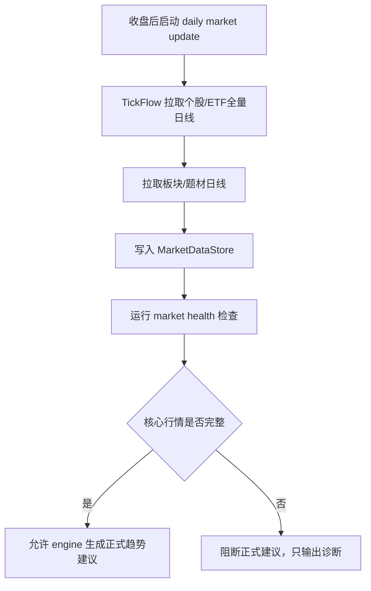
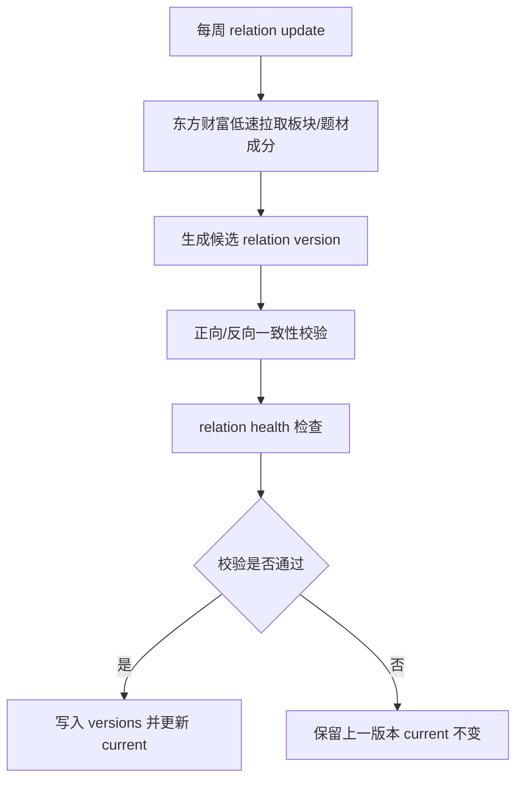

# TFS v2 数据管理设计

> 本文档从 `REFACTOR_MANUAL.md` 中拆出数据管理部分，并按“可落地优先”重新收敛。后续数据层实现、迁移和验收以本文档为准；总手册只保留架构摘要和文档索引。

---

## 1. 设计目标

v2 数据管理只解决一个核心问题：**给 engine/display 提供可信、完整、可追溯的数据入口**。

第一阶段不做“数据平台”，只做能支撑 v2 主链路落地的最小闭环：

1. **全量行情数据**：每日收盘后更新，主源为 TickFlow。
2. **映射关系数据**：每周更新一次，主源为东方财富体系，Tushare Pro 作为备源或校验源。
3. **DataLayer 唯一入口**：engine、evaluation、display 只能通过 DataLayer 取数据。
4. **health 准出**：行情不完整不出正式推荐；关系过期或缺失则降级协同判断。

本设计的第一阶段必须能在少量核心文件内落地：

```text
v2/data_layer/
├── __init__.py      # DataLayer 门面
├── storage.py       # MarketDataStore，行情 parquet 读写
├── relations.py     # RelationStore，关系版本读写和查询
├── lifecycle.py     # market_health / relation_health
└── fetcher.py       # update_market_daily / update_relations_weekly 编排
```

超过这个范围的复杂设计先列为“后续增强”，不阻塞第一阶段实现。

---

## 2. 数据资产分类

### 2.1 MarketDataStore：每日全量行情

MarketDataStore 管理每日更新的行情序列。

| 数据 | 内容 | 主源 | 更新频率 | 存储位置 |
|------|------|------|----------|----------|
| 个股日线 | 全市场 A 股 OHLCV | TickFlow | 每个交易日收盘后 | `v2/data/stock/{code}.parquet` |
| ETF 日线 | 全市场 ETF OHLCV | TickFlow | 每个交易日收盘后 | `v2/data/etf/{code}.parquet` |
| 板块日线 | 行业/板块指数 OHLCV | AkShare/同花顺或 TickFlow 可用源 | 每个交易日收盘后 | `v2/data/sector/{code}.parquet` |
| 题材日线 | 概念/题材指数 OHLCV | AkShare/同花顺或 TickFlow 可用源 | 每个交易日收盘后 | `v2/data/theme/{code}.parquet` |

行情数据目标：**全量、同日、可计算**。

### 2.2 RelationStore：每周映射关系

RelationStore 管理低频更新的关系数据。

| 数据 | 内容 | 主源 | 备源/校验 | 更新频率 | 第一阶段优先级 |
|------|------|------|-----------|----------|----------------|
| 个股-板块关系 | stock -> sectors / sector -> stocks | 东方财富 | Tushare 申万行业 | 每周一次 | 必做 |
| 个股-题材关系 | stock -> themes / theme -> stocks | 东方财富 | Tushare concept/concept_detail | 每周一次 | 必做 |
| 名称映射 | code -> name | TickFlow/东方财富/AkShare | Tushare | 每周或每月 | 必做 |
| 股票/ETF/板块/题材列表 | universe 定义 | TickFlow/东方财富/AkShare | Tushare | 每周一次 | 必做 |
| ETF-成分关系 | etf -> holdings / stock -> etfs | 东方财富或 Tushare | Tushare ETF 持仓 | 每周一次 | 第二阶段 |

第一阶段核心链路是“行情 + 板块/题材关系”。ETF holdings 保留设计，但不作为第一阶段阻塞项。

---

## 3. 推荐目录结构

第一阶段目录结构保持简单。

```text
v2/data/
├── stock/
│   └── 300308.parquet
├── etf/
│   └── 159915.parquet
├── sector/
│   └── 881121.parquet
├── theme/
│   └── 308614.parquet
│
├── meta/
│   ├── names/
│   │   ├── stock_names.json
│   │   └── etf_names.json
│   │
│   ├── universe/
│   │   ├── stock_list.json
│   │   ├── etf_list.json
│   │   ├── sector_list.json
│   │   └── theme_list.json
│   │
│   ├── relations/
│   │   ├── current.json
│   │   └── versions/
│   │       └── 2026-W26.json
│   │
│   └── health/
│       ├── market_health_2026-06-27.json
│       └── relation_health_2026-W26.json
```

`raw_relations/` 不作为第一阶段核心链路。需要排障时可以临时保存原始结果，后续再固定为正式目录。

---

## 4. 存储格式设计

### 4.1 行情 parquet schema

所有行情 parquet 使用统一 schema。

```text
date     datetime64 或 YYYY-MM-DD
open     float64
high     float64
low      float64
close    float64
volume   float64 或 int64
amount   float64，可选但建议保留
```

约束：

- `date` 不允许重复。
- `date` 不允许未来日期。
- `open/high/low/close` 不允许为空。
- `low <= open <= high`，`low <= close <= high`。
- `close > 0`。
- `volume >= 0`。
- 增量写入必须按日期去重并排序。

### 4.2 关系版本 schema

关系版本文件是 RelationStore 的核心产物。

第一阶段稳定 ID 规则保持简单：

1. 优先使用数据源原始 code：`eastmoney:sector:BK0422`。
2. 如果没有稳定 code，使用 `source:type:name` 降级生成：`eastmoney:theme:CPO`。
3. 中文名只用于展示，不作为内部唯一 key 的唯一依据。

```json
{
  "version": "2026-W26",
  "as_of_date": "2026-06-27",
  "created_at": "2026-06-27T20:30:00",
  "sources": {
    "sector": "eastmoney",
    "theme": "eastmoney",
    "names": "tickflow"
  },
  "entities": {
    "stocks": {
      "300308": {"name": "中际旭创"}
    },
    "sectors": {
      "eastmoney:sector:通信设备": {
        "name": "通信设备",
        "source": "eastmoney",
        "source_id": "通信设备"
      }
    },
    "themes": {
      "eastmoney:theme:CPO": {
        "name": "CPO",
        "source": "eastmoney",
        "source_id": "CPO"
      }
    }
  },
  "stock_profiles": {
    "300308": {
      "name": "中际旭创",
      "sectors": ["eastmoney:sector:通信设备"],
      "themes": ["eastmoney:theme:CPO", "eastmoney:theme:光模块"]
    }
  },
  "sector_members": {
    "eastmoney:sector:通信设备": ["300308"]
  },
  "theme_members": {
    "eastmoney:theme:CPO": ["300308"]
  }
}
```

关系文件必须同时提供正向和反向索引，避免上层重复构建映射。

### 4.3 ETF holdings 后续扩展字段

ETF holdings 第二阶段接入。接入时必须标注可信度，不能默认等价于板块/题材强关系。

```json
{
  "etf_holdings": {
    "159915": {
      "holding_type": "official_periodic",
      "as_of_date": "2026-06-27",
      "confidence": "medium",
      "members": [
        {"code": "300308", "name": "中际旭创", "weight": 5.12}
      ]
    }
  }
}
```

---

## 5. 数据源策略

### 5.1 每日行情：TickFlow 主源

TickFlow 作为每日行情主源：

- 可批量拉取全量数据。
- 相比东财，封禁风险低。
- 适合每日收盘后的固定批处理。

每日行情更新只负责行情，不负责关系映射。东财关系源不可用不能拖垮每日行情更新。

### 5.2 每周关系：东方财富主源

东方财富体系作为关系数据主源：

- 板块/题材/成分股覆盖较完整。
- 概念和题材关系更贴近市场使用习惯。
- 很多映射关系现阶段只有东财较容易获取。

东财调用必须低频、集中、限速：

- 只在每周关系任务中调用。
- 限速统一收口到 fetch 控制平面。
- provider 内禁止 sleep、重试、计数。
- 失败率异常时断路器立即停手。
- 更新失败时沿用上一周关系，不能覆盖 current。

### 5.3 Tushare Pro：备源和校验源

Tushare Pro 不作为每日行情主依赖。第一阶段只作为关系备源或人工校验参考，避免引入权限、积分、频次造成的实现阻塞。

可用方向：

- `concept` / `concept_detail`：概念分类和概念成分。
- `index_classify`：申万行业分类。
- `index_member` / `index_member_all`：申万行业成分。
- `index_weight`：指数成分和权重。
- ETF 持仓组合明细：第二阶段 ETF holdings 备源。

---

## 6. 更新流程

### 6.1 A 轨：每日行情更新



每日行情健康检查至少包含：

- expected universe 来自 `meta/universe/*.json`，禁止手写固定数量。
- actual 数据来自实际 parquet 成功集合。
- 检查最新日期是否等于目标交易日或允许的最近交易日。
- 检查 schema、空数据、重复日期、明显异常 OHLC。

### 6.2 B 轨：每周关系更新



关系更新失败不阻断基础趋势判断，但会禁用或降级板块/题材协同判断。

---

## 7. 健康检查与准出规则

### 7.1 market_health

`market_health_{date}.json` 记录每日行情是否可用于正式建议。

```json
{
  "date": "2026-06-27",
  "status": "complete",
  "source": "tickflow",
  "checks": {
    "stock": {
      "status": "complete",
      "expected_count": 4560,
      "actual_count": 4552,
      "missing_count": 8,
      "missing_sample": ["600000", "000001"],
      "latest_date_ok": true
    },
    "etf": {
      "status": "complete",
      "expected_count": 730,
      "actual_count": 730,
      "missing_count": 0,
      "latest_date_ok": true
    },
    "sector": {
      "status": "complete",
      "expected_count": 90,
      "actual_count": 90,
      "missing_count": 0,
      "latest_date_ok": true
    },
    "theme": {
      "status": "warning",
      "expected_count": 373,
      "actual_count": 360,
      "missing_count": 13,
      "missing_sample": ["eastmoney:theme:xxx"],
      "latest_date_ok": true
    }
  },
  "allowed": {
    "stock_recommendation": true,
    "etf_recommendation": true,
    "sector_confirmation": true,
    "theme_confirmation": true
  },
  "issues": []
}
```

硬规则：

- 个股行情不完整：禁止正式个股推荐。
- ETF 行情不完整：禁止正式 ETF 推荐。
- 板块行情不完整：禁用板块确认。
- 题材行情不完整：禁用题材确认。
- 有 stale 行情进入推荐池：直接失败。

### 7.2 relation_health

`relation_health_{version}.json` 记录关系版本是否可用。第一阶段只保留三类核心指标：板块覆盖、题材覆盖、正反向一致性。

```json
{
  "version": "2026-W26",
  "as_of_date": "2026-06-27",
  "status": "complete",
  "sources": {
    "sector": "eastmoney",
    "theme": "eastmoney"
  },
  "coverage": {
    "stock_universe_count": 4552,
    "stock_with_sector_count": 4380,
    "stock_with_theme_count": 3290,
    "stock_with_sector_ratio": 0.96,
    "stock_with_theme_ratio": 0.72
  },
  "consistency": {
    "forward_reverse_match": true,
    "missing_reverse_count": 0
  },
  "issues": []
}
```

硬规则：

- 关系版本缺失：禁用板块/题材协同判断。
- 关系版本超过 14 天未更新：基础趋势可运行，但关系解释降级。
- 正向/反向关系不一致：不能发布新关系版本，沿用上一版本。
- 个股无关系映射：该个股仍可做基础趋势判断，但不能获得板块/题材协同加分。
- ETF holdings 第一阶段不参与强准出。

---

## 8. DataLayer 第一阶段 API

DataLayer 是上层唯一入口。第一阶段 API 要少而稳。

```python
class DataLayer:
    # 行情数据
    def load_daily(self, dtype: str, code: str): ...
    def list_symbols(self, dtype: str) -> list[str]: ...
    def get_date_range(self, dtype: str, code: str) -> tuple: ...

    # 行情健康
    def check_market_health(self, date: str) -> dict: ...
    def get_latest_complete_market_date(self) -> str: ...

    # 关系数据
    def get_relation_version(self) -> str: ...
    def get_relation_as_of(self, market_date: str) -> str: ...
    def get_stock_profile(self, code: str, relation_version: str = None) -> dict: ...
    def get_sector_members(self, sector_id: str, relation_version: str = None) -> list[str]: ...
    def get_theme_members(self, theme_id: str, relation_version: str = None) -> list[str]: ...
    def check_relation_health(self, relation_version: str = None) -> dict: ...

    # 更新入口
    def update_market_daily(self, date: str = None) -> dict: ...
    def update_relations_weekly(self, week: str = None) -> dict: ...
```

第二阶段再补：

```python
def get_etf_holdings(self, etf_code: str, relation_version: str = None) -> list[dict]: ...
def get_related_etfs(self, stock_code: str, relation_version: str = None) -> list[str]: ...
```

禁止事项：

- engine/display/evaluation 禁止直接 `pd.read_parquet`。
- engine/display/evaluation 禁止直接读取 `v2/data/meta/*.json`。
- engine/display/evaluation 禁止直接调用 TickFlow、AkShare、Tushare。
- provider 禁止出现 `time.sleep`、自建 retry、自建请求计数。

---

## 9. 存储管理原则

### 9.1 行情数据按标的保存

行情数据仍按 `{dtype}/{code}.parquet` 存储。原因：

- 趋势计算通常按标的读取完整历史。
- 增量更新简单。
- 文件损坏影响范围小。
- 与旧系统迁移成本较低。

### 9.2 关系数据按版本保存

关系数据按周版本保存。原因：

- 板块、题材成分不需要每日更新。
- 历史回看必须知道当时使用的关系版本。
- 新版本校验失败时可以快速回滚到上一版本。
- 关系内部使用稳定 ID，中文名只用于展示，避免改名/同名导致映射错乱。

### 9.3 health 文件作为准出门禁

不引入复杂的多级审计系统，先用两个轻量 health 文件解决最大风险：

- `market_health_{date}.json`：当日行情是否完整。
- `relation_health_{version}.json`：关系版本是否可用。

后续如需要更强审计能力，再扩展 fetch report 或 snapshot manifest。

---

## 10. 实施优先级

### 10.1 第一阶段必做

1. 建立 `MarketDataStore` 和 `RelationStore` 的目录与读写契约。
2. 实现 universe 文件，作为 expected_count 的来源。
3. 实现关系版本文件 `relations/current.json` 与 `relations/versions/{version}.json`。
4. 实现板块/题材关系的稳定 ID、中文展示名、source/source_id。
5. 实现 DataLayer 第一阶段关系查询 API。
6. 实现 `market_health` 和 `relation_health` 两个轻量健康检查。
7. 确保 engine/display 只能通过 DataLayer 获取行情和关系。

### 10.2 第一阶段暂缓

- 完整日期快照系统。
- 复杂 fetch_plan/fetch_report。
- 固定 `raw_relations/` 正式归档流程。
- 图数据库。
- ETF holdings 强集成。
- ETF holding confidence 参与评分。
- 多数据源自动融合评分。
- 历史全版本关系回放优化。

这些可以等 v2 主链路跑通后再逐步加强。

---

## 11. 验收标准

数据管理第一阶段完成后，必须满足：

- 行情数据和关系数据分离管理。
- 每日行情更新不依赖东方财富关系接口。
- 每周关系更新失败不会污染当前可用关系版本。
- 每次正式结果都能记录 `market_date` 和 `relation_version`。
- DataLayer 能回答：某个个股属于哪些板块、题材。
- DataLayer 能回答：某个板块/题材包含哪些个股。
- 正向和反向关系一致。
- expected_count 来自 universe 文件，而不是硬编码数字。
- 行情不完整时不能生成正式推荐。
- 关系过期时基础趋势仍可运行，但协同判断必须降级或禁用。

---

## 12. 当前设计决策

当前确认的设计决策：

- v2 数据管理分为“映射关系”和“全量行情”两部分。
- 映射关系每周更新一次，不每日更新。
- 全量行情每日收盘后更新。
- TickFlow 作为全量行情主源。
- 东方财富体系作为映射关系主源，但必须低频、限速、断路、可续传。
- Tushare Pro 作为关系备源和校验源，不作为每日行情主依赖。
- 第一阶段不上复杂快照系统，只保留 health 门禁和关系版本。
- 第一阶段优先板块/题材关系，ETF holdings 进入第二阶段。
