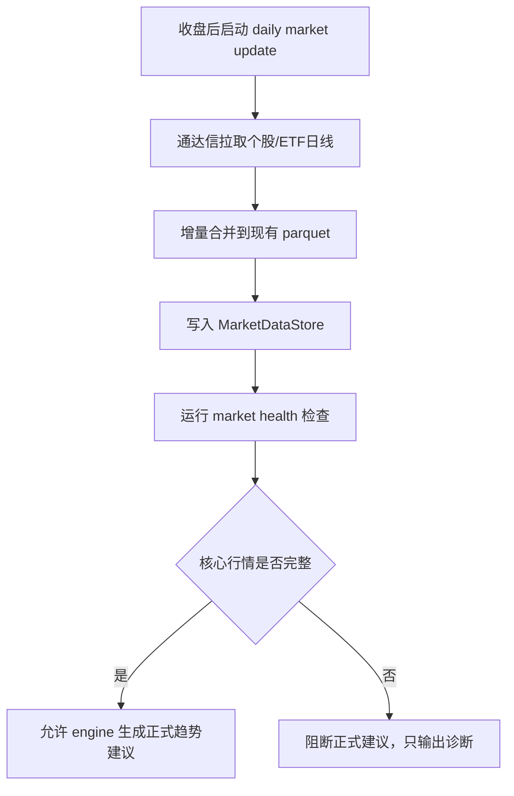
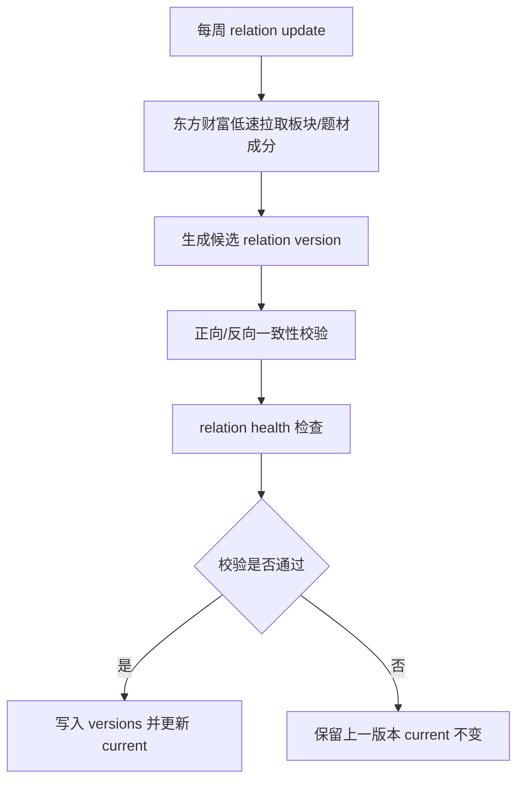

# TFS v2 数据管理设计

> 本文档是 v2 数据层的权威设计文档。所有数据层实现、迁移和验收以本文档为准。
>
> **最后更新：2026-07-11** — 反映通达信(mootdx)+腾讯实际实现。

---

## 1. 设计目标

v2 数据管理只解决一个核心问题：**给 engine/display 提供可信、完整、可追溯的数据入口**。

第一阶段不做"数据平台"，只做能支撑 v2 主链路落地的最小闭环：

1. **全量行情数据**：每日收盘后更新，主源为通达信(mootdx TCP)，备源为 akshare HTTP。
2. **映射关系数据**：每周更新一次，主源为东方财富/同花顺。
3. **DataLayer 唯一入口**：engine、evaluation、display 只能通过 DataLayer 取数据。
4. **health 准出**：行情不完整不出正式推荐；关系过期或缺失则降级协同判断。

本设计的第一阶段必须能在少量核心文件内落地：

```text
v2/data_layer/
├── __init__.py              # DataLayer 门面
├── config.py                # 集中配置（路径、阈值）
├── storage.py               # MarketDataStore，行情 parquet 读写
├── relations.py             # RelationStore，关系版本读写和查询
├── lifecycle.py             # market_health / relation_health
├── history.py               # 历史状态序列
├── fetcher.py               # update_market_daily / update_relations_weekly 编排
│
├── providers/               # 数据源适配层
│   ├── __init__.py
│   ├── mootdx_tencent.py    # ✅ 通达信K线 + 腾讯行情（日K主源）
│   ├── akshare_em.py        # ✅ 东财（板块/题材映射）
│   ├── akshare_ths.py       # 同花顺（备用，待实现）
│   └── tickflow.py          # TickFlow（已被 mootdx 替代）
│
└── fetch/                   # 拉取控制层
    ├── __init__.py
    ├── rate_limiter.py      # ✅ Token bucket 限流（东财1次/s）
    ├── journal.py           # ✅ 进度日志（断点恢复）
    ├── circuit_breaker.py   # 熔断器（待实现）
    ├── executor.py          # 并发执行器（待实现）
    ├── registry.py          # 数据源路由+降级（待实现）
    └── config.py            # 桶容量/阈值配置（待实现）
```

超过这个范围的复杂设计先列为"后续增强"，不阻塞第一阶段实现。

---

## 2. 数据资产分类

### 2.1 MarketDataStore：每日全量行情

MarketDataStore 管理每日更新的行情序列。

| 数据 | 内容 | 主源 | 备源 | 更新频率 | 存储位置 |
|------|------|------|------|----------|----------|
| 个股日线 | 全市场 A 股 OHLCV | 通达信 TCP | akshare HTTP | 每个交易日收盘后 | `v2/data/stock/{code}.parquet` |
| ETF 日线 | 全市场 ETF OHLCV | 通达信 TCP | akshare HTTP | 每个交易日收盘后 | `v2/data/etf/{code}.parquet` |
| 板块日线 | 行业/板块指数 OHLCV | 通达信 TCP | — | 每个交易日收盘后 | `v2/data/sector/{code}.parquet` |
| 题材日线 | 概念/题材指数 OHLCV | 通达信 TCP | — | 每个交易日收盘后 | `v2/data/theme/{code}.parquet` |

行情数据目标：**全量、同日、可计算**。

### 2.2 RelationStore：每周映射关系

RelationStore 管理低频更新的关系数据。

| 数据 | 内容 | 主源 | 备源/校验 | 更新频率 | 第一阶段优先级 |
|------|------|------|-----------|----------|----------------|
| 个股-板块关系 | stock -> sectors / sector -> stocks | 东方财富 | 同花顺 | 每周一次 | 必做 |
| 个股-题材关系 | stock -> themes / theme -> stocks | 东方财富 | 同花顺 | 每周一次 | 必做 |
| 名称映射 | code -> name | 通达信/东方财富 | — | 每周或每月 | 必做 |
| 股票/ETF列表 | universe 定义 | 通达信 | 东方财富 | 每周一次 | 必做 |
| ETF-成分关系 | etf -> holdings / stock -> etfs | 东方财富 | — | 每周一次 | 第二阶段 |

第一阶段核心链路是"行情 + 板块/题材关系"。ETF holdings 保留设计，但不作为第一阶段阻塞项。

---

## 3. 推荐目录结构

第一阶段目录结构保持简单。

```text
v2/data/
├── stock/                     # 个股日K（5590只）
│   ├── 000001.parquet
│   └── 600519.parquet
├── etf/                       # ETF日K（1522只）
│   ├── 159001.parquet
│   └── 510300.parquet
├── sector/                    # 板块日K
├── theme/                     # 题材日K
│
├── meta/
│   ├── universe/
│   │   ├── stock_list.json
│   │   └── etf_list.json
│   │
│   ├── relations/
│   │   ├── current.json
│   │   ├── active.json
│   │   └── versions/
│   │       └── 2026-W26.json
│   │
│   ├── health/
│   │   ├── market_health_2026-06-27.json
│   │   └── relation_health_2026-W26.json
│   │
│   └── fetch_journal.json     # 拉取进度日志（断点恢复）
```

---

## 4. 存储格式设计

### 4.1 行情 parquet schema

所有行情 parquet 使用统一 schema。

```text
date     datetime64 或 YYYY-MM-DD
open     float64
high     float64
low      float64
close    float64
volume   float64 或 int64
amount   float64，可选但建议保留
```

约束：

- `date` 不允许重复。
- `date` 不允许未来日期。
- `open/high/low/close` 不允许为空。
- `low <= open <= high`，`low <= close <= high`。
- `close > 0`。
- `volume >= 0`。
- 增量写入必须按日期去重并排序。

### 4.2 关系版本 schema

关系版本文件是 RelationStore 的核心产物。

第一阶段稳定 ID 规则保持简单：

1. 优先使用数据源原始 code：`eastmoney:sector:BK0422`。
2. 如果没有稳定 code，使用 `source:type:name` 降级生成：`eastmoney:theme:CPO`。
3. 中文名只用于展示，不作为内部唯一 key 的唯一依据。

```json
{
  "version": "2026-W26",
  "as_of_date": "2026-06-27",
  "created_at": "2026-06-27T20:30:00",
  "sources": {
    "sector": "eastmoney",
    "theme": "eastmoney",
    "names": "mootdx"
  },
  "entities": {
    "stocks": {
      "300308": {"name": "中际旭创"}
    },
    "sectors": {
      "eastmoney:sector:通信设备": {
        "name": "通信设备",
        "source": "eastmoney",
        "source_id": "通信设备"
      }
    },
    "themes": {
      "eastmoney:theme:CPO": {
        "name": "CPO",
        "source": "eastmoney",
        "source_id": "CPO"
      }
    }
  },
  "stock_profiles": {
    "300308": {
      "name": "中际旭创",
      "sectors": ["eastmoney:sector:通信设备"],
      "themes": ["eastmoney:theme:CPO", "eastmoney:theme:光模块"]
    }
  },
  "sector_members": {
    "eastmoney:sector:通信设备": ["300308"]
  },
  "theme_members": {
    "eastmoney:theme:CPO": ["300308"]
  }
}
```

关系文件必须同时提供正向和反向索引，避免上层重复构建映射。

### 4.3 ETF holdings 后续扩展字段

ETF holdings 第二阶段接入。接入时必须标注可信度，不能默认等价于板块/题材强关系。

```json
{
  "etf_holdings": {
    "159915": {
      "holding_type": "official_periodic",
      "as_of_date": "2026-06-27",
      "confidence": "medium",
      "members": [
        {"code": "300308", "name": "中际旭创", "weight": 5.12}
      ]
    }
  }
}
```

---

## 5. 数据源策略

### 5.1 每日行情：通达信(mootdx)主源

通达信 TCP 作为每日行情主源：

- **不封 IP**：TCP 二进制协议，直连通达信行情服务器(7709)，实测无风控。
- **批量无限制**：单股 0.02s，5590 只 4 分钟完成全量补数据。
- **免费无 Key**：无需注册、无需 API Key。
- **覆盖全**：A 股、ETF、指数均支持。

```python
# 通达信 K线获取示例
from mootdx.quotes import Quotes
client = Quotes.factory(market='std')
klines = client.bars(symbol='600519', frequency=9, offset=730)
# 返回: open, close, high, low, vol, amount, datetime
```

腾讯财经 HTTP 作为辅助数据源：

- 实时行情/PE/PB/市值/换手率/涨跌停价。
- 同样不封 IP，免费无 Key。

```python
# 腾讯行情获取示例
import urllib.request
url = "https://qt.gtimg.cn/q=sh600519"
# 返回 88 字段，~分隔
```

每日行情更新只负责行情，不负责关系映射。东财关系源不可用不能拖垮每日行情更新。

### 5.2 每周关系：东方财富主源

东方财富体系作为关系数据主源：

- 板块/题材/成分股覆盖较完整。
- 概念和题材关系更贴近市场使用习惯。
- 很多映射关系现阶段只有东财较容易获取。

东财调用必须低频、集中、限速：

- 只在每周关系任务中调用。
- 限速统一收口到 fetch/rate_limiter.py（令牌桶，1次/s）。
- provider 内禁止 sleep、重试、计数。
- 失败率异常时断路器（待实现）立即停手。
- 更新失败时沿用上一周关系，不能覆盖 current。

### 5.3 同花顺：备用关系源

同花顺作为关系备源：

- 板块/题材列表可用。
- 成分股接口不稳定，部分 akshare 版本缺失。

### 5.4 TickFlow：已废弃

TickFlow 原计划作为日K主源，但因：
- 服务不稳定（多次连接失败）
- API 参数需调试（period 枚举值不明确）
- 通达信 TCP 完全满足需求且更稳定

已用通达信(mootdx)完全替代，`providers/tickflow.py` 保留为空文件。

### 5.5 Tushare Pro：备源和校验源

Tushare Pro 不作为每日行情主依赖。第一阶段只作为关系备源或人工校验参考。

---

## 6. 更新流程

### 6.1 A 轨：每日行情更新



增量合并流程：

1. 读现有 parquet
2. 检查最新日期是否已有目标交易日数据
3. 如无，通达信拉取近 730 天数据
4. concat → 按 date 去重 → 排序
5. 覆盖写回 parquet

每日行情健康检查至少包含：

- expected universe 来自 `meta/universe/*.json`，禁止手写固定数量。
- actual 数据来自实际 parquet 成功集合。
- 检查最新日期是否等于目标交易日或允许的最近交易日。
- 检查 schema、空数据、重复日期、明显异常 OHLC。

### 6.2 B 轨：每周关系更新



关系更新失败不阻断基础趋势判断，但会禁用或降级板块/题材协同判断。

### 6.3 数据拉取分工总表

| 数据类型 | 主源 | 备源 | 频率 | 封IP风险 |
|---------|------|------|------|---------|
| 日K线（股票/ETF/指数） | 通达信 TCP | akshare HTTP | 每日 | **不封** |
| 股票/ETF列表 | 通达信 `stock_all()` | 东财 `stock_zh_a_spot_em` | 月度 | **不封** |
| 板块/题材列表 | 东财/同花顺 | — | 周度 | 有风控 |
| 板块成分股 | 东财/同花顺 | — | 周度 | 有风控 |
| 实时行情/PE/PB | 腾讯财经 HTTP | — | 每日 | **不封** |

---

## 7. 健康检查与准出规则

### 7.1 market_health

`market_health_{date}.json` 记录每日行情是否可用于正式建议。

```json
{
  "date": "2026-07-10",
  "status": "complete",
  "source": "mootdx",
  "checks": {
    "stock": {
      "status": "complete",
      "expected_count": 5590,
      "actual_count": 5182,
      "missing_count": 408,
      "missing_sample": ["000003", "000005"],
      "latest_date_ok": true,
      "note": "408只停牌/退市，无新数据"
    },
    "etf": {
      "status": "complete",
      "expected_count": 1522,
      "actual_count": 1522,
      "missing_count": 0,
      "latest_date_ok": true
    }
  },
  "allowed": {
    "stock_recommendation": true,
    "etf_recommendation": true
  },
  "issues": []
}
```

硬规则：

- 个股行情不完整：禁止正式个股推荐。
- ETF 行情不完整：禁止正式 ETF 推荐。
- 有 stale 行情进入推荐池：直接失败。

### 7.2 relation_health

`relation_health_{version}.json` 记录关系版本是否可用。

```json
{
  "version": "2026-W26",
  "as_of_date": "2026-06-27",
  "status": "complete",
  "sources": {
    "sector": "eastmoney",
    "theme": "eastmoney"
  },
  "coverage": {
    "stock_universe_count": 5590,
    "stock_with_sector_count": 4380,
    "stock_with_theme_count": 3290,
    "stock_with_sector_ratio": 0.78,
    "stock_with_theme_ratio": 0.59
  },
  "consistency": {
    "forward_reverse_match": true,
    "missing_reverse_count": 0
  },
  "issues": []
}
```

硬规则：

- 关系版本缺失：禁用板块/题材协同判断。
- 关系版本超过 14 天未更新：基础趋势可运行，但关系解释降级。
- 正向/反向关系不一致：不能发布新关系版本，沿用上一版本。
- 个股无关系映射：该个股仍可做基础趋势判断，但不能获得板块/题材协同加分。

---

## 8. DataLayer 第一阶段 API

DataLayer 是上层唯一入口。第一阶段 API 要少而稳。

```python
class DataLayer:
    # 行情数据
    def load_daily(self, dtype: str, code: str): ...
    def list_symbols(self, dtype: str) -> list[str]: ...
    def get_date_range(self, dtype: str, code: str) -> tuple: ...

    # 行情健康
    def check_market_health(self, date: str) -> dict: ...
    def get_latest_complete_market_date(self) -> str: ...

    # 关系数据
    def get_relation_version(self) -> str: ...
    def get_relation_as_of(self, market_date: str) -> str: ...
    def get_stock_profile(self, code: str, relation_version: str = None) -> dict: ...
    def get_sector_members(self, sector_id: str, relation_version: str = None) -> list[str]: ...
    def get_theme_members(self, theme_id: str, relation_version: str = None) -> list[str]: ...
    def check_relation_health(self, relation_version: str = None) -> dict: ...

    # 更新入口
    def update_market_daily(self, date: str = None) -> dict: ...
    def update_relations_weekly(self, week: str = None) -> dict: ...
```

第二阶段再补：

```python
def get_etf_holdings(self, etf_code: str, relation_version: str = None) -> list[dict]: ...
def get_related_etfs(self, stock_code: str, relation_version: str = None) -> list[str]: ...
```

禁止事项：

- engine/display/evaluation 禁止直接 `pd.read_parquet`。
- engine/display/evaluation 禁止直接读取 `v2/data/meta/*.json`。
- engine/display/evaluation 禁止直接调用通达信、AkShare。
- provider 禁止出现 `time.sleep`、自建 retry、自建请求计数（统一走 fetch 控制层）。

---

## 9. 存储管理原则

### 9.1 行情数据按标的保存

行情数据仍按 `{dtype}/{code}.parquet` 存储。原因：

- 趋势计算通常按标的读取完整历史。
- 增量更新简单。
- 文件损坏影响范围小。
- 与旧系统迁移成本较低。

### 9.2 关系数据按版本保存

关系数据按周版本保存。原因：

- 板块、题材成分不需要每日更新。
- 历史回看必须知道当时使用的关系版本。
- 新版本校验失败时可以快速回滚到上一版本。
- 关系内部使用稳定 ID，中文名只用于展示，避免改名/同名导致映射错乱。

### 9.3 health 文件作为准出门禁

不引入复杂的多级审计系统，先用两个轻量 health 文件解决最大风险：

- `market_health_{date}.json`：当日行情是否完整。
- `relation_health_{version}.json`：关系版本是否可用。

后续如需要更强审计能力，再扩展 fetch report 或 snapshot manifest。

---

## 10. 实施优先级

### 10.1 已完成

1. ✅ `MarketDataStore` 和 `RelationStore` 的目录与读写契约。
2. ✅ universe 文件，作为 expected_count 的来源。
3. ✅ 关系版本文件 `relations/current.json` 与 `relations/versions/{version}.json`。
4. ✅ DataLayer 第一阶段关系查询 API。
5. ✅ `market_health` 和 `relation_health` 两个轻量健康检查。
6. ✅ engine/display 只能通过 DataLayer 获取行情和关系。
7. ✅ 通达信(mootdx) Provider — 日K主源，不封IP。
8. ✅ 东财 Provider — 板块/题材映射。
9. ✅ Token bucket 限流器 — 防封IP。
10. ✅ 进度日志 — 断点恢复。
11. ✅ 全量数据补全 — 06-29~07-10 缺失数据已补。

### 10.2 待实现（按优先级）

1. `providers/akshare_ths.py` — 同花顺板块/题材 Provider。
2. `fetch/circuit_breaker.py` — 熔断器（东财失败率>30%自动暂停）。
3. `fetch/executor.py` — 并发执行器（3个worker）。
4. `fetch/registry.py` — 数据源路由+降级链。
5. `fetch/config.py` — 桶容量/阈值配置。

### 10.3 第二阶段暂缓

- 完整日期快照系统。
- 复杂 fetch_plan/fetch_report。
- 图数据库。
- ETF holdings 强集成。
- 多数据源自动融合评分。

---

## 11. 验收标准

数据管理第一阶段完成后，必须满足：

- ✅ 行情数据和关系数据分离管理。
- ✅ 每日行情更新不依赖东方财富关系接口。
- ✅ 每周关系更新失败不会污染当前可用关系版本。
- ✅ 每次正式结果都能记录 `market_date` 和 `relation_version`。
- ✅ DataLayer 能回答：某个个股属于哪些板块、题材。
- ✅ DataLayer 能回答：某个板块/题材包含哪些个股。
- ✅ expected_count 来自 universe 文件，而不是硬编码数字。
- ✅ 行情不完整时不能生成正式推荐。
- ✅ 关系过期时基础趋势仍可运行，但协同判断必须降级或禁用。
- ✅ 全量数据已补全至 2026-07-10（5182只股票 + 1522只ETF）。

---

## 12. 当前设计决策

当前确认的设计决策：

- v2 数据管理分为"映射关系"和"全量行情"两部分。
- 映射关系每周更新一次，不每日更新。
- 全量行情每日收盘后更新。
- **通达信(mootdx TCP)作为全量行情主源**（替代原 TickFlow 方案）。
  - 原因：不封IP、批量无限制、免费无Key、覆盖全。
  - TickFlow 因服务不稳定已废弃。
- **腾讯财经作为实时行情/PE/PB辅助源**。
- 东方财富体系作为映射关系主源，但必须低频、限速、断路、可续传。
- Tushare Pro 作为关系备源和校验源，不作为每日行情主依赖。
- 第一阶段不上复杂快照系统，只保留 health 门禁和关系版本。
- 第一阶段优先板块/题材关系，ETF holdings 进入第二阶段。
