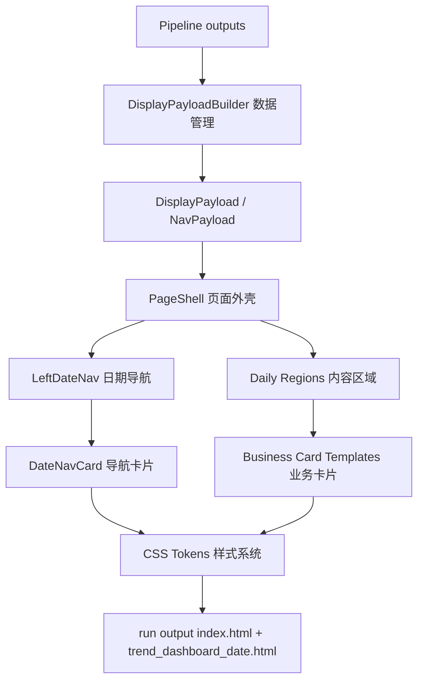
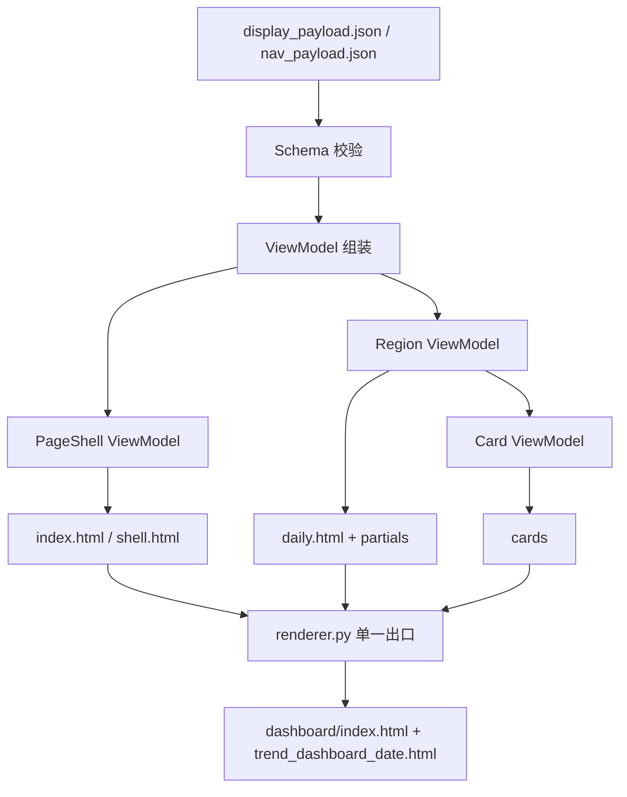
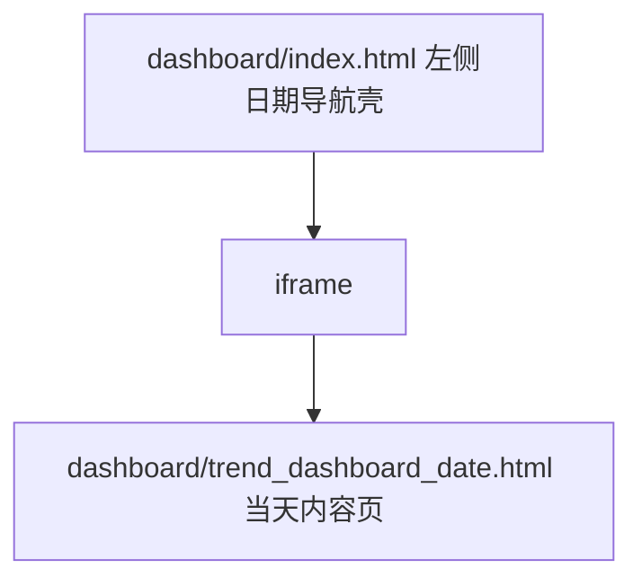
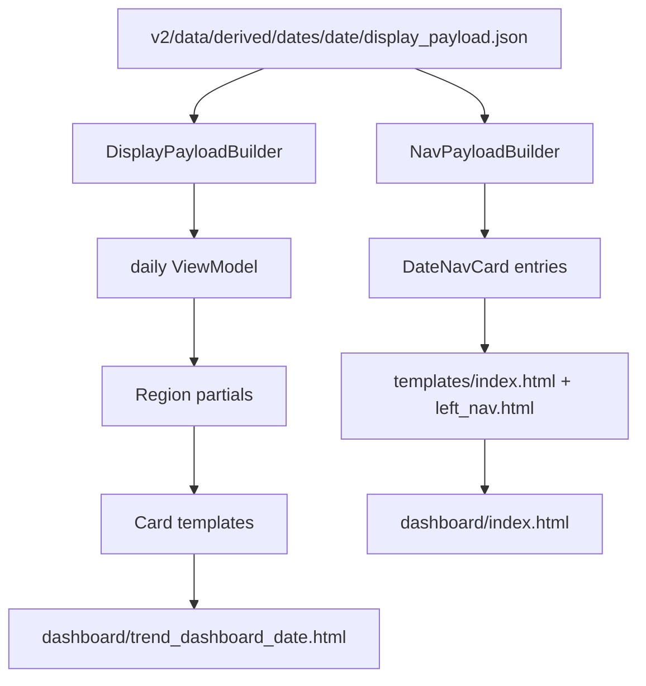
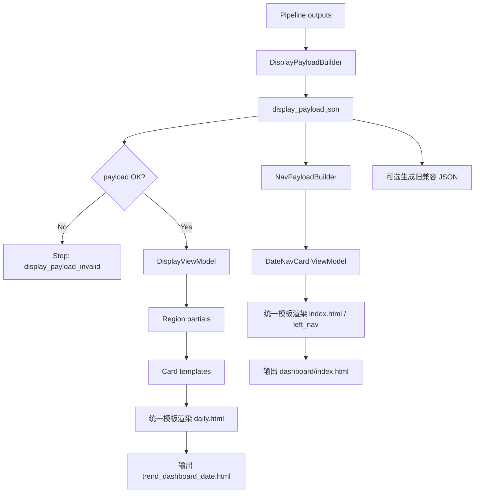

# TFS v2 Display 展示层设计

> 本文档是 v2 display 展示层的模块设计。总设计见 `v2/REFACTOR_MANUAL.md`。
>
> 上游模块文档：
> - `v2/doc/data_management_design.md`
> - `v2/doc/engine_design.md`
> - `v2/doc/evaluation_evolution_design.md`
> - `v2/doc/pipeline_design.md`
>
> 设计原则：Display 只负责“把 Pipeline 产出的 display payload 渲染成用户可看的页面”。它不获取基础数据，不计算趋势指标，不判断状态，不做推演验证。旧展示层的用户入口、日期导航、页面信息结构只作为参考；旧系统里 Python/H5/字符串拼接、多处补丁注入的实现方式不再作为 v2 标准路径复用。v2 Display 必须收敛为“DisplayPayloadBuilder 数据管理 + PageShell 页面外壳 + Region 区域管理 + Card Template Library 卡片模板库 + CSS Tokens 样式系统”，任何区域都不能再由多个脚本分散补丁式生成。

---

## 1. 本层定位

Display 层是整个系统最后一层，负责用户可见结果：



Display 层负责：

1. 由 `DisplayPayloadBuilder` 把 Pipeline、Engine、Evaluation、DataLayer 摘要整理成展示 payload。
2. 由 `NavPayloadBuilder` 从日期产物聚合左侧导航数据。
3. 由 `PageShell` 管理 run 输出目录中 `index.html` 的左侧日期导航和右侧 iframe 外壳。
4. 由 Region partial 管理每日内容页的区域顺序和布局。
5. 由 Card Template Library 管理所有可复用卡片样式，包括业务卡片和日期导航卡片。
6. 由统一 renderer 输出 run 输出目录中的 `trend_dashboard_{date}.html` 和 `index.html`。
7. 展示 Engine / Evaluation 的结果，但不重新计算。
8. 必要时生成旧 dashboard 兼容数据，但兼容数据不是 v2 标准数据源。

Display 层不负责：

- 不直接读接口数据。
- 不直接读 parquet 行情。
- 不计算 MA / MACD / RSI / 状态机。
- 不生成 `StrategySignal`。
- 不做推演验证或规则发现。
- 不决定候选池排序。
- 不修改 Pipeline 的 run manifest。

---

## 2. 旧系统展示能力调研

### 2.1 入口壳 `dashboard/index.html`

旧系统用户入口是 `dashboard/index.html`，它是侧边栏 + iframe 壳页面。

关键特征：

1. 左侧固定日期导航。
2. 主区域 iframe 加载每日 dashboard。
3. 支持侧边栏折叠。
4. 用户实际访问的是 `http://localhost:8765/index.html`，不是单个 `trend_dashboard_*.html`。

可复用点：

- 入口壳模式必须保留。
- 日期列表、快速点、iframe 加载模式必须保留。
- `build_nav_index.py` 独占生成侧边栏的边界必须保留。

不合理点：

- 当前 `index.html` 是生成产物，不应被人工或 Pipeline 随意修改。
- 日期导航数据来源混杂，后续应从 display payload / date index 派生。

### 2.2 每日报告 `scripts/build_final.py`

旧 `build_final.py` 是每日 dashboard 的核心生成入口。

可复用点：

- 用户熟悉的视觉结构和阅读路径应保留。
- 每日报告文件命名 `trend_dashboard_{date}.html` 应保留。
- 旧页面中已有的板块、题材、个股、操作建议区块经验应作为 v2 Region / Card 设计参考。

不合理点：

- 如果脚本内部重新读取多处数据、拼策略字段，应逐步收敛为只读 display payload。
- 旧脚本不应成为新的策略计算入口。

### 2.3 导航生成 `scripts/build_nav_index.py`

旧 `build_nav_index.py` 负责生成 `dashboard/index.html`。

可复用点：

- 侧边栏日期导航保护优先级最高。
- 继续由一个专门入口生成 `index.html`，避免其他脚本随意修改。
- 导航中展示市场强弱、领涨信息、日期标签的能力可保留。

不合理点：

- 导航数据应从稳定的日期产物读取，不能依赖散落 JSON。
- Display adapter 要明确“谁可以改 run 输出目录中的 index.html”。

### 2.4 操作面板注入 `scripts/render_action_panel.py`

旧 `render_action_panel.py` 通过模板提取和字符串替换，将操作建议注入每日 HTML。

可复用点：

- 操作面板的位置、字段含义和用户阅读顺序可作为参考。
- 旧操作面板字段可映射为 `action_card` / `risk_card` 的 payload 字段。

不合理点：

- 字符串查找和替换比较脆弱。
- 操作建议不能在展示层重新算，只能消费 Engine 的 `position_hint`、`action_hint`、`risk_flags`。
- 面板注入失败不应影响上游 DataLayer / Engine 产物。

### 2.5 四层漏斗展示 `scripts/build_all_dashboard.py`

旧脚本直接读取 `dashboard/data/dashboard_data.json`，在脚本中拼接完整 HTML。

可复用点：

- 四层漏斗、主线板块、翻转关注、表格搜索、详情展开等展示经验可以复用。
- `dashboard_data.json` 的字段结构可作为 v2 display payload 的兼容参考。

不合理点：

- HTML 字符串直接拼接，维护成本高。
- 展示脚本读取 dashboard_data 后对 conditions、score、state 等字段有强假设。
- 样式、数据映射、HTML 拼接混在一起。

---

## 3. 旧展示层主要问题

### 3.1 展示层容易重新变成万能层

旧系统中，展示脚本不只是展示，经常顺手做字段修正、状态标签兼容、动作面板拼接、日期导航同步。v2 必须防止 Display 再次拥有策略判断权。

### 3.2 数据入口不统一

旧展示层读取：

- `dashboard/data/dashboard_data.json`
- `actions_{date}.json`
- `date_nav.json`
- `enhanced_actions_*.json`
- 各种历史状态和推演 JSON

v2 必须收敛为：

- 标准入口：`v2/data/derived/dates/{date}/display_payload.json`
- 旧兼容入口：由 adapter 生成 `dashboard/data/*.json`

### 3.3 HTML 生成方式脆弱

旧脚本大量拼 HTML 字符串，多个脚本分别生成不同区域，再靠字符串查找、替换、注入补丁拼到一起。最终效果虽然能展示，但结构非常脆弱：随便改一个字段、一个区域高度、一个 DOM 标记，都可能导致页面错乱或注入失败。

v2 不能继续这种方式。第一阶段允许参考旧页面的信息结构和视觉分区，但不允许延续“多个入口生成不同区域 + 后处理补丁注入”的生成方式。

### 3.4 侧边栏导航必须保护

`dashboard/index.html` 是用户入口。任何 Display 改动都不能破坏：

- 左侧日期列表。
- iframe 加载每日 dashboard。
- 折叠按钮。
- 最新日期默认打开。
### 3.5 多入口补丁式生成不可维护

旧系统中页面区域来源过多：有的区域由 Python 拼 HTML，有的区域靠 H5/JS 处理，有的区域由后置脚本注入，有的区域由导航脚本重新生成。这导致：

1. 页面结构没有唯一 owner。
2. 数据字段变化会连锁影响多个脚本。
3. 某个脚本修一个区域，可能破坏另一个区域。
4. 很难判断页面错乱是模板问题、数据问题还是注入顺序问题。

v2 Display 必须把页面生成收敛为单一模板体系。不同区块可以拆组件/partial，但必须由同一个 renderer 按同一个 payload 渲染，不能再由多个脚本后处理式拼接。

### 3.6 卡片样式散落导致小改动高风险

旧页面里不同区域有不同卡片样式，但这些样式经常和区域 HTML、业务字段、颜色规则混在一起。结果是：

1. 改一个操作卡颜色，可能影响主线卡或风险卡。
2. 新增一个区域时，经常复制旧 HTML 再局部改样式。
3. 同一种状态 badge 在不同区域颜色、间距、字体不一致。
4. 日期导航项虽然也是高信息密度卡片，但容易被当作普通链接列表处理。

v2 必须把重复出现的视觉单元抽成 Card Template Library。Region 只负责区域编排，Card 负责视觉结构，CSS Tokens 负责颜色和尺寸。任何重复卡片不能散落在多个 partial 中各写一份。

## 4. v2 Display 设计目标

第一阶段目标不是重新设计一个炫的新 UI，而是把展示层从“多脚本补丁式生成”收敛成“统一模板渲染器”。

v2 Display 必须做到：

1. 标准输入只来自 `DisplayPayloadBuilder` / `NavPayloadBuilder` 产物。
2. 保留旧 dashboard 的用户入口、日期导航、核心信息分区和用户熟悉的阅读路径。
3. 使用统一模板生成每日页面，不能多个脚本分别生成页面区域。
4. 保留侧边栏日期导航和 iframe 壳，并将每个日期项抽象为 `DateNavCard`。
5. 用 Region partial 管理页面区域，用 Card template 管理可复用卡片样式。
6. 生成用户可直接打开的每日 HTML。
7. 展示 Engine 输出的状态、评分、风险、仓位建议。
8. 展示 Evaluation 的推演摘要和自进化建议摘要。
9. 不重新计算任何策略字段。
10. 展示失败不能污染上游产物。
11. 页面结构必须对字段增减、文本长度、数据缺失有容错，不允许随便改一个数就导致布局错乱。
12. 颜色、间距、边框、状态样式集中在 CSS Tokens，不散落在 Python/HTML 字符串里。

---

## 5. 第一阶段目录设计

```text
v2/display/
├── __init__.py              # Display 门面
├── builder.py               # DisplayPayloadBuilder，组装每日展示数据
├── nav.py                   # NavPayloadBuilder，日期导航数据生成/校验
├── renderer.py              # 单一渲染入口，负责完整页面生成
├── schema.py                # DisplayPayload / NavPayload schema 校验
├── view_model.py            # payload -> PageShell / Region / Card ViewModel
├── adapter.py               # 可选：display_payload -> 旧 dashboard/data 兼容 JSON
├── templates/               # 页面模板，只放结构，不放策略逻辑
│   ├── shell.html           # PageShell 基础模板
│   ├── index.html           # 侧边栏 iframe 壳模板
│   ├── daily.html           # 每日报告主模板
│   ├── partials/            # Region 区域模板，只负责布局编排
│   │   ├── left_nav.html
│   │   ├── overview.html
│   │   ├── action_panel.html
│   │   ├── funnel.html
│   │   ├── signal_groups.html
│   │   ├── evaluation.html
│   │   └── tables.html
│   └── cards/               # Card Template Library，负责可复用卡片形态
│       ├── base_card.html
│       ├── date_nav_card.html
│       ├── metric_card.html
│       ├── signal_card.html
│       ├── action_card.html
│       ├── risk_card.html
│       ├── scenario_card.html
│       ├── sector_card.html
│       ├── table_card.html
│       └── empty_card.html
├── assets/                  # 展示层静态资源
│   ├── display.css
│   └── display.js
└── compatibility.py         # 可选兼容输出，不参与 v2 标准渲染路径
```

第一阶段不引入 React/Vue，不新建前端工程。使用服务端模板或轻量模板渲染方式生成静态 HTML。模板可以拆 partial 和 card，但只能由 `renderer.py` 一个入口组装。

核心分层规则：

1. `builder.py` 负责数据管理，把上游产物整理成结构化 payload，不生成 HTML。
2. `nav.py` 负责日期导航数据，生成 `NavPayload` 和 `DateNavCard` 数据，不修改每日内容页。
3. `partials/` 负责区域管理，只决定区域顺序、标题、布局和卡片组合。
4. `cards/` 负责卡片模板库，所有重复视觉单元必须先进入 card template。
5. `assets/display.css` 负责 CSS Tokens，颜色、间距、状态、密度不得散落在模板或 Python 字符串里。

---

## 6. Display Payload 设计

Display 标准输入是：

```text
v2/data/derived/dates/{date}/display_payload.json
```

基本结构：

```json
{
  "meta": {
    "date": "2026-06-27",
    "run_id": "20260627_180500_daily",
    "source": "v2.pipeline.display_payload",
    "relation_version": "2026-W26",
    "strategy_params_hash": "...",
    "created_at": "2026-06-27T18:05:00"
  },
  "overview": {},
  "regions": [],
  "cards": [],
  "signals": [],
  "screening": {},
  "evaluation": {},
  "nav": {}
}
```

Display 只使用 payload 中已有字段。缺字段时只能：

1. 标记展示缺失。
2. 输出 warning。
3. 不显示对应区块或显示 empty card。

不能反向调用 Engine 或 DataLayer 补算。

### 6.1 Builder 输出边界

`DisplayPayloadBuilder` 是展示层的数据管理入口。它负责把 Pipeline manifest、Engine signals、Evaluation report、DataLayer health 摘要整理成稳定的展示 schema。

允许：

- 字段归类。
- 摘要提取。
- 展示排序使用上游已给出的 rank / score。
- 生成 `regions[]` 和 `cards[]` 的结构化数据。
- 给缺失字段填 `N/A`、空数组或 warning。

禁止：

- 重新计算趋势状态。
- 重新筛选候选池。
- 重新判断买卖动作。
- 生成 HTML 字符串。
- 写入 `dashboard/index.html` 或每日 HTML。

### 6.2 Region / Card 数据结构

Region 是页面区域，Card 是可复用视觉单元。payload 中的 region 只引用 card，不直接写完整 HTML。

```json
{
  "regions": [
    {
      "id": "action_panel",
      "title": "操作建议",
      "layout": "grid",
      "card_ids": ["action_001", "risk_001"]
    }
  ],
  "cards": [
    {
      "id": "action_001",
      "type": "action_card",
      "variant": "stock",
      "status": "watch",
      "title": "中际旭创",
      "subtitle": "300308",
      "score": 86,
      "badges": ["上涨趋势", "AI算力"],
      "metrics": [
        {"label": "状态", "value": "4"},
        {"label": "强度", "value": "高"}
      ],
      "reasons": ["站上MA20", "行业强度靠前"],
      "risks": ["短线涨幅偏大"]
    }
  ]
}
```

规则：

1. Region 负责组合和布局，不负责卡片内部结构。
2. Card 负责视觉结构，不负责区域顺序。
3. `type` 决定使用哪个 card template。
4. `variant` / `status` 只选择样式，不触发策略判断。
5. payload 不允许塞入已拼好的 HTML。

---

## 7. 模板化渲染设计

v2 Display 的核心变化是：**页面只能由一个 renderer 基于一个 payload 和一组模板生成**。



### 7.1 模板分层

| 模板层 | 示例 | 职责 | 禁止 |
|--------|------|------|------|
| PageShell | `shell.html` / `index.html` | 管左侧导航、iframe 外壳、默认日期 | 写每日内容、计算导航字段 |
| Region partial | `overview.html` / `action_panel.html` / `funnel.html` | 管区域顺序、标题、布局、卡片组合 | 重复写卡片内部结构、重新筛选候选池 |
| Card template | `metric_card.html` / `signal_card.html` / `date_nav_card.html` | 管可复用卡片结构和状态样式 | 改区域顺序、重新计算策略字段 |
| Asset | `display.css` / `display.js` | 管 CSS Tokens 和轻交互 | 生成核心策略内容 |

Region partial 不直接写重复卡片 HTML。只要某种视觉单元出现两次以上，或未来可能复用，就必须抽到 `templates/cards/`。

### 7.2 ViewModel 规则

模板不直接消费原始 payload。`renderer.py` 先把 payload 转成 ViewModel：

```python
@dataclass
class DisplayViewModel:
    meta: dict
    shell: dict
    nav: dict
    regions: list[dict]
    cards: dict[str, dict]
    warnings: list[str]
```

ViewModel 只做字段归类、默认值填充、展示格式转换，不做策略计算。

允许：

- 空字段显示 `N/A`。
- 长文本截断或折叠。
- 数字格式化。
- 根据已有 state_label / status 选择样式 token。
- 把 payload 中的 `regions[]`、`cards[]` 转成模板友好的 ViewModel。

禁止：

- 重新计算 state。
- 重新计算 score。
- 根据价格重新判断买卖。
- 根据缺失字段去 DataLayer 补查。
- 在 ViewModel 中拼 HTML 字符串。

### 7.3 Card Template Library

卡片模板库是 v2 Display 的核心复用层。它把老页面中按区域散落的卡片样式收口到统一目录。

| Card | 用途 | 关键字段 |
|------|------|----------|
| `date_nav_card` | 左侧日期导航卡片 | date / weekday / market / leaders / status |
| `metric_card` | 概览指标 | label / value / unit / status / trend |
| `signal_card` | 股票、ETF、板块、题材信号 | name / code / score / badges / reasons / risks |
| `action_card` | 操作建议、仓位建议 | action_hint / position_hint / confidence / risk_flags |
| `risk_card` | 风险提示 | level / title / reasons / affected_targets |
| `scenario_card` | A/B/C 推演 | label / probability / expected_state / conditions |
| `sector_card` | 板块/题材明细 | leaders / related_themes / related_stocks / etfs |
| `table_card` | 长表格容器 | columns / rows / empty_state / pagination |
| `empty_card` | 空状态 | title / message / severity |

规则：

1. 卡片模板只消费 `card` ViewModel。
2. 卡片模板不读取全局 payload，不调用 DataLayer。
3. 卡片模板通过 `type` 选择结构，通过 `variant` / `status` 选择 CSS token。
4. 业务卡片和导航卡片可以共享 base card、badge、metric row 等基础样式。
5. 新增区域优先复用已有 card；只有已有 card 无法表达时，才新增 card template。

### 7.4 布局稳定规则

为避免“改一个数页面就乱”，所有模板必须遵守：

1. 卡片宽度、表格列宽、区域边界要有稳定约束。
2. 长文本必须折行、截断或展开，不允许撑破布局。
3. 数据缺失时显示空状态，不允许区块整体错位。
4. 每个区块独立渲染，某个区块失败不能导致整页白屏。
5. 表格列顺序由模板固定，不由数据 dict 顺序决定。
6. 颜色和状态映射集中在 display style map，不散落在多个脚本。
7. 页面 CSS 集中在 `assets/display.css`，禁止每个区块内联一套独立样式。
8. JS 只负责交互，如切换、展开、搜索，不负责生成策略内容。

### 7.5 单一渲染入口

只允许 `v2/display/renderer.py` 生成每日 HTML。

禁止：

- 一个脚本生成主体，另一个脚本再字符串注入操作面板。
- 一个脚本改导航，另一个脚本改 iframe 内容。
- H5/JS 在浏览器端再拼核心策略内容。
- Pipeline 直接调用多个展示脚本拼最终页面。

### 7.6 区块数量弹性规则

截图只代表某一天的页面样式，不代表每个区块的卡片数量固定。Display 模板必须支持数量弹性：

1. 每个区块的卡片数量由 `display_payload` 决定。
2. 模板不得假设固定 2 个、4 个、5 个或 10 个卡片。
3. 卡片区使用 CSS Grid / auto-fit / minmax 布局，自动换行。
4. 表格行数不限，长表格使用滚动、分页或折叠。
5. 操作建议区可以同时支持 0 个、少量或多组建议。
6. 某个区块无数据时显示空状态，不隐藏整个页面结构。
7. 展示层可以配置默认展示上限，例如 Top 5 / Top 10，但完整数据仍保留在 payload 中，页面提供展开或查看全部入口。
8. 任何区块不能因为数据数量变化导致布局错乱。

也就是说：截图提供的是视觉和信息结构参考，不是固定数量模板。

---

## 8. 展示页面整体结构拆解

用户提供的截图只是右侧 iframe 中的“当天内容页”，不是完整展示系统。旧系统完整展示由两层组成：



因此 v2 Display 必须拆成两个模板对象：

1. **导航壳页面**：`dashboard/index.html`，左侧日期导航 + 右侧 iframe。
2. **当天内容页面**：`dashboard/trend_dashboard_{date}.html`，也就是截图中的长内容页。

这两个页面职责不同，不能混在一个模板里。

### 8.1 左侧日期导航壳

旧导航壳由 `scripts/build_nav_index.py` 生成，关键逻辑包括：

- `load_date_nav()` 从 `dashboard/data/date_nav.json` 读取日期列表。
- `fetch_index_data()` 拉取上证、科创、创业板涨跌幅。
- `build_stock_name_map()` 补充龙头股票名称。
- `_render_date_item()` 渲染每个日期项。
- `_render_quick_dot()` 渲染快速跳转圆点。
- `generate_html()` 输出 `dashboard/index.html`。
- JS 中 `loadDate(dateStr)` 切换 iframe 到 `trend_dashboard_{date}.html`。

v2 导航壳保留这个交互模型，但数据来源改为 v2 的日期产物索引。

#### 8.1.1 导航壳结构

```text
index.html
├── sidebar
│   ├── toggle button
│   ├── header
│   │   ├── title: 趋势跟随
│   │   └── report count
│   ├── quick-bar
│   │   └── quick-dot[]
│   └── sidebar-list
│       └── DateNavCard[]
└── main
    └── iframe#reportFrame
```

#### 8.1.2 导航壳元素清单

| 元素 | 展示内容 | 数据字段 | 数据来源 | 交互 |
|------|----------|----------|----------|------|
| sidebar | 左侧固定导航栏 | - | 模板结构 | 可折叠 |
| toggle button | `◀/▶` | `nav_collapsed` 状态 | 前端本地状态 | 点击收起/展开 |
| header title | `趋势跟随` | 固定文案 | 模板 | 无 |
| report count | `{n} 天报告` | `report_count` | nav payload | 无 |
| quick-bar | 快速圆点集合 | `dates[].health` | nav payload | 点击切换日期 |
| quick-dot | 强/正常/弱颜色点 | `health` | nav payload | hover 放大，click loadDate |
| sidebar-list | 日期项列表 | `dates[]` | nav payload | 滚动 |
| DateNavCard | 单个交易日三行摘要卡片 | `date_nav_card` | nav payload | click loadDate |
| iframe | 当天内容页 | `default_date` / clicked date | nav payload | src 切换 |

#### 8.1.3 DateNavCard 元素清单

每个日期导航项不是普通链接，而是一个 `DateNavCard`。它是 PageShell/Nav 层卡片，进入 `templates/cards/date_nav_card.html`，由 `left_nav.html` 循环渲染。

`DateNavCard` 固定为三行：

1. 第一行：时间身份。
2. 第二行：当前大环境。
3. 第三行：龙头信息。

| 行 | 元素 | 字段 | 示例/含义 | 来源 |
|----|------|------|-----------|------|
| 第一行 | 日期标签 | `date` / `label` / `weekday` | `06-27 周五` | nav payload |
| 第一行 | 日期状态 | `is_current` / `is_latest` / `is_trade_day` / `data_status` | 当前、最新、数据缺失 | nav payload / manifest |
| 第二行 | 市场状态 | `market.label` / `market.level` | `趋势延续`、`环境偏强` | display payload overview |
| 第二行 | 大盘摘要 | `market.indices[]` | 上证、科创、创业板涨跌 | market summary |
| 第二行 | 趋势温度 | `market.temperature` / `market.risk_level` | 偏强、震荡、风险升高 | overview / screening summary |
| 第三行 | 龙头板块 | `leaders.sector` | `通信设备` | signal_groups / screening |
| 第三行 | 龙头题材 | `leaders.theme` | `AI算力` | signal_groups / relation |
| 第三行 | 龙头个股 | `leaders.stock` | `中际旭创` | signal_groups / action_panel |
| 第三行 | 龙头 ETF | `leaders.etf` | `半导体设备ETF` | signal_groups / action_panel |

示例 NavPayload：

```json
{
  "date": "2026-06-26",
  "weekday": "周五",
  "is_current": true,
  "is_latest": true,
  "data_status": "complete",
  "market": {
    "label": "趋势延续",
    "level": "warm",
    "summary": "环境偏强",
    "indices": [
      {"label": "上证", "value": "+0.25%"},
      {"label": "创业板", "value": "+1.02%"}
    ]
  },
  "leaders": {
    "sector": "通信设备",
    "theme": "AI算力",
    "stock": "中际旭创",
    "etf": "半导体设备ETF"
  }
}
```

规则：

1. `DateNavCard` 数据由 `v2/display/nav.py` 从 `v2/data/derived/dates/{date}/display_payload.json`、run manifest 或日期索引聚合生成。
2. 导航生成时不能再拉接口，不能重新计算市场状态、龙头或趋势温度。
3. 龙头信息必须是结构化字段，不能拼成一整句字符串。
4. 缺少某类龙头时只隐藏该字段或显示短占位，不影响卡片三行结构。
5. 当前日期、最新日期、数据异常日期使用统一状态 token，不允许在模板内散写 class。
6. `DateNavCard` 可以共享 `base_card`、badge、metric row，但不放进右侧内容区 region。

### 8.2 右侧当天内容页

右侧当天内容页就是截图里的长页面，由 `trend_dashboard_{date}.html` 承载。它只展示某一天的结果，不负责日期切换。

当天内容页结构：

```text
trend_dashboard_{date}.html
├── 顶部概览区
├── 操作建议区
├── 主线与翻转关注区
├── 推演评估区
├── 漏斗区
├── 明细卡片区
└── 表格区
```

当天内容页只读取该日期的 `display_payload.json`，不读取 date_nav，不修改 index.html。

### 8.3 两层页面的生成关系



生成顺序：

1. 先生成每天的 `trend_dashboard_{date}.html`。
2. 再聚合所有日期的 nav entry。
3. 最后生成 `dashboard/index.html`。

这也延续旧系统红线：`index.html` 必须由导航生成器独占生成，不能由每日内容渲染器修改。

---

## 9. 截图目标内容页实现方案

用户提供的目标效果是一个高信息密度、长页面、分区明显的趋势复盘面板。v2 不照搬旧实现方式，但要保留这种“从总览到细节逐层下钻”的阅读路径。

### 9.1 页面结构

v2 每日报告按固定模板分为以下区域：

```text
Daily Dashboard
├── 顶部概览区
│   ├── 日期 / run_id / 数据健康状态
│   ├── 市场状态 / 主线数量 / 风险数量
│   └── 快速结论摘要
├── 操作建议区
│   ├── ETF 建议
│   ├── 个股建议
│   └── 关注列表建议
├── 主线与翻转关注区
│   ├── 主线板块
│   ├── 翻转板块
│   └── 翻转个股
├── 推演评估区
│   ├── 明日状态推演
│   ├── 风险场景
│   └── 自进化建议摘要
├── 漏斗区
│   ├── 板块 -> 题材 -> 个股
│   └── 通过/淘汰数量
├── 明细卡片区
│   ├── 板块卡片
│   ├── 题材卡片
│   └── 个股卡片
└── 表格区
    ├── 全板块表
    ├── 全题材表
    ├── 趋势个股表
    └── ETF 表
```

实现原则：

1. 页面是单个每日 HTML，由 `renderer.py` 一次性生成。
2. 每个区域对应一个 partial 模板，不允许后置脚本注入。
3. 页面信息密度可以高，但区块边界、列宽、文本换行必须稳定。
4. 桌面端优先双列/多列卡片布局，表格区保持横向滚动。
5. 移动端降级为单列，不允许内容互相遮挡。

### 9.2 模板与数据绑定

每个区域只绑定 ViewModel 中对应字段，并通过 `card_ids` 引用卡片：

| 页面区域 | partial 模板 | Region 字段 | 默认 Card 模板 | 数据来源 |
|----------|--------------|-------------|----------------|----------|
| 顶部概览区 | `overview.html` | `regions.overview` | `metric_card` / `empty_card` | display payload meta / screening summary |
| 操作建议区 | `action_panel.html` | `regions.action_panel` | `action_card` / `risk_card` | Engine `position_hint` / `action_hint` |
| 主线与翻转关注区 | `signal_groups.html` | `regions.signal_groups` | `signal_card` / `sector_card` | Engine `signals` / `screening` |
| 推演评估区 | `evaluation.html` | `regions.evaluation` | `scenario_card` / `metric_card` | Evaluation summary |
| 漏斗区 | `funnel.html` | `regions.funnel` | `sector_card` / `metric_card` | screening / relation summary |
| 明细卡片区 | `signal_groups.html` | `regions.details` | `signal_card` / `sector_card` | StrategySignal 聚合 |
| 表格区 | `tables.html` | `regions.tables` | `table_card` / `empty_card` | screening full lists |

禁止模板直接读取原始 JSON 文件。所有模板只消费 `DisplayViewModel`。Region partial 不直接复制卡片 HTML，只编排 card。

### 9.3 右侧内容页元素级拆解

截图中的当天内容页是长页面，区块数量固定，区块内卡片/行数量弹性。以下拆解以“页面区块 -> 卡片组 -> 单卡字段 -> 数据来源 -> 缺失处理”为准。

#### A. 顶部概览区

用途：让用户一眼知道这是哪一天、数据是否可信、市场整体状态如何。

```text
A. 顶部概览区
├── A1. 页面标题栏
├── A2. 运行与数据健康条
├── A3. 市场概览指标卡 0..N
└── A4. 今日结论摘要
```

| 元素 | 数量 | 字段 | 数据来源 | 缺失处理 |
|------|------|------|----------|----------|
| A1 页面标题 | 1 | `date`、`weekday`、标题文案 | `meta` | date 缺失则停止渲染 |
| A2 运行信息 | 1 | `run_id`、`created_at`、`relation_version`、`strategy_params_hash` | `meta` | 缺失显示 `N/A` |
| A2 数据健康 | 1 | `market_health`、`relation_health`、`warnings[]` | `overview` / `meta` | warning 高亮 |
| A3 指标卡 | 0..N | `label`、`value`、`unit`、`status`、`trend` | `overview.metrics[]` | 无指标显示空状态 |
| A4 今日结论 | 0..1 | `summary`、`highlights[]`、`risks[]` | `overview.conclusion` | 无结论则隐藏 |

需要的 payload 字段：

```json
"overview": {
  "metrics": [],
  "conclusion": {
    "summary": "",
    "highlights": [],
    "risks": []
  }
}
```

#### B. 操作建议区

用途：展示可行动对象，但只展示 Engine 给出的建议，不在 Display 中重新判断买卖。

```text
B. 操作建议区
├── B1. 稳健推荐组 0..N
├── B2. 强势追踪组 0..N
├── B3. ETF 建议组 0..N
├── B4. 个股建议组 0..N
└── B5. Watchlist 关注组 0..N
```

单张操作建议卡字段：

| 字段 | 含义 | 来源 |
|------|------|------|
| `name` | 名称 | `action_panel.*[].name` |
| `code` | 代码 | `action_panel.*[].code` |
| `dtype` | stock / etf / sector / theme | `action_panel.*[].dtype` |
| `state_label` | 趋势状态 | Engine signal |
| `score` | 0-100 主评分 | Engine signal |
| `confidence` | 信心估计 | Engine signal |
| `action_hint` | 操作提示 | Engine scoring |
| `position_hint.suggested_ratio` | 建议仓位 | Engine scoring |
| `position_hint.max_ratio` | 仓位上限 | Engine scoring |
| `reason_summary` | 入选理由摘要 | display payload 聚合 |
| `risk_flags[]` | 风险标签 | Engine signal |
| `links[]` | 行情/详情链接 | display payload |

数量规则：

- 每组 0..N。
- 默认展示 Top N，完整数据可折叠展开。
- 无数据时显示“暂无稳健推荐/暂无强势追踪”等空状态。

#### C. 主线与翻转关注区

用途：展示市场主线、可能翻转、健康回调和顶部风险。

```text
C. 主线与翻转关注区
├── C1. 主线板块卡片组 0..N
├── C2. 翻转关注卡片组 0..N
├── C3. 健康回调卡片组 0..N
├── C4. 二波候选卡片组 0..N
└── C5. 顶部风险卡片组 0..N
```

单张信号卡字段：

| 字段 | 含义 | 来源 |
|------|------|------|
| `group` | mainline / reversal_watch / healthy_pullback / second_wave / top_risk | `signal_groups` |
| `name` / `code` / `dtype` | 标的信息 | signal |
| `state` / `state_label` | 趋势状态 | Engine |
| `score` | 主评分 | Engine |
| `rank` | 组内排名 | screening |
| `reason_summary` | 入选理由 | display payload 聚合 |
| `reason_details[]` | 展开详情 | display payload 聚合 |
| `risk_flags[]` | 风险 | Engine |
| `relations` | 所属板块/题材/成分 | DataLayer relation + screening |
| `projection_summary` | 明日推演摘要 | Evaluation 可选 |

缺失处理：

- 某个分组为空时显示空状态卡。
- `projection_summary` 缺失时不显示推演行。
- `relations` 缺失时显示“关系数据缺失”，不临时查询。

#### D. 焦点板块 / 明细卡片区

用途：承接旧 `焦点板块` 卡片能力，展示板块级完整信息。

```text
D. 焦点板块区
└── D1. 板块卡片 0..N
    ├── 基本信息
    ├── 状态与评分
    ├── 明日推演 A/B/C
    ├── 持续天数/历史统计
    ├── 龙头个股表 0..N
    └── 相关 ETF 表 0..N
```

板块卡字段：

| 元素 | 字段 | 来源 |
|------|------|------|
| 基本信息 | `name`、`code`、`rank` | `signal_groups.mainline[]` / `screening.sectors[]` |
| 状态 | `state_label`、`state_bar`、`last_5_states` | Engine / Evaluation history |
| 评分 | `score`、`score_breakdown` | Engine |
| 推演 | `scenario_a/b/c`、`scenario_weights` | Evaluation projection |
| 统计 | `current_state_days`、`avg_up_days`、`max_up_days` | Evaluation / screening summary |
| 龙头个股 | `leaders[]` | relation + screening stocks |
| 相关 ETF | `etfs[]` | relation / screening etfs |
| 点击详情 | `trajectory_id` | display payload |

龙头个股表字段：`name`、`code`、`ret20`、`score`、`reason`。
相关 ETF 表字段：`name`、`code`、`state_label`、`score`。

#### E. 推演评估区

用途：展示推演验证、反思闭环、自进化建议，不做交易收益回测。

```text
E. 推演评估区
├── E1. 明日推演摘要卡 0..N
├── E2. 推演准确率面板 0..1
├── E3. 错误模式表 0..1
├── E4. 反思闭环健康度面板 0..1
├── E5. 发现规则表 0..1
└── E6. 权重建议表 0..1
```

字段：

| 元素 | 字段 | 来源 |
|------|------|------|
| 明日推演摘要 | `projection.cards[]` | Evaluation projection |
| 准确率指标 | `exact_accuracy`、`directional_accuracy`、`total` | Evaluation report |
| 按状态准确率 | `by_state[]` | Evaluation report |
| 错误模式 | `top_errors[]` | Evaluation report |
| 反思健康度 | `reflection.health`、`coverage`、`patterns_count` | Reflection report |
| 发现规则 | `discovered_rules[]` | RuleDiscovery |
| 权重建议 | `evolution_suggestions[]` | EvolutionAdvisor |

缺失处理：

- daily 默认不跑全量 evaluation，因此该区可显示“本日未运行推演评估”。
- 如果只有轻量摘要，只显示 E1；E2-E6 折叠或隐藏。

#### F. 漏斗区

用途：展示板块 -> 题材 -> 个股的筛选路径。

```text
F. 漏斗区
├── F1. 漏斗总览
├── F2. 层级路径 0..N
└── F3. 通过/淘汰统计
```

字段：

| 字段 | 含义 | 来源 |
|------|------|------|
| `layers[]` | 每一层名称、数量、通过率 | `funnel.layers` |
| `paths[]` | 板块-题材-个股路径 | `funnel.paths` |
| `pass_count` / `reject_count` | 通过/淘汰数 | screening |
| `top_paths[]` | 重点路径 | screening + relations |

缺失处理：无漏斗数据时显示“暂无漏斗筛选结果”，不尝试从关系数据现场计算。

#### G. 趋势个股表格区

用途：展示全量趋势个股，支持搜索和排序。

```text
G. 趋势个股表格区
├── G1. 区块标题
├── G2. 搜索框
└── G3. 个股表格 0..N 行
```

表格列：

| 列 | 字段 | 来源 |
|----|------|------|
| 名称 | `name` | signal |
| 代码 | `code` | signal |
| 状态 | `state_label` | Engine |
| 得分 | `score` | Engine |
| 结构 | `conditions.structure` | Engine |
| 量能 | `conditions.volume` | Engine |
| 持续 | `conditions.persistence` | Engine |
| 所属板块 | `relations.sectors[]` | RelationStore |
| 关联题材 | `relations.themes[]` | RelationStore |
| 现价 | `price.close` | market data / signal indicators |
| 止损 | `levels.stop_loss` | Engine levels |
| 仓位 | `position_hint.suggested_ratio` | Engine |

#### H. ETF 直筛表格区

用途：展示 ETF 趋势筛选结果。

表格列：

| 列 | 字段 | 来源 |
|----|------|------|
| 名称 | `name` | signal |
| 代码 | `code` | signal |
| 状态 | `state_label` | Engine |
| 得分 | `score` | Engine |
| 结构 | `conditions.structure` | Engine |
| 量能 | `conditions.volume` | Engine |
| 持续 | `conditions.persistence` | Engine |
| MA20偏离 | `indicators.ma20_deviation` | Engine indicators |
| 20日涨跌 | `indicators.ret20` | Engine indicators |
| 仓位 | `position_hint.suggested_ratio` | Engine |

#### I. 轨迹弹窗 / 展开详情

用途：点击卡片查看某标的历史状态轨迹和推演解释。

字段：

| 字段 | 来源 |
|------|------|
| `trajectory_id` | display payload |
| `last_n_states[]` | Evaluation / Engine history |
| `state_transitions[]` | Evaluation |
| `projection_history[]` | Evaluation |
| `reason_details[]` | display payload 聚合 |

缺失处理：无轨迹数据时弹窗显示“暂无历史轨迹”。

### 9.4 元素级数据缺口

为了支持上面的元素清单，display payload 还需要补这些明确字段：

1. `overview.metrics[]`
2. `overview.conclusion`
3. `action_panel.robust[]`
4. `action_panel.hot[]`
5. `action_panel.watchlist[]`
6. `signal_groups.mainline[]`
7. `signal_groups.reversal_watch[]`
8. `signal_groups.healthy_pullback[]`
9. `signal_groups.second_wave[]`
10. `signal_groups.top_risk[]`
11. `funnel.layers[]`
12. `funnel.paths[]`
13. `tables.stocks.columns[]`
14. `tables.stocks.rows[]`
15. `tables.etfs.columns[]`
16. `tables.etfs.rows[]`
17. `evaluation_summary.projection`
18. `evaluation_summary.reflection`
19. `evaluation_summary.evolution_suggestions[]`
20. `trajectory_map{}`

这些字段多数是已有 `signals/screening/evaluation` 的展示聚合，不是新增策略计算。

---

## 10. 中间层数据对展示需求的满足度

根据截图目标页面，当前 Pipeline 中间层数据设计基本能满足主页面展示，但需要在 `display_payload` 组装时补充几个展示友好的聚合字段。

### 10.1 已能满足的展示需求

| 展示需求 | 中间层数据是否满足 | 来源 |
|----------|--------------------|------|
| 日期、运行批次、数据版本 | 满足 | payload meta / run_manifest |
| 市场概览 | 基本满足 | screening summary / health |
| 标的状态、状态标签 | 满足 | `signals.json` |
| 分数、信心估计 | 满足 | `StrategySignal.score` / `confidence` |
| 风险标签 | 满足 | `risk_flags` |
| 仓位建议 | 满足 | `position_hint` |
| 行动提示 | 满足 | `action_hint` |
| 板块/题材/个股关系 | 满足 | relation profile / screening |
| 主线、翻转、回调、二波等分组 | 基本满足 | `screening.json` + `signals.signals` |
| 推演摘要 | 满足 | `evaluation_summary.json` |
| 全量表格 | 满足 | `screening.json` / `signals.json` |

### 10.2 需要补充的展示聚合字段

为了让模板稳定、避免 Display 自己计算，Pipeline 的 `display_payload` 应额外提供这些字段：

```json
{
  "overview": {
    "market_health": "normal",
    "total_symbols": 0,
    "strong_count": 0,
    "weak_count": 0,
    "risk_count": 0,
    "mainline_count": 0,
    "reversal_count": 0
  },
  "action_panel": {
    "etf": [],
    "stock": [],
    "watchlist": []
  },
  "funnel": {
    "layers": [],
    "relations_summary": {}
  },
  "signal_groups": {
    "mainline": [],
    "reversal_watch": [],
    "healthy_pullback": [],
    "second_wave": [],
    "top_risk": []
  },
  "tables": {
    "sectors": [],
    "themes": [],
    "stocks": [],
    "etfs": []
  },
  "evaluation_summary": {
    "projection": {},
    "reflection": {},
    "evolution_suggestions": []
  }
}
```

这些字段不是新的策略计算，而是 Pipeline 对 `signals.json`、`screening.json`、`evaluation_summary.json` 的展示聚合。

### 10.3 当前缺口

当前中间层数据设计还需要明确以下字段，否则页面会退化为“能展示但不好读”：

1. **分组字段**：`mainline`、`reversal_watch`、`healthy_pullback`、`second_wave`、`top_risk`。
2. **展示理由字段**：每个标的需要 `reason_summary` 和 `reason_details`，避免模板拼接长理由。
3. **关系摘要字段**：板块/题材/个股的上游关系，例如所属板块、关联题材、共振数量。
4. **表格列字段**：每张表的列定义要固定，例如 name/code/state/score/risk/action。
5. **空状态字段**：每个区块需要明确 `items=[]` 和 `empty_message`。
6. **链接字段**：东方财富/其他行情链接应由 payload 提供，Display 不临时拼。

### 10.4 结论

中间层的核心数据足够，但 display payload 需要承担“展示聚合”职责。Display 不应该从 `signals.json` 临时推断页面分组；这些分组应由 Pipeline 在 `display_payload` 阶段生成，并带上稳定字段。

---

## 11. Display Payload 生成职责映射

本章把“页面需要什么”反向映射到 Pipeline 的 `display_payload` 生成职责。原则是：Display 只渲染，Pipeline 负责把 Engine/Evaluation 的产物整理成适合展示的 View 数据。

### 11.1 总体映射

| Display 字段 | Pipeline 来源 | 生成职责 | 是否新增策略计算 |
|--------------|---------------|----------|------------------|
| `overview.metrics[]` | `run_manifest`、health、`screening.json` | 汇总数量和状态 | 否 |
| `overview.conclusion` | `signals.json`、`screening.json`、risk summary | 生成展示摘要 | 否 |
| `action_panel.robust[]` | `signals.json`、`screening.json` | 按已有 score/action/risk 分组 | 否 |
| `action_panel.hot[]` | `signals.json`、`screening.json` | 聚合强势但过热对象 | 否 |
| `action_panel.watchlist[]` | watchlist scope + `signals.json` | 关注池展示聚合 | 否 |
| `signal_groups.*[]` | `signals.json`、`screening.json` | 按 Engine 已有 signals/risk_flags 分组 | 否 |
| `funnel.layers[]` | `screening.json`、RelationStore 摘要 | 展示漏斗层级 | 否 |
| `funnel.paths[]` | `screening.json`、relation profile | 展示板块-题材-个股路径 | 否 |
| `tables.*.columns[]` | Display 固定列定义 | 固定表格 schema | 否 |
| `tables.*.rows[]` | `signals.json`、`screening.json` | 转换成表格行 | 否 |
| `evaluation_summary.*` | `evaluation_summary.json` | 轻量摘要裁剪 | 否 |
| `trajectory_map{}` | Engine 历史状态 / Evaluation history | 组装弹窗数据 | 否 |

### 11.2 Pipeline 需要新增的 payload builder

Pipeline 层应在 `v2/pipeline/payload.py` 中提供一个明确的 builder：

```python
class DisplayPayloadBuilder:
    def build(
        self,
        *,
        date: str,
        run_manifest: RunManifest,
        signals: list[StrategySignal],
        screening: dict,
        evaluation_summary: dict | None = None,
    ) -> dict:
        ...
```

职责：

1. 读取本次 run 的 `signals`、`screening`、`evaluation_summary`。
2. 生成页面所需的 `overview`、`action_panel`、`signal_groups`、`funnel`、`tables`、`trajectory_map`。
3. 给每个区块补 `empty_message`。
4. 给表格补 `columns`，保证模板不从数据推断列顺序。
5. 给每个卡片补 `reason_summary`、`reason_details`、`links`。
6. 写出 `v2/data/derived/dates/{date}/display_payload.json`。

禁止：

- 不重新计算 state、score、risk、position。
- 不重新筛选策略候选，只能按 Engine/Evaluation 已有字段聚合。
- 不拉取行情接口。
- 不临时读取 dashboard HTML 反推数据。

### 11.3 字段生成细则

#### `overview`

由 `run_manifest`、health 和 `screening` 汇总：

```json
"overview": {
  "market_health": "normal",
  "relation_health": "normal",
  "total_symbols": 0,
  "strong_count": 0,
  "weak_count": 0,
  "risk_count": 0,
  "mainline_count": 0,
  "reversal_count": 0,
  "metrics": [],
  "conclusion": {}
}
```

#### `action_panel`

由 `signals` 中已有 `action_hint`、`position_hint`、`risk_flags`、`score` 聚合：

```json
"action_panel": {
  "robust": [],
  "hot": [],
  "etf": [],
  "stock": [],
  "watchlist": [],
  "empty_message": "暂无操作建议"
}
```

#### `signal_groups`

由 `signals.signals`、`risk_flags`、`screening` 分组生成：

```json
"signal_groups": {
  "mainline": [],
  "reversal_watch": [],
  "healthy_pullback": [],
  "second_wave": [],
  "top_risk": []
}
```

分组依据必须来自 Engine 输出，例如 `signals` 字段、`risk_flags` 或 `screening` 标签。Display Payload Builder 不得自己发明新的技术判断。

#### `tables`

由固定列定义 + rows 组成：

```json
"tables": {
  "stocks": {"columns": [], "rows": [], "empty_message": "暂无趋势个股"},
  "etfs": {"columns": [], "rows": [], "empty_message": "暂无 ETF 结果"},
  "sectors": {"columns": [], "rows": []},
  "themes": {"columns": [], "rows": []}
}
```

### 11.4 与 Pipeline 文档的同步要求

`v2/doc/pipeline_design.md` 中的 `display_payload` stage 必须与本章保持一致：

- Pipeline 负责生成展示聚合字段。
- Display 负责模板渲染。
- 如果 Display 新增页面区块，先补本章字段映射，再补 Pipeline payload builder。
- 如果 Pipeline 无法提供某字段，Display 只能显示空状态或 warning，不能现场计算。

---

## 12. 视觉规范与样式系统

截图展示的是暗色、高信息密度、窄宽长页面。v2 需要保留这种“信息密度”和“复盘面板”气质，但必须把视觉规则集中到 `v2/display/assets/display.css`，不能每个模板各写各的。

### 12.1 整体基调

| 项 | 规则 |
|----|------|
| 背景 | 深色背景，减少长时间阅读疲劳 |
| 信息密度 | 高密度，但区块边界清楚 |
| 页面宽度 | 内容区最大宽度建议 960-1120px，居中显示 |
| 页面节奏 | 大区块之间留 12-16px，卡片之间留 8-12px |
| 动效 | 只保留轻量 hover、展开、折叠，不做花哨动画 |
| 字体 | 系统字体优先，中文可读性优先 |

### 12.2 字号层级

| 层级 | 用途 | 建议字号 | 字重 |
|------|------|----------|------|
| `page-title` | 页面标题 | 16-18px | 700 |
| `section-title` | 区块标题 | 14-15px | 700 |
| `card-title` | 卡片标题 | 13px | 650-700 |
| `body` | 正文/理由 | 11-12px | 400-500 |
| `table` | 表格内容 | 11px | 400 |
| `caption` | 辅助说明 | 10px | 400 |
| `badge` | 状态标签 | 10-11px | 600 |

禁止使用随 viewport 宽度缩放的字体。长文本通过折行、截断、展开解决。

### 12.3 颜色系统

颜色必须集中定义为 CSS 变量：

```css
:root {
  --bg-page: #0d1117;
  --bg-panel: #161b22;
  --bg-card: #0f1720;
  --border-muted: #30363d;
  --text-main: #e6edf3;
  --text-muted: #8b949e;
  --color-up: #3fb950;
  --color-down: #f85149;
  --color-watch: #d29922;
  --color-info: #58a6ff;
  --color-risk: #ff7b72;
}
```

禁止：

- 每个 partial 自己写一套颜色。
- 使用大面积高饱和背景。
- 让颜色成为唯一信息表达，必须配合文字标签。

### 12.4 状态色映射

| 状态 | 文案 | 颜色 |
|------|------|------|
| 1 | 下跌趋势 | `--color-down` |
| 2 | 下跌反弹 | `--color-watch` |
| 3 | 翻转确认中 | `--color-info` |
| 4 | 上涨趋势 | `--color-up` |
| 5 | 上涨回调 | `--color-watch` |
| `3'` | 转跌确认中 | `--color-risk` |

状态颜色只表达趋势阶段，不替代风险提示。风险仍通过 `risk_flags` badge 展示。

### 12.5 区块视觉规则

| 区块 | 主色倾向 | 样式 |
|------|----------|------|
| 顶部概览 | 蓝/绿 | 低饱和边框，指标卡紧凑排列 |
| 操作建议 | 绿/黄 | 卡片强调 action 和仓位，风险 badge 明显 |
| 主线 | 绿 | 边框清晰，突出 score 和 leader |
| 翻转关注 | 蓝/黄 | 标识“观察”，避免误导为强买入 |
| 顶部风险 | 红/橙 | 高亮 risk flags 和降仓原因 |
| 推演评估 | 蓝 | 默认折叠详细表，只露摘要 |
| 漏斗 | 青/蓝 | 层级路径清晰，数量徽标统一 |
| 表格 | 灰蓝 | 表头固定风格，行 hover 轻微高亮 |

### 12.6 布局与尺寸规则

1. 页面主容器最大宽度：`960px-1120px`。
2. 卡片 grid：`repeat(auto-fit, minmax(280px, 1fr))`。
3. 小卡片最小宽度不低于 `240px`。
4. 区块 padding：`12px-16px`。
5. 卡片 padding：`10px-12px`。
6. 表格区域必须允许横向滚动。
7. 表格列宽由列定义控制，不能被长文本撑开。
8. 卡片标题、分数、状态 badge 固定在顶部区域。

### 12.7 文本与缺失处理

1. `reason_summary` 默认显示 1-2 行，超出折叠。
2. `reason_details` 默认折叠，点击展开。
3. 空数组显示空状态，不移除区块边界。
4. 缺数字显示 `N/A`。
5. 缺风险显示 `无明显风险`，不能空白。
6. 链接缺失则隐藏链接按钮，不显示坏链接。

### 12.8 表格样式规则

1. 表头固定深色背景。
2. 数字右对齐，名称/理由左对齐。
3. 状态列用 badge。
4. 分数列可用小进度条或数字，但样式统一。
5. 搜索框只过滤当前表格，不影响其他区块。
6. 表格行数超过阈值时默认折叠或分页，不能无限撑爆首屏。

---

## 13. Card Template Library 详细设计

Card Template Library 是展示层可扩展性的基础。老页面中“不同区域不同卡片样式”的经验要保留，但实现上必须收口为卡片模板，而不是散在各个区域 partial 里。

### 13.1 卡片分组

```text
cards/
├── base_card.html
├── shell/
│   └── date_nav_card.html
└── business/
    ├── metric_card.html
    ├── signal_card.html
    ├── action_card.html
    ├── risk_card.html
    ├── scenario_card.html
    ├── sector_card.html
    ├── table_card.html
    └── empty_card.html
```

第一阶段可以先采用平铺目录，后续卡片变多时再拆 `shell/`、`business/` 子目录。分类规则保持不变。

### 13.2 卡片职责边界

| 层级 | 职责 | 示例改动 |
|------|------|----------|
| Builder | 产出结构化 card 数据 | 新增 `leaders.theme` 字段 |
| Region | 决定卡片在哪个区域、按什么顺序出现 | 把风险卡移到操作建议区上方 |
| Card | 决定单张卡片内部 DOM 结构 | SignalCard 增加 score breakdown |
| CSS Tokens | 决定颜色、间距、状态、密度 | 把 warning 从黄色改为橙色 |

改动必须落在对应层级。禁止为了改卡片颜色去改 Builder，禁止为了新增字段去复制一份区域 HTML。

### 13.3 卡片基础字段

所有 card 至少支持：

```json
{
  "id": "card_id",
  "type": "signal_card",
  "variant": "stock",
  "status": "watch",
  "title": "",
  "subtitle": "",
  "badges": [],
  "metrics": [],
  "body": {},
  "actions": [],
  "warnings": []
}
```

字段规则：

1. `id` 用于 region 引用和 DOM anchor。
2. `type` 映射 card template。
3. `variant` 表达 stock / etf / sector / theme / nav 等视觉变体。
4. `status` 表达 success / watch / risk / muted / missing 等状态样式。
5. `body` 存放卡片特有结构，但仍必须是 JSON，不允许 HTML。
6. `warnings` 只展示数据缺失或展示降级，不改变业务结论。

### 13.4 DateNavCard 三行模板

`DateNavCard` 是导航栏中的专用卡片，固定三行：

```text
DateNavCard
├── line 1: date + weekday + status badges
├── line 2: market environment summary
└── line 3: leading sector/theme/stock/ETF
```

它的样式密度高于右侧业务卡片，但仍使用同一套 token：

- `--nav-card-bg`
- `--nav-card-active-bg`
- `--nav-card-border`
- `--nav-card-width`
- `--status-complete`
- `--status-warning`
- `--status-missing`

DateNavCard 的验收要求：

1. 当前日期高亮明显。
2. 最新日期和当前日期可以同时表达。
3. 数据异常日期有 warning 标记。
4. 龙头字段缺失不破坏三行布局。
5. 点击区域覆盖整张卡片，而不是只有日期文字能点。

### 13.5 卡片复用规则

1. Region partial 中出现重复 DOM 结构时，必须抽成 card。
2. 同一类型 card 的颜色、边框、badge、metric row 不允许在多个 partial 里复制。
3. 新增 Card 必须同时定义字段、模板、空状态和 CSS token。
4. Card 模板不能直接访问 `signals`、`evaluation`、`screening` 等全局对象，只能消费当前 card ViewModel。
5. Card 不负责排序。排序在 Builder 或 Region ViewModel 中完成，且必须基于上游已有 rank/score。

---

## 14. 旧兼容输出设计

第一阶段为了降低风险，Display adapter 可以把 v2 payload 转为旧展示脚本需要的数据：

```text
dashboard/data/
├── dashboard_data.json
├── actions_{date}.json
├── date_nav.json
└── enhanced_actions_{date}.json    # 如旧 build_final 仍需要
```

但这些是兼容产物，不是 v2 标准产物。

规则：

- 标准产物在 `v2/data/derived/dates/{date}/display_payload.json`。
- 兼容产物可以写 `dashboard/data/`。
- 兼容产物必须带 `source_run_id` 和 `source_payload_path`。
- 兼容产物不能被 Engine / Evaluation 再消费。

---

## 15. 渲染流程



第一阶段渲染不再采用“主体 HTML + 后置字符串注入 + 多脚本补丁”的标准路径。旧脚本只能作为字段、模板结构和兼容输出参考；v2 标准渲染路径必须由 `renderer.py` 单一入口完成。

---

## 16. 旧能力复用策略

| 旧能力 | v2 归属 | 复用方式 |
|--------|---------|----------|
| `dashboard/index.html` | Display 输出 | 保留入口壳，不手工改 |
| `scripts/build_nav_index.py` | `v2/display/nav.py` / templates/index.html | 复用侧边栏交互和数据含义，迁移为模板化生成 |
| `scripts/build_final.py` | `v2/display/templates/daily.html` 参考 | 复用每日 HTML 信息结构，不继续作为 v2 标准渲染入口 |
| `scripts/render_action_panel.py` | `v2/display/templates/partials/action_panel.html` 参考 | 复用操作面板字段和位置，不继续后置字符串注入 |
| `scripts/build_all_dashboard.py` | `v2/display/templates/partials/` 参考 | 复用四层漏斗、主线、翻转关注、表格结构，不直接复用混合脚本 |
| `dashboard/data/dashboard_data.json` | 兼容产物 | 由 adapter 从 payload 生成 |
| `dashboard/data/date_nav.json` | 兼容产物 | 由 nav adapter 从日期目录生成 |

---

## 17. 不合理点的 v2 修正

### 17.1 禁止展示层重新算策略

任何 Display 模块不得计算趋势指标、状态、分数、风险和仓位。需要这些字段时，只能从 payload 读取。

### 17.2 保护侧边栏壳

`dashboard/index.html` 只能由导航生成器更新，不能由每日 HTML 渲染器或 Pipeline 直接改。

### 17.3 兼容输出降级为 adapter 责任

旧 `dashboard/data/*.json` 只是旧展示脚本兼容层，不再作为系统标准数据源。

### 17.4 统一模板替代多脚本补丁

旧 `build_final.py`、`render_action_panel.py`、`build_all_dashboard.py` 的页面结构经验可以复用，但 v2 标准渲染必须由 `renderer.py` 加 `templates/` 完成。任何新增展示区块都必须新增或修改 partial 模板，不能新增一个后置脚本去改 HTML 字符串。

---

## 18. 实施顺序

1. 定义 DisplayPayload / NavPayload schema。
2. 实现 `DisplayPayloadBuilder`，产出 `regions[]` 和 `cards[]`，不生成 HTML。
3. 实现 `NavPayloadBuilder`，从日期产物生成 `DateNavCard` 数据。
4. 建立 `templates/daily.html`、`templates/index.html`、`templates/partials/` 和 `templates/cards/`。
5. 建立 `assets/display.css` 和 `assets/display.js`，统一样式 token 和轻交互。
6. 实现 ViewModel 组装，完成字段归类、默认值、格式化和 card lookup。
7. 实现 `renderer.py` 单一渲染入口，生成每日 HTML 和 index 壳。
8. 实现 `adapter.py`：payload -> 旧 `dashboard_data.json` / `actions_{date}.json`，只作为兼容输出。
9. 接入 Pipeline 的 display stage。
10. 用固定日期对比旧 dashboard 的信息完整性和新页面布局稳定性。
11. 验证 `dashboard/index.html` 侧边栏、DateNavCard 和 iframe 行为。

---

## 19. 验证标准

Display 第一阶段完成时必须满足：

1. `display_payload.json` schema 校验失败时不渲染。
2. 每日报告文件能生成到 `dashboard/trend_dashboard_{date}.html`。
3. `dashboard/index.html` 能加载最新日期。
4. 侧边栏日期列表不丢失。
5. iframe 能加载每日 dashboard。
6. Display 不调用 DataLayer / Engine / Evaluation 内部逻辑。
7. 旧兼容 JSON 带来源 run 信息。
8. 渲染失败不会覆盖上一个可用 dashboard。
9. 页面只由 `renderer.py` 单一入口生成，不依赖后置字符串注入。
10. 新增或删除某个展示字段时，页面区块保持布局稳定。
11. 长文本、空数据、缺失区块不会撑破页面或导致整页白屏。
12. CSS 和 JS 集中在 `assets/`，不得每个脚本散落一套内联样式。
13. 每个重复视觉单元必须使用 Card Template Library，不得在 partial 中复制卡片 DOM。
14. DateNavCard 必须展示日期/周几、大环境、龙头板块/题材/个股等三行信息。
15. 修改卡片颜色或状态样式时，只允许改 CSS token 或 card template，不得改 Builder 业务数据。

---

## 20. 实施准入规则

### 20.1 旧能力先行规则

实现任何 Display v2 模块前，必须先确认旧展示入口：

| v2 能力 | 必须先对齐的旧来源 | 对齐重点 |
|---------|--------------------|----------|
| 每日报告渲染 | `scripts/build_final.py` | 文件命名、页面结构、旧字段需求 |
| 日期导航 | `scripts/build_nav_index.py`、`dashboard/index.html` | iframe 壳、日期列表、折叠按钮 |
| 操作面板 | `scripts/render_action_panel.py` | 注入位置、字段来源、失败边界 |
| 漏斗展示 | `scripts/build_all_dashboard.py` | 四层漏斗、主线、翻转关注、表格结构 |
| 兼容数据 | `dashboard/data/*.json` | 旧字段格式和必需字段 |

### 20.2 红线

- 禁止未经确认重写整个前端。
- 禁止引入 React/Vue 等新前端工程作为第一阶段方案。
- 禁止 Display 直接读 parquet 或接口。
- 禁止 Display 重新计算策略字段。
- 禁止每日渲染器直接修改 `dashboard/index.html`。
- 禁止破坏侧边栏日期导航。
- 禁止继续采用多个脚本分别生成页面区域再后置注入。
- 禁止用字符串查找替换作为 v2 标准渲染机制。
- 禁止把兼容 JSON 当作 v2 标准数据源。
- 禁止在 Region partial 里复制可复用卡片 DOM。
- 禁止把 DateNavCard 降级成普通日期链接列表。

### 20.3 文档反写规则

如果实现时发现旧 `build_final.py`、`build_nav_index.py`、`render_action_panel.py` 的实际依赖和本文档不一致，必须先更新本文档，再继续实现。

---

## 21. 整体审查结论

当前 Display 设计是模板化收缩方案，不是继续旧补丁方案，也不是推倒重做前端：

1. 保留旧用户入口和页面信息结构。
2. 只把数据入口统一到 display payload / nav payload。
3. 把旧 dashboard/data 降级为兼容输出。
4. 不改变用户访问入口。
5. 不重写侧边栏壳的交互模型，但将导航项明确升级为 DateNavCard。
6. 不引入新前端框架。
7. 用 `templates/` + `renderer.py` 统一生成页面，替代多脚本补丁式生成。
8. 用 Region partial 管理区域，用 Card Template Library 管理可复用卡片，用 CSS Tokens 管理视觉变量。
9. CSS/JS 集中管理，避免区域级内联样式到处散落。
10. 右侧内容页已经拆到区块、卡片、字段、空状态、数量弹性和视觉规则。
11. Pipeline / Builder 负责生成展示聚合字段，Display 只做模板绑定和渲染。

Display 层第一阶段的目标是稳定迁移展示数据流，同时建立统一视觉规范，避免旧系统那种多脚本、多补丁、多套样式导致的页面错乱。

---

## 22. 当前设计决策

- Display 层第一阶段复用旧 dashboard 的侧边栏 + iframe 交互形态。
- v2 标准入口输出到当次 run 输出目录的 `index.html`。
- 每日报告文件继续命名为 `trend_dashboard_{date}.html`，并输出到同一 run 目录。
- 标准输入是当次 run 输出目录的 `display_payload.json` 和 `nav_payload.json`。
- 旧 `dashboard/data/*.json` 只是兼容产物。
- `build_nav_index.py` 的侧边栏生成边界必须保护，并迁移为 `NavPayloadBuilder + DateNavCard` 模式。
- 第一阶段不做 UI 重做，不引入新前端项目。
- 展示层采用 `DisplayPayloadBuilder + PageShell + Region + Card Template Library + CSS Tokens` 的隔离设计。
- 所有重复卡片样式必须抽入 `templates/cards/`，区域模板只做组合和布局。
