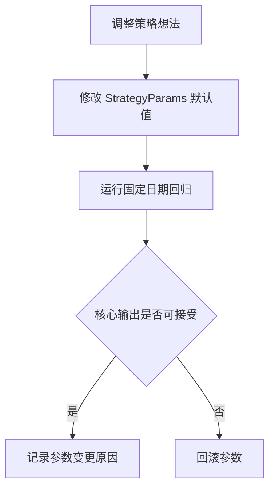
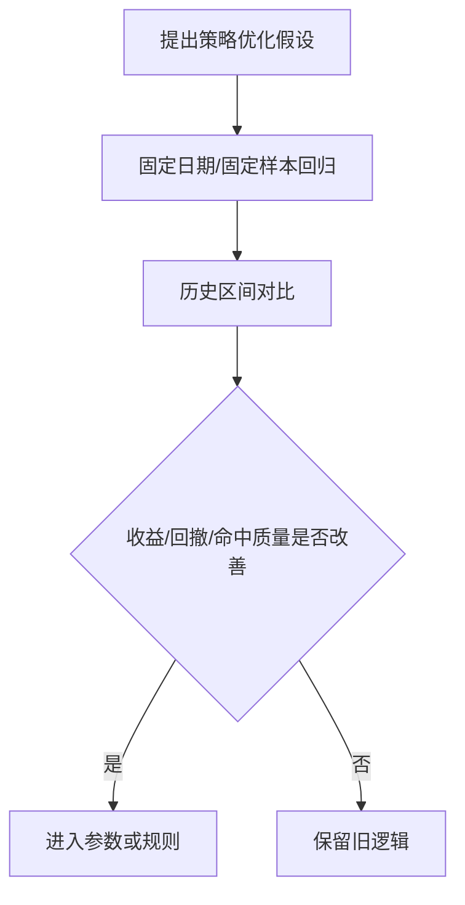
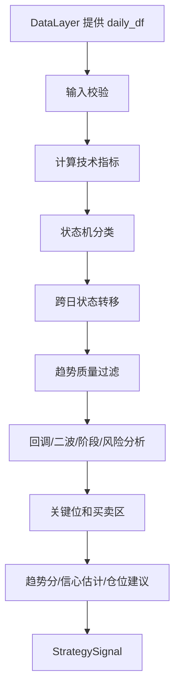
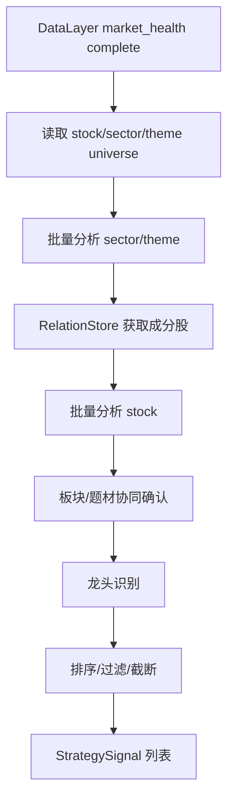
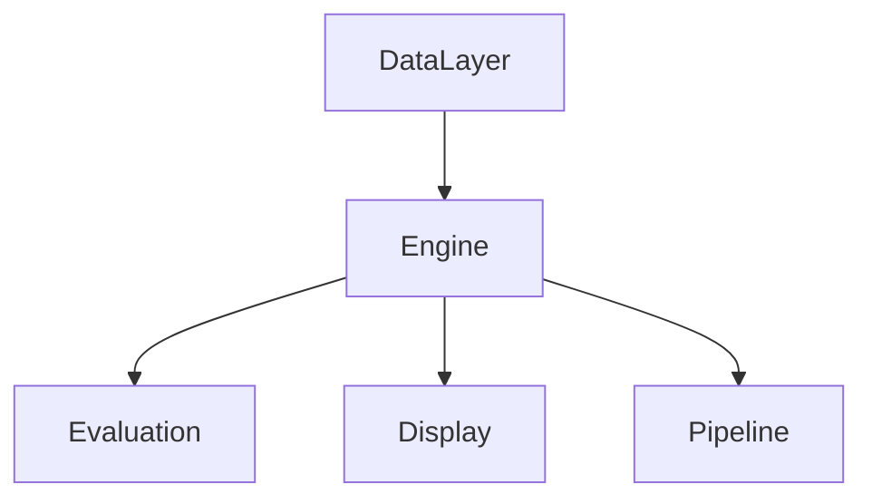

# TFS v2 Engine 策略层设计

> 本文档是 v2 策略层/趋势判定层的模块设计。总设计见 `v2/REFACTOR_MANUAL.md`，数据输入契约见 `v2/doc/data_management_design.md`。
>
> 设计原则：这是重构，不是推倒重写。第一阶段优先复用旧系统已验证逻辑，把职责从 `src/enhanced_actions.py` 中拆清楚，形成可落地、可测试、与展示解耦的 engine 主链路。

---

## 1. 本层职责

Engine 层只负责“把 DataLayer 提供的行情和关系数据，计算成可解释的策略信号”。

Engine 层负责：

1. 计算技术指标。
2. 判断趋势状态。
3. 执行趋势质量过滤。
4. 分析回调、二波、顶部风险、关键位。
5. 计算趋势分、信心估计、仓位建议、行动提示。
6. 计算趋势分、信心估计、仓位建议、行动提示。
7. 基于板块/题材关系做漏斗筛选和协同确认。
8. 输出稳定的策略结果对象 `StrategySignal`。

Engine 层不负责：

- 不直接拉取数据。
- 不直接读 parquet、JSON、目录。
- 不生成 HTML。
- 不拼展示卡片文案。
- 不维护 dashboard 文件。
- 第一阶段不重写整套策略，但允许修正旧系统中已经确认的口径错误、风险默认和字段语义问题。

---

## 2. 旧系统策略流程现状

旧系统实际策略入口是 `src/enhanced_actions.py`。它是事实上的小型策略系统，横跨数据、策略、展示三层。

当前主要流程：

```mermaid
flowchart TD
    A[EnhancedActionGenerator.generate(date)] --> B[_check_data_completeness]
    B --> C[_scan_best_etfs / _scan_best_stocks]
    C --> D[_load_price_data]
    D --> E[_slice_to_date]
    E --> F[_calc_indicators]
    F --> G[_determine_state]
    G --> H[StateMachine.transition]
    H --> I[趋势质量过滤]
    I --> J[PullbackAnalyzer / SecondWaveDetector]
    J --> K[_calc_trend_context / confidence / score]
    K --> L[_calc_buy_sell_zone / key_levels / position]
    L --> M[_build_card]
    M --> N[enhanced_actions JSON]
```

问题不在于没有策略设计，而在于：

- 数据读取、策略计算、展示拼装都在一个类里。
- `_build_card` 既做策略判断又做卡片字段组装。
- 状态机、回调、二波、评分等逻辑散落在多个位置。
- `src/engine/` 和 `src/funnel/` 里已有可复用模块，但没有成为主流程。
- 策略输出直接面向展示 dict，缺少中间策略对象。

---

## 3. 可复用旧代码资产

第一阶段优先复用，不重写稳定行为。

| 旧代码 | 当前职责 | v2 归属 | 处理策略 |
|--------|----------|---------|----------|
| `src/enhanced_actions.py::_ma/_ema/_rsi/_bbands/_macd/_mfi` | 技术指标 | `v2/engine/indicators.py` | 复制并保持公式一致 |
| `src/enhanced_actions.py::_calc_indicators` | 指标聚合 | `v2/engine/indicators.py` | 拆出纯函数 |
| `src/engine/state_machine.py` | 状态机 classify/transition | `v2/engine/classifier.py` 或直接复用 | 第一阶段保持语义 |
| `src/engine/conditions.py` | 结构/量能/持续性条件 | `v2/engine/filters.py` | 复用为质量过滤依据 |
| `src/engine/pullback.py` | 回调分析 | `v2/engine/analyzers.py` | 复用 |
| `src/engine/second_wave.py` | 二波检测 | `v2/engine/analyzers.py` | 复用 |
| `src/engine/stage.py` | 阶段分类 | `v2/engine/analyzers.py` | 复用 |
| `src/engine/pivots.py` | 高低点/关键位 | `v2/engine/levels.py` | 复用 |
| `src/funnel/*` | 板块/题材/个股/ETF 漏斗 | `v2/engine/funnel.py` | 第一阶段先接板块/题材/个股，ETF 后续 |
| `src/enhanced_actions.py::_calc_trend_score` | 趋势评分 | `v2/engine/scoring.py` | 迁移后统一为 0-100 主分口径 |
| `src/enhanced_actions.py::_calc_probability` | 启发式情景估计 | `v2/engine/scoring.py` | 迁移但改名为 confidence/scenario_estimate，不再称统计概率 |
| `src/enhanced_actions.py::_calc_position` | 仓位建议 | `v2/engine/scoring.py` | 迁移但修正“缺失市场状态默认绿灯”的风险默认 |

---

## 4. 不可再拆的功能点

第一阶段按最小功能点拆分，避免继续形成万能文件。

### 4.1 单标的分析功能点

1. **输入校验**：确认 `daily_df` 字段、长度、日期排序满足计算要求。
2. **指标计算**：MA、EMA、MACD、RSI、MFI、BOLL、成交量均线等。
3. **基础状态分类**：调用状态机输出 state、label、reason。
4. **跨日状态转移**：基于上一日 state 和当日事件做 transition。
5. **趋势质量过滤**：过滤弱趋势、伪突破、趋势破坏、均线结构不佳。
6. **回调分析**：识别健康回调、过深回调、可加仓区域。
7. **二波检测**：识别二波启动或二波确认。
8. **阶段分类**：启动、延续、加速、尾声、破坏等阶段标签。
9. **顶部风险检测**：顶背离、连续下跌、放量滞涨等风险 flags。
10. **关键位计算**：支撑、压力、止损、突破位。
11. **趋势分与信心估计**：输出 0-100 趋势分 `score`，以及启发式 `confidence/scenario_estimate`。
12. **仓位建议**：输出 position_hint，不直接生成展示文案，且不得在市场环境缺失时默认满风险。
13. **策略信号输出**：组装 `StrategySignal`。

### 4.2 全市场扫描功能点

1. **读取 universe**：通过 DataLayer 获取 stock/etf/sector/theme 列表。
2. **行情健康准入**：只消费通过 market_health 的数据。
3. **批量单标的分析**：对 universe 中每个标的运行单标的分析。
4. **板块/题材关系注入**：通过 RelationStore 给个股补充关系上下文。
5. **板块/题材协同确认**：统计成分股趋势占比和龙头强度。
6. **排序与截断**：按 score、state、风险 flags 排序，输出候选池。
7. **结果留痕**：每次输出记录 `market_date`、`relation_version`、engine 版本。

---

## 5. 预期效果

第一阶段完成后，Engine 层应达到这些效果：

1. `enhanced_actions.py` 中策略计算职责被拆出，展示拼装不再和核心策略混在一起。
2. 单个标的可以独立分析，输出稳定的 `StrategySignal`。
3. 全市场扫描可以通过 DataLayer 输入，而不是自己扫目录。
4. 板块/题材关系可以参与协同确认，但关系缺失时不影响基础趋势判断。
5. 旧策略主体行为基本保持一致，但字段语义、评分口径、风险默认等已确认问题必须修正；固定日期/固定标的的 state、score、关键 flags 可对比验证。
6. 展示层未来只需要消费 `StrategySignal`，不需要重新计算趋势。
7. 新增策略或调整评分时有明确 owner，不再往一个万能文件里塞逻辑。

第一阶段不追求：

- 不追求重写策略体系。
- 不追求全新评分模型。
- 不追求 ETF holdings 强协同。
- 不追求一步替换整个 `enhanced_actions.py`。
- 不追求 display 同步重构。

---

## 6. 模块划分

第一阶段建议使用这些文件：

```text
v2/engine/
├── __init__.py          # Engine 门面
├── signal.py            # StrategySignal / EngineContext 数据结构
├── params.py            # StrategyParams，集中管理阈值/权重/开关
├── indicators.py        # 技术指标和指标聚合
├── classifier.py        # 状态机 classify/transition 封装
├── filters.py           # 趋势质量过滤
├── analyzers.py         # pullback / second_wave / stage / risk flags
├── levels.py            # key levels / support / resistance
├── scoring.py           # score / confidence / scenario_estimate / position_hint
└── funnel.py            # sector/theme/stock 漏斗编排
```

### 6.1 `signal.py`

定义 engine 的稳定输出，不面向展示卡片。

```python
@dataclass
class StrategySignal:
    code: str
    name: str
    dtype: str
    market_date: str
    relation_version: str | None
    state: int
    state_label: str
    score: float                 # 0-100 主评分，不允许突破口径
    confidence: float            # 启发式信心估计，不是统计概率
    scenario_estimate: dict       # up/flat/down 等情景估计，可选
    action_hint: str
    position_hint: dict
    indicators: dict
    trend_context: dict
    relations: dict
    risk_flags: list[str]
    signals: dict
```

### 6.2 `params.py`

集中管理策略阈值、评分权重和功能开关。以后调整策略、分数标准或新增指标时，优先改参数和局部模块，不允许把魔法数字散落到各文件。

```python
@dataclass
class StrategyParams:
    ma_periods: tuple[int, ...] = (5, 10, 20, 60, 120, 250)
    rsi_period: int = 14
    macd_fast: int = 12
    macd_slow: int = 26
    macd_signal: int = 9
    min_history_days: int = 250
    breakout_lookback: int = 20
    pullback_max_pct: float = 0.10
    pullback_volume_shrink_ratio: float = 0.80
    pullback_volume_expand_ratio: float = 1.30
    score_min: float = 0.0
    score_max: float = 100.0
    unknown_market_position_cap: float = 0.50
    top_divergence_score_penalty: float = 8.0
    sector_theme_bonus_max: float = 8.0
    score_weights: dict = field(default_factory=dict)
    enabled_indicators: set[str] = field(default_factory=set)
```

第一阶段可以先用代码内默认参数，不强制引入 YAML 配置。等主链路稳定后，再把 `StrategyParams` 接到 `v2/assets/config/strategy.yaml`。

### 6.3 `indicators.py`

从 `enhanced_actions.py` 迁移指标函数。第一阶段保持公式和字段名一致，避免行为漂移。

### 6.4 `classifier.py`

封装 `StateMachine.classify` 和 `StateMachine.transition`。它只负责状态，不负责评分和展示文案。

### 6.5 `filters.py`

承接旧系统里散落的过滤逻辑，例如弱趋势过滤、均线空头过滤、趋势破坏过滤、涨幅/回撤约束。

### 6.6 `analyzers.py`

组合回调、二波、阶段、顶部风险等分析。它可以复用旧 `PullbackAnalyzer`、`SecondWaveDetector`、`StageClassifier`。

### 6.7 `scoring.py`

承接趋势评分、信心估计、仓位建议。第一阶段不是简单照搬旧公式，而是按“可安全直接修正”和“需要回测后再改”分层处理：

1. 趋势主分 `score` 固定为 0-100，修正旧 `_calc_trend_score` 注释 0-100 但实际上限 150 的口径冲突。
2. 旧 `_calc_probability` 迁移为 `confidence` / `scenario_estimate`，保留启发式计算思想，但不再称为统计概率。
3. 旧 `_calc_position` 迁移为 `position_hint`，状态只作为仓位输入之一，不允许 state 直接等于最终仓位。
4. 缺失市场环境时使用 `unknown_market_position_cap`，不得默认绿灯或满风险。
5. 顶背离、放量回撤、跌破前低、触及 MA60 等风险信号进入 `risk_flags`，并参与扣分或仓位上限调整。

### 6.8 `funnel.py`

编排板块、题材、个股漏斗：

1. 先分析板块/题材趋势。
2. 通过 RelationStore 找成分股。
3. 分析成分股趋势。
4. 识别龙头和协同确认。
5. 输出候选池。

ETF 直筛保留接口，第二阶段强化。

---

## 7. 策略可调机制

策略层必须支持快速调整指标、阈值、分数标准和功能开关，但第一阶段不能为了配置化引入过重框架。

### 7.1 参数集中化

所有可调参数必须集中在 `StrategyParams` 或明确的参数对象里：

- 指标周期：MA、RSI、MACD、BOLL。
- 过滤阈值：最小历史天数、回调最大幅度、突破窗口、量能放大倍数。
- 评分权重：趋势结构、量能、持续性、回调质量、板块/题材协同。
- 功能开关：是否启用二波检测、是否启用顶部风险、是否启用题材协同。

禁止事项：

- 禁止在 `classifier.py`、`filters.py`、`scoring.py` 中散落无法追踪的魔法数字。
- 禁止为了调整一个分数权重而修改多个文件。
- 禁止策略参数和展示文案绑定。

### 7.2 调整路径

第一阶段调整路径：



第二阶段可以扩展为：

```text
v2/assets/config/strategy.yaml -> StrategyParams -> Engine
```

但配置文件不是第一阶段必需项，避免设计过重。

### 7.3 新增指标规范

新增指标必须遵守：

1. 先放入 `indicators.py`，只做纯计算。
2. 再由 `filters.py`、`scoring.py` 或 `analyzers.py` 消费。
3. 必须在 `StrategySignal.indicators` 或 `signals` 中留痕。
4. 必须说明该指标影响的是“过滤、评分、风险提示、仓位”中的哪一类。
5. 不能直接影响展示文案，展示层只能消费 engine 输出。

---

## 8. 策略内容优化决策

结构重构不等于策略已经最优。本阶段允许把已经确认的旧系统问题直接修正进 v2，但必须区分三类：

1. **直接生效**：字段命名、评分口径、风险默认、职责边界等明确错误或误导。
2. **参数化后保留**：会影响选股结果但旧逻辑仍可用的阈值、权重和判断条件。
3. **回测后再改**：会改变趋势状态、候选排序、买卖时机的策略升级。

### 8.1 旧策略中合理、必须复用的部分

以下逻辑方向是合理的，第一阶段不推倒重写：

1. **六状态趋势模型**：下跌趋势、下跌中的反弹、翻转确认中、上涨趋势、上涨中的回调、转跌确认中。这套模型比简单买卖信号更适合趋势跟随系统。
2. **结构/量能/持续性三类趋势条件**：`src/engine/conditions.py` 的拆法是对的，v2 继续保留，但阈值必须收敛到 `StrategyParams`。
3. **状态机 classify + transition 两段式设计**：先判断当日状态，再结合上一日状态做转移，适合做跨日连续策略。
4. **回调、二波、阶段、关键位分析**：这些分析模块已经存在，第一阶段优先复用，避免重写造成行为漂移。
5. **板块/题材/个股漏斗思想**：趋势系统不能只看单股，板块和题材协同必须进入 engine 输出。

### 8.2 第一阶段直接生效的修正

这些修正不是激进策略优化，而是为了消除旧系统中的错误口径和风险隐患，第一阶段直接进入 v2。

#### 8.2.1 `probability` 改为信心估计

旧 `_calc_probability` 不是统计概率。它根据涨跌方向、涨幅、量比、RSI、BOLL 位置等指标拼出 up/flat/down 的启发式比例。

v2 决策：

- `StrategySignal` 不再使用 `probability` 作为主字段。
- 使用 `confidence` 表示综合信心，范围 0-100。
- 使用 `scenario_estimate` 保存上涨/震荡/下跌等情景估计。
- 展示层如果要展示，也必须叫“信心”或“情景估计”，不能叫“胜率”或“真实概率”。

#### 8.2.2 `score` 固定为 0-100

旧 `_calc_trend_score` 注释写 0-100，但代码允许最高 150。这会让评分含义混乱，也会影响排序解释。

v2 决策：

- `score` 是主评分，固定 0-100。
- 超额优势不得突破 `score_max`。
- 如果需要额外解释，放入 `score_breakdown`，例如结构分、动量分、量能分、风险扣分、协同分。
- 排名只能使用明确口径的 `score` 或 `rank_score`，不得把 0-100 和 150 口径混用。

#### 8.2.3 缺失市场环境不得默认绿灯

旧 `_calc_position` 在没有实时市场数据时默认 `green`，等价于默认允许满风险。这对交易系统不安全。

v2 决策：

- 市场环境缺失时，`market_regime = unknown`。
- `unknown` 状态下仓位上限由 `StrategyParams.unknown_market_position_cap` 控制，默认 0.50。
- `position_hint` 必须记录 `market_regime_source` 和 `cap_reason`。
- 不允许任何模块在市场环境缺失时隐式假设全仓可行。

#### 8.2.4 状态不直接等于仓位

旧状态机里的仓位映射过于粗，例如上涨趋势/上涨中回调可以直接给 100%。这会把趋势判断和风险预算混在一起。

v2 决策：

- `classifier.py` 只输出趋势阶段。
- `scoring.py` 根据 state、score、risk_flags、market_regime、波动和协同信号生成 `position_hint`。
- `position_hint` 至少包含：`suggested_ratio`、`max_ratio`、`base_ratio`、`risk_adjustment`、`reason`。
- 状态 4/5 不能天然等于满仓，只能提高基础仓位倾向。

#### 8.2.5 顶部风险进入 risk_flags 和扣分

旧 `_detect_top_divergence` 只影响文案，不参与评分、过滤或仓位。这不合理。

v2 决策：

- 顶背离输出为 `risk_flags`，例如 `top_divergence`。
- 顶背离默认扣分由 `StrategyParams.top_divergence_score_penalty` 控制。
- 若顶背离叠加放量滞涨、跌破 MA20、连续下跌，应进一步降低 `position_hint.max_ratio`。
- 顶部风险不直接改变趋势状态，除非状态机本身已经触发转弱条件。

#### 8.2.6 风险信号统一归口

旧系统风险判断散落在 `_build_card`、评分、文案和局部 analyzer 中。

v2 决策：

- 所有风险统一进入 `risk_flags` 和 `score_breakdown.risk_penalty`。
- 第一阶段必须覆盖：`top_divergence`、`volume_pullback`、`broke_prev_low`、`touched_ma60`、`trend_breakdown`、`insufficient_history`。
- 风险信号可以降低评分和仓位，但不得在展示层重新计算。

### 8.3 第一阶段参数化但不直接改结论的部分

这些旧逻辑有优化空间，但直接改会影响历史输出。第一阶段先集中到 `StrategyParams`，默认尽量贴近旧行为。

1. **MA20/MA60 门槛**：保留旧趋势语义，但周期和容忍区间参数化。
2. **回调最大幅度**：旧逻辑固定约 -10%，第一阶段用 `pullback_max_pct` 管理；后续再引入 ATR/波动率归一。
3. **缩量/放量阈值**：旧逻辑约 0.8/1.3，第一阶段放入 `pullback_volume_shrink_ratio` 和 `pullback_volume_expand_ratio`。
4. **趋势状态转移阈值**：先复用旧 state machine，所有阈值逐步显性化。
5. **板块/题材协同权重**：第一阶段可以轻量影响评分，但加分上限由 `sector_theme_bonus_max` 控制，不能压过个股趋势本身。

### 8.4 必须回测后再改的部分

以下内容不能在结构重构中顺手改掉，必须通过固定日期样本和历史区间回放：

1. 重配趋势评分权重。
2. 大改六状态切换规则。
3. 新增 ADX、ATR、相对强度等指标并直接参与主评分。
4. 改变二波启动/确认的买入时机。
5. 让板块/题材协同成为强过滤条件。
6. 改变候选池排序主键。

### 8.5 策略优化评估原则

任何策略内容优化都必须通过三步：



策略优化必须单独提交、单独记录，不能和结构重构混在一起。

### 8.6 内容优化优先级

第二阶段优先评估：

1. 趋势状态判定是否需要“板块/题材协同确认”。
2. 趋势分 `score` 是否拆成可解释的子分：结构分、动量分、量能分、风险扣分、协同分。
3. 旧概率字段已经确定改名为 `confidence` 或 `scenario_estimate`，后续只评估信心估计公式是否需要调整。
4. 回调健康判断是否引入 ATR 或波动率归一化。
5. 顶部风险 flags 是否统一为扣分项，而不是直接改变状态。

---

## 9. Engine 流程图

### 9.1 单标的分析流程



### 9.2 全市场策略流程



### 9.3 分层依赖



Engine 可以依赖 DataLayer。DataLayer 不能依赖 Engine。Display 不能绕过 Engine 重新计算策略指标。

---

## 10. 第一阶段 API

```python
class Engine:
    def analyze_symbol(
        self,
        dtype: str,
        code: str,
        daily_df,
        *,
        market_date: str,
        name: str = "",
        relation_profile: dict | None = None,
        prev_state: int | None = None,
    ) -> StrategySignal:
        ...

    def run_universe(
        self,
        date: str,
        data_layer,
        *,
        scope: str = "stock",
        top_n: int = 50,
    ) -> list[StrategySignal]:
        ...
```

第一阶段只要求：

- `analyze_symbol` 能稳定输出单标的 `StrategySignal`。
- `run_universe` 能跑 stock universe。
- sector/theme 协同可以先作为信号字段输出，不强行参与复杂评分。

---

## 11. 验证方式

第一阶段必须用旧系统做回归基准。

### 11.1 单标的回归验证

选固定日期和固定标的，例如：

- `2026-06-12`
- `2026-06-22`
- 中际旭创、核心 ETF、一个板块指数、一个题材指数

对比字段：

- state
- state_label
- score
- confidence
- scenario_estimate
- position_hint
- pullback / second_wave / top_divergence flags

允许展示文案不同。允许以下已确认修正导致字段名或数值口径变化：

- 旧 `probability` 对应新 `confidence/scenario_estimate`。
- 旧 `trend_score` 若超过 100，新 `score` 必须压到 0-100 口径。
- 旧缺失市场环境默认绿灯，新 `position_hint` 必须降级为 unknown/保守上限。
- 旧顶背离只影响文案，新结果必须进入 `risk_flags`。

除上述修正外，不允许 state、核心趋势含义和主要候选原因无解释漂移。

### 11.2 全市场候选验证

使用旧 `enhanced_actions_{date}.json` 作为参考，比较：

- top 股票/ETF 候选是否大体一致。
- 被过滤掉的原因是否可解释。
- 新 engine 是否因为数据 health 或关系缺失主动降级。

### 11.3 结构验证

- engine 不直接 `pd.read_parquet`。
- engine 不直接读 `v2/data/meta/*.json`。
- engine 不生成 HTML 或展示卡片字段。
- display 不重新计算趋势指标。

---

## 12. 实施优先级

### 12.1 第一阶段必做

1. 建立 `StrategySignal` 数据结构。
2. 建立 `StrategyParams` 默认参数对象。
3. 迁移指标函数到 `indicators.py`。
3. 封装状态机到 `classifier.py`。
4. 抽取趋势质量过滤到 `filters.py`。
5. 组合回调、二波、阶段、风险分析到 `analyzers.py`。
6. 迁移评分、信心估计、仓位到 `scoring.py`，同时落实 0-100 分数、unknown 市场环境、risk_flags 扣分等直接修正。
7. 实现 `Engine.analyze_symbol`。
8. 使用固定日期样本与旧输出做等价验证。

### 12.2 第二阶段必做

1. 实现 `Engine.run_universe`。
2. 接入 DataLayer universe 和关系版本。
3. 接入板块/题材协同确认。
4. 复用 `src/funnel` 的排序、龙头识别、置信度逻辑。
5. 输出候选池 `StrategySignal` 列表。

### 12.3 后续增强

- ETF holdings 协同。
- 多源关系置信度参与评分。
- 更细的市场宽度和环境过滤。
- 更复杂的风险预算和仓位模型。
- 与 evaluation 层联动优化参数。

---

## 13. 实施准入规则

本章是 Engine 第一阶段实现前的准入约束。只要后续开始写代码，就必须按这里执行；不能把这些规则留到实现时临场判断。

### 13.1 任务拆分规则

第一阶段必须按模块顺序小步实现，每一步只完成一个明确 owner：

1. 先建立 `StrategySignal` 和 `StrategyParams`，固定输出契约和参数入口。
2. 再迁移 `indicators.py`，只做指标纯计算，不混入策略判断。
3. 再封装 `classifier.py`，只处理状态分类和状态转移。
4. 再实现 `filters.py` 和 `analyzers.py`，分别承接趋势质量过滤、回调、二波、阶段、风险分析。
5. 再实现 `scoring.py`，落实 score、confidence、scenario_estimate、position_hint。
6. 最后实现 `Engine.analyze_symbol`，把各模块串成单标的分析主链路。

禁止事项：

- 禁止一次性实现整个 Engine。
- 禁止在 `Engine.analyze_symbol` 中重新堆出一个新的万能函数。
- 禁止为了赶进度绕过 `StrategySignal` 或 `StrategyParams`。
- 禁止边实现边扩大到 display、pipeline 或 dashboard 重构。

### 13.2 回归验证规则

每完成一个会影响策略输出的模块，都必须用固定日期、固定标的和旧系统输出做对比。

最低验证要求：

1. 指标迁移后，对比关键指标数值，例如 MA、MACD、RSI、BOLL、成交量均线。
2. 状态机封装后，对比 `state`、`state_label` 和状态转移结果。
3. 回调/二波/风险分析迁移后，对比 `pullback`、`second_wave`、`risk_flags`。
4. 评分和仓位迁移后，对比 `score`、`confidence/scenario_estimate`、`position_hint`。
5. `Engine.analyze_symbol` 完成后，对比完整 `StrategySignal`。

允许变化的内容仅限第 8 章已经确认的直接修正，例如：

- `probability` 改为 `confidence/scenario_estimate`。
- `score` 从旧 150 上限修正为 0-100。
- 缺失市场环境从默认绿灯改为 unknown/保守仓位上限。
- 顶背离从只影响文案改为进入 `risk_flags` 和扣分。

除这些已确认修正外，策略含义不能无解释漂移。

### 13.3 文档反写规则

实现过程中如果发现本文档没有覆盖的细节，必须先更新本文档，再继续实现。

需要反写的情况包括：

1. 旧逻辑比文档描述更复杂。
2. 字段名、字段结构或默认参数需要调整。
3. 某个旧函数不能直接复用，需要替代方案。
4. 回归验证发现新旧行为差异，但差异是合理的。
5. 某个策略优化必须从“直接生效”降级为“回测后再改”。

禁止事项：

- 禁止实现时凭感觉改设计但不更新文档。
- 禁止代码已经改变策略含义，文档仍写“保持旧行为”。
- 禁止把临时妥协藏在代码里，必须在设计文档中留下决策记录。

---

## 14. 当前设计决策

当前确认的设计决策：

- Engine 第一阶段不重写整套策略，但直接修正字段语义、评分上限、风险默认和仓位职责边界。
- 第一阶段优先复用 `src/enhanced_actions.py`、`src/engine/`、`src/funnel/` 中已有稳定逻辑。
- 策略阈值、分数权重、功能开关必须收敛到 `StrategyParams`，避免魔法数字继续扩散。
- Engine 输出 `StrategySignal`，不输出展示卡片。
- DataLayer 是唯一数据来源。
- 板块/题材关系在第一阶段参与协同确认；ETF holdings 第二阶段接入。
- 第一阶段直接生效的策略修正以第 8 章为准；除第 8 章列出的修正外，其余策略优化必须通过回归或回测后再进入主逻辑。
