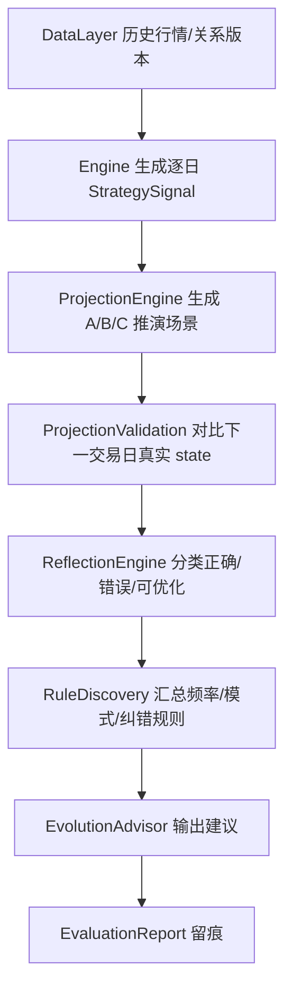
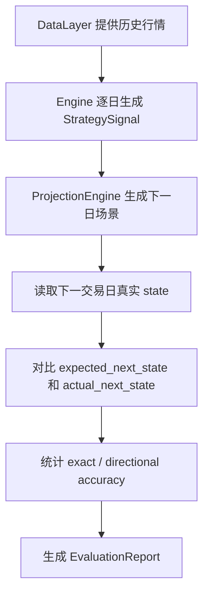

# TFS v2 推演评估与自进化层设计

> 本文档是 v2 evaluation 层的模块设计。总设计见 `v2/REFACTOR_MANUAL.md`，上游策略信号契约见 `v2/doc/engine_design.md`。
>
> 设计原则：第一阶段不做交易收益回测，不模拟资金曲线，不优化买卖绩效。evaluation 层先专注于“推演生成、历史回放验证、错误模式归因、自进化建议”。它是 Engine 的验证层和反馈层，不是另一个策略引擎。
>
> 重构边界：即使本层从“推演回测”重命名为“推演评估与自进化”，也必须明确这是在旧系统已有 `ScenarioEngine`、`ProjectionBacktest` 和历史状态验证流程基础上的优化重构，不是推倒重来。命名变化只用于澄清职责边界，不能成为重写既有可用逻辑的理由。

---

## 1. 本层定位

Evaluation & Evolution 层负责回答三个问题：

1. **推演**：基于今天的 `StrategySignal`，未来可能出现哪些状态路径？
2. **验证**：这些推演在历史上准不准？哪些状态、场景、市场环境最容易错？
3. **自进化**：根据验证结果，应该怎样调整推演权重、风险提示或策略参数建议？

本层负责：

1. 生成状态推演场景。
2. 用历史状态序列验证推演准确率。
3. 对 v2 Engine 输出和旧系统输出做回归对比。
4. 统计错误模式、状态准确率、场景准确率。
5. 输出自进化建议。
6. 记录评估结果，供 pipeline 和 display 消费。

本层不负责：

- 不直接拉取数据。
- 不计算技术指标。
- 不重新判断趋势状态。
- 不生成候选池。
- 不生成 HTML。
- 第一阶段不做交易收益回测、资金曲线、最大回撤、胜率盈亏比。
- 第一阶段自进化不自动修改 Engine 主逻辑。

---

## 2. 为什么暂不做交易回测

“回测”容易混淆两个完全不同的目标：

1. **交易绩效回测**：模拟买卖、仓位、收益率、回撤、胜率。
2. **推演验证**：验证状态推演和策略信号是否稳定、是否可解释、是否比旧系统更可靠。

v2 第一阶段的核心任务是重构系统主链路。此时 Engine 的输出契约、字段口径、风险信号还在建立。如果过早做交易绩效回测，会把数据问题、状态问题、仓位问题、买卖规则问题混在一起，反而降低落地确定性。

因此第一阶段明确：

- 保留并强化历史推演验证。
- 保留固定样本回归对比。
- 保留错误模式归因。
- 保留自进化建议。
- 暂不做交易收益回测。

交易绩效回测可以作为后续增强，但不能抢第一阶段主线。

---

## 3. 旧系统可复用资产

本章是实施约束，不只是参考材料。v2 evaluation 层必须先复用旧系统已经跑通的推演和统计思路，再做职责归位、字段规范和数据入口改造。

禁止事项：

- 禁止因为模块重命名就重新设计一套全新的推演模型。
- 禁止跳过旧 `ScenarioEngine` 的状态场景映射，直接凭感觉写新场景。
- 禁止跳过旧 `ProjectionBacktest` 的准确率、按状态、按场景、错误模式统计思路。
- 禁止把“自进化”做成脱离旧推演验证基础的新系统。

| 旧代码 | 当前职责 | v2 归属 | 处理策略 |
|--------|----------|---------|----------|
| `src/analysis/scenario.py` | 根据状态生成明日推演场景 | `v2/evaluation/projection.py` | 复用状态到场景的基本映射，去掉展示化动作文案 |
| `src/analysis/projection_backtest.py` | 遍历历史状态，验证推演准确率 | `v2/evaluation/validation.py` | 复用统计思路，改名为 ProjectionValidation，避免交易回测误解 |
| `src/analysis/reflection.py` | 分析推演正误、错误分类、提取经验模式 | `v2/evaluation/reflection.py` 或 `evolution.py` | 复用反思分类和完整性门控，第一阶段只产出建议 |
| `src/analysis/rule_discovery.py` | 从历史频率、正确模式、错误修正中发现规则 | `v2/evaluation/evolution.py` | 复用规则发现思路，但禁止第一阶段自动改主策略 |
| `src/analysis/projection_weights.py` | 管理各状态 A/B/C 场景权重 | `v2/evaluation/weights.py` | 复用默认权重、调整幅度限制和归一化逻辑，改为建议/实验权重 |
| `src/analysis/breadth.py` | 市场宽度统计 | `v2/evaluation/market.py` | 可复用为推演环境因子，第一阶段不强行影响主策略 |
| `src/analysis/comparison.py` | 跨日期趋势变化对比 | `v2/evaluation/comparison.py` | 复用为新旧/前后状态变化解释 |
| `src/analysis/beta.py` | 板块相对大盘 beta | `v2/evaluation/market.py` | 后续增强，第一阶段只保留设计入口 |
| `scripts/run_projection_backtest.py` | 全量推演验证脚本 | `v2/evaluation/runner.py` 或 pipeline 调用 | 复用执行流程，接入 DataLayer 和 Engine 输出 |
| `scripts/run_reflection_loop.py` | 推演、反思、规则发现、权重调整、再推演闭环 | `v2/evaluation/runner.py` | 复用闭环顺序，但第一阶段不自动落权重到主逻辑 |
| `tests/analysis/test_reflection.py` | 反思、规则发现、权重调整测试 | `tests/v2/evaluation/` | 迁移为 v2 evaluation 测试基准 |
| `dashboard/data/projection_log.json` | 推演验证结果 | `v2/data/evaluation/` | 第一阶段可参考字段，不继续写 dashboard/data |
| `dashboard/data/discovered_rules.json` | 规则发现结果 | `v2/data/evaluation/` | 第一阶段作为输出格式参考 |
| `dashboard/data/projection_weights.json` | 推演场景权重 | `v2/data/evaluation/` 或配置文件 | 第一阶段作为实验权重，不自动驱动主策略 |
| `dashboard/data/history_states_full.json` | 旧历史状态缓存 | DataLayer/Engine 输出替代 | 仅作为迁移验证参考，不作为 v2 长期核心数据源 |

旧系统里“推演回测”的思路是对的，但命名和边界需要调整。v2 中它不是交易回测，而是“推演验证”。

---

## 4. 第一阶段模块划分

```text
v2/evaluation/
├── __init__.py          # Evaluation 门面
├── projection.py        # ProjectionEngine，生成推演场景
├── validation.py        # ProjectionValidation，历史推演验证
├── regression.py        # RegressionComparator，新旧输出回归对比
├── reflection.py        # ReflectionEngine，正误反思和错误分类
├── evolution.py         # EvolutionAdvisor / RuleDiscovery，自进化建议
├── weights.py           # ProjectionWeights，实验权重管理
├── market.py            # 市场宽度 / beta 等评估环境因子
├── comparison.py        # 跨日趋势变化对比
├── metrics.py           # AccuracyStats / ErrorPattern 等统计结构
└── runner.py            # 本层独立运行入口，可被 pipeline 调用
```

第一阶段只做这些文件，不引入复杂实验平台。

### 4.1 第一阶段主链路



这条链路对应旧 `scripts/run_reflection_loop.py` 的“推演 → 验证 → 反思 → 规则发现 → 权重调整 → 再推演”，但 v2 第一阶段做两个边界收缩：

1. 权重调整只作为建议或实验输出，不自动写回主策略。
2. 再推演只用于验证建议是否可能改善准确率，不作为自动上线依据。

### 4.2 不可再拆的功能点

1. **推演场景生成**：根据当前 `StrategySignal.state` 生成 A/B/C 场景。
2. **场景权重读取**：按状态读取 A/B/C 权重，默认复用旧 `ProjectionWeights.DEFAULT_WEIGHTS`。
3. **历史状态回放**：按日期遍历历史 `StrategySignal`，构造“今天推演、明天验证”的样本。
4. **严格准确率统计**：预测状态和真实状态完全一致。
5. **方向准确率统计**：预测状态和真实状态方向一致，例如 4/5 偏强、1/2 偏弱。
6. **按状态统计**：统计每个 current_state 的推演准确率。
7. **按场景统计**：统计场景 A/B/C 的准确率和样本数。
8. **错误模式归因**：把错误分成可优化、不可控、样本不足等类别。
9. **规则发现**：从真实状态转换频率、正确模式、错误修正中生成候选规则。
10. **自进化建议**：输出权重、风险规则、状态场景覆盖的调整建议。
11. **回归对比**：对比旧 projection/reflection 输出和 v2 输出，识别异常漂移。
12. **报告输出**：生成可被 pipeline/display 消费的结构化报告。

### 4.3 第一阶段不做

- 不做资金曲线。
- 不做买入卖出成交模拟。
- 不做收益率、最大回撤、盈亏比、换手率。
- 不做自动调参上线。
- 不把自进化建议自动写入 Engine 主参数。
- 不因为准确率短期提升就自动替换旧推演规则。

---

## 5. 核心数据结构

### 5.1 `ProjectionScenario`

```python
@dataclass
class ProjectionScenario:
    label: str                 # A/B/C 或更明确的场景名
    probability_label: str     # 大概率/中概率/小概率
    weight: float              # 场景权重，0-1
    current_state: str
    expected_next_state: str
    conditions: list[str]      # 触发条件，不写展示文案
    action_hint: str | None    # 可选，只能来自策略建议，不做展示拼装
    risk_flags: list[str]
```

说明：

- 旧系统 `Scenario.action` 有大量操作文案，例如“加仓至1.5倍”。v2 第一阶段不直接继承这些激进操作文案。
- 推演场景只说明“可能怎么走”和“为什么”，交易动作应由 Engine 的 `position_hint` 和后续执行规则决定。

### 5.2 `ProjectionValidationResult`

```python
@dataclass
class ProjectionValidationResult:
    date: str
    code: str
    dtype: str
    current_state: str
    scenario_label: str
    expected_next_state: str
    actual_next_state: str
    is_exact: bool
    is_directionally_correct: bool
    error_type: str | None
```

### 5.3 `TradePlan`

`TradePlan` 是交易指导型推演输出，不是交易绩效回测。它回答“明天出现什么条件时应该做什么”，但不模拟真实资金账户、成交、收益曲线或自动下单。

```python
@dataclass
class TradeTrigger:
    scenario_label: str
    action_type: str              # buy/add/reduce/exit/hold/watch
    expected_next_state: str
    target_position_pct: float    # 单标的计划仓位比例，0-1
    trigger_conditions: list[str]
    risk_controls: list[str]
    evidence: dict

@dataclass
class TradePlan:
    code: str
    name: str
    dtype: str
    market_date: str
    current_state: str
    base_position_pct: float
    target_position_pct: float
    triggers: list[TradeTrigger]
    risk_controls: list[str]
    evidence: dict
```

第一版规则：

1. 输入只消费 `StrategySignal` 和 `ProjectionScenario`，不重复判状态。
2. 状态仓位基准复用旧 6 状态语义，单标的计划仓位参考旧 portfolio target pct：ETF state3/state4/state5/state3p 为 8%/15%/20%/5%，stock 为 3%/8%/10%/3%。
3. A/B/C 场景只转成结构化动作，不复用旧中文 action 文案。
4. evidence 第一版包含场景权重、历史转移频率/样本数/置信度等证据字段；后续再接完整验证输出。
5. Display 只能消费 `TradePlan`，不能在模板里计算买卖条件或仓位。

### 5.4 `EvaluationReport`

```python
@dataclass
class EvaluationReport:
    start_date: str
    end_date: str
    scope: str
    total: int
    exact_accuracy: float
    directional_accuracy: float
    by_state: dict
    by_scenario: dict
    top_errors: list[dict]
    evolution_suggestions: list[dict]
    projections: dict
    trade_plans: dict
```

---

## 6. 推演生成设计

`ProjectionEngine` 的输入是 Engine 输出的 `StrategySignal`，不是原始 K 线。

```python
class ProjectionEngine:
    def generate(
        self,
        signal: StrategySignal,
        *,
        params: EvaluationParams | None = None,
    ) -> list[ProjectionScenario]:
        ...
```

推演逻辑第一阶段沿用六状态模型：

| 当前状态 | 场景 A | 场景 B | 场景 C |
|----------|--------|--------|--------|
| 1 下跌趋势 | 继续下跌/弱势 | 反弹到状态 2 | 无 |
| 2 下跌反弹 | 继续反弹 | 突破进入状态 3 | 反弹失败回状态 1 |
| 3 翻转确认 | 继续确认 | 放量确认到状态 4 | 假突破回状态 1 |
| 4 上涨趋势 | 趋势延续 | 缩量回调到状态 5 | 转弱到状态 3' |
| 5 上涨回调 | 回调结束回状态 4 | 继续回调 | 转弱到状态 3' |
| 3' 转跌确认 | 假跌破收复回状态 4 | 继续转弱确认 | 破位回状态 1 |

第一阶段默认权重可沿用旧系统：

```python
{"A": 0.60, "B": 0.30, "C": 0.10}
```

但权重必须进入 `EvaluationParams` 或 `ProjectionWeights`，不能硬编码在推演函数里。

### 6.1 旧推演规则合理性审查

旧 `src/analysis/scenario.py` 的六状态 A/B/C 场景方向基本合理，应该作为 v2 第一阶段的默认推演骨架：

1. 状态 4 以上涨延续为 A、缩量回调为 B、转弱为 C，符合趋势跟随语义。
2. 状态 5 以回调结束为 A、继续回调为 B、转弱为 C，符合“上涨中的回调”定义。
3. 状态 3 以继续确认、放量确认、假突破失败三种路径覆盖，适合翻转确认阶段。
4. 状态 1/2 保持弱势和反弹观察，适合空仓/观察阶段。
5. 状态 3' 的“假跌破收复/继续转弱/破位”三分法可以保留。

但旧规则有四个需要归位优化的点：

1. **动作文案过度交易化**：例如“加仓至1.5倍”“全部清仓”。这些不应由推演层直接决定，v2 中只保留为可选 `action_hint`，最终仓位以 Engine 的 `position_hint` 为准。
2. **权重来源经验化**：默认 A/B/C 权重多数是 0.60/0.30/0.10 或局部变体。v2 第一阶段复用默认值，但必须留在 `ProjectionWeights` 或 `EvaluationParams`，后续由验证结果提出调整建议。
3. **旧推演主要只看 state**：v2 第一阶段仍以 state 为主，避免重写；但接口要允许读取 `risk_flags`、`confidence`、`market_regime` 作为后续权重修正因子。
4. **3' 表达需要统一**：旧系统同时出现 `3'` 和 `3p`。v2 内部统一用一种规范表示，输出时再做展示适配。

### 6.2 第一阶段直接保留的默认状态场景

第一阶段不重新设计状态转移表。默认场景必须从旧 `ScenarioEngine` / `ProjectionBacktest._make_scenarios` 迁移：

| 当前状态 | 场景 A | 场景 B | 场景 C | 处理策略 |
|----------|--------|--------|--------|----------|
| 1 | 1 -> 1 | 1 -> 2 | 无 | 复用 |
| 2 | 2 -> 2 | 2 -> 3 | 2 -> 1 | 复用 |
| 3 | 3 -> 3 | 3 -> 4 | 3 -> 1 | 复用 |
| 4 | 4 -> 4 | 4 -> 5 | 4 -> 3' | 复用 |
| 5 | 5 -> 4 | 5 -> 5 | 5 -> 3' | 复用 |
| 3' | 3' -> 4 | 3' -> 3' | 3' -> 1 | 复用 |

任何新增场景都必须先进入 evolution 建议，不得直接进入主推演逻辑。

---

## 7. 历史推演验证设计

历史推演验证的目标不是判断“赚不赚钱”，而是判断“状态推演准不准”。

```python
class ProjectionValidation:
    def validate_range(
        self,
        start_date: str,
        end_date: str,
        data_layer,
        engine,
        projection_engine,
        *,
        scope: str = "sector",
    ) -> EvaluationReport:
        ...
```

验证流程：



准确率分两类：

1. **严格准确率 exact_accuracy**：预测状态和真实下一状态完全一致。
2. **方向准确率 directional_accuracy**：虽然状态不完全一致，但方向一致，例如 4/5 都属于偏强，1/2 都属于偏弱。

错误模式至少包括：

- `false_strength`：预测偏强，实际转弱。
- `false_weakness`：预测偏弱，实际转强。
- `missed_pullback`：没有预测到回调。
- `missed_breakdown`：没有预测到破位。
- `late_reversal`：反转确认滞后。

---

## 8. 回归对比设计

`RegressionComparator` 专门验证 v2 重构是否偏离旧系统。

```python
class RegressionComparator:
    def compare_symbol(
        self,
        old_record: dict,
        new_signal: StrategySignal,
    ) -> dict:
        ...

    def compare_universe(
        self,
        old_records: list[dict],
        new_signals: list[StrategySignal],
    ) -> dict:
        ...
```

对比内容：

- `state`
- `state_label`
- `score`
- `confidence/scenario_estimate`
- `position_hint`
- `risk_flags`
- 候选池是否大体一致
- 排序变化是否可解释

允许差异以 `v2/doc/engine_design.md` 第 8 章为准，例如 score 统一到 0-100、probability 改名、unknown 市场环境保守处理、顶背离进入 risk_flags。

---

## 9. 反思与自进化设计

自进化不是自动改代码，也不是自动改主策略。第一阶段只输出建议。

```python
class ReflectionEngine:
    def reflect(
        self,
        results: list[ProjectionValidationResult],
    ) -> tuple[list[ReflectionEntry], list[LearnedPattern]]:
        ...

class EvolutionAdvisor:
    def suggest(self, report: EvaluationReport) -> list[dict]:
        ...
```

v2 第一阶段必须复用旧 `ReflectionEngine` 和 `RuleDiscovery` 的三段式思路：

1. **反思分类**：正确、可优化、不可控。
2. **模式提取**：从正确推演中提取高置信度模式。
3. **规则发现**：从真实状态转换频率、正确模式和错误修正中生成建议。

旧系统中 `RuleDiscovery.apply_to_weights` 会把规则应用到权重。v2 第一阶段不直接照搬这个副作用，改为生成建议报告，由人工确认后再进入实验权重或后续参数调整。

建议类型：

1. **场景权重建议**：某状态下场景 A 长期过度乐观，则建议降低 A 权重。
2. **风险规则建议**：某类 `false_strength` 集中出现在顶背离后，则建议增强顶部风险扣分。
3. **状态转移建议**：某状态经常跳到另一个状态但现有场景没有覆盖，则建议新增或调整场景。
4. **样本不足提示**：某状态样本太少，不给优化建议。
5. **参数观察建议**：建议某个参数进入后续回测或人工评估。

第一阶段硬约束：

- 自进化建议只写入报告。
- 不自动修改 `StrategyParams`。
- 不自动修改 `EvaluationParams`。
- 不自动改变 Engine 主逻辑。
- 所有建议必须带证据：样本数、准确率、错误模式、影响范围。

---

## 10. EvaluationParams 与权重管理

```python
@dataclass
class EvaluationParams:
    default_scenario_weights: dict = field(default_factory=lambda: {"A": 0.60, "B": 0.30, "C": 0.10})
    min_samples_for_suggestion: int = 30
    weak_accuracy_threshold: float = 0.45
    strong_accuracy_threshold: float = 0.65
    enable_evolution_suggestions: bool = True
```

第一阶段用代码默认值，不引入配置文件。等主链路稳定后再考虑 `v2/assets/config/evaluation.yaml`。

### 10.1 ProjectionWeights 迁移原则

旧 `src/analysis/projection_weights.py` 已经有可复用的权重管理能力：

- 各状态默认 A/B/C 权重。
- 单次调整幅度限制。
- 权重归一化。
- 调整原因和日期留痕。

v2 第一阶段复用这些能力，但调整用途：

1. `ProjectionWeights` 只管理推演实验权重。
2. 权重变化不自动影响 Engine 主策略。
3. 权重建议必须来自 `ProjectionValidation`、`ReflectionEngine` 或 `RuleDiscovery` 的证据。
4. 每次权重调整必须保留 reason、support、confidence。
5. 如果新权重使验证准确率下降，必须能回退。

---

## 11. 存储输出

第一阶段输出建议放到：

```text
v2/data/evaluation/
├── projection_report_{start}_{end}_{scope}.json
├── regression_report_{date}.json
├── reflection_report_{start}_{end}_{scope}.json
├── discovered_rules_{start}_{end}_{scope}.json
├── projection_weights_experiment.json
└── evolution_suggestions_{start}_{end}_{scope}.json
```

输出必须包含：

- 评估时间范围。
- 使用的数据版本和关系版本。
- Engine 版本或参数摘要。
- 样本数量。
- 准确率。
- 错误模式。
- 自进化建议。

不再直接写入 `dashboard/data/`。展示层如果需要，后续从 v2 输出读取。

---

## 12. 第一阶段实施顺序

1. 建立 `ProjectionScenario`、`ProjectionValidationResult`、`EvaluationReport`。
2. 建立 `EvaluationParams` 和 `ProjectionWeights` 实验权重对象。
3. 从旧 `src/analysis/scenario.py` 迁移推演场景生成逻辑。
4. 从旧 `src/analysis/projection_backtest.py` 迁移准确率统计思路，改为 `ProjectionValidation`。
5. 从旧 `src/analysis/reflection.py` 迁移反思分类和模式提取逻辑。
6. 从旧 `src/analysis/rule_discovery.py` 迁移规则发现逻辑，输出建议而不是自动改主策略。
7. 实现 `RegressionComparator`，服务 Engine 重构验证。
8. 实现 `runner.py`，允许独立运行固定日期/区间评估。
9. 用旧 `history_states_full.json`、`projection_log.json`、`reflection_report.json`、`discovered_rules.json` 做迁移对比。

---

## 13. 验证标准

第一阶段完成时必须满足：

1. `ProjectionEngine.generate` 能基于 `StrategySignal` 生成稳定场景。
2. `ProjectionValidation` 能复现旧系统“按状态/按场景/总体准确率”的核心统计。
3. `ReflectionEngine` 能复现旧系统正确/可优化/不可控的基础错误分类。
4. `RuleDiscovery` 能复现旧系统的频率分析、模式挖掘、纠错规则输出。
5. `RegressionComparator` 能指出 v2 Engine 和旧系统输出的差异，并区分允许差异和异常漂移。
6. `EvolutionAdvisor` 能基于报告输出带证据的建议。
7. evaluation 层不直接读 dashboard 目录，不直接生成 HTML，不重新计算技术指标。
8. 第一阶段没有交易收益回测、资金曲线、最大回撤模块。

---

## 14. 实施准入规则

本章是 evaluation 层进入编码前的硬约束。后续实现不能只看模块名开写，必须先确认旧能力来源、迁移目标和验证方式。

### 14.1 旧能力先行规则

每实现一个 v2 evaluation 模块，必须先定位旧系统对应来源：

| v2 模块 | 必须先对齐的旧来源 | 对齐重点 |
|---------|--------------------|----------|
| `projection.py` | `src/analysis/scenario.py`、`src/analysis/projection_backtest.py` 的场景生成 | 状态到 A/B/C 场景映射、默认权重、3'/3p 表示 |
| `validation.py` | `src/analysis/projection_backtest.py` | 总体准确率、按状态准确率、按场景准确率、错误模式 |
| `reflection.py` | `src/analysis/reflection.py` | 正确/可优化/不可控分类、模式提取、完整性门控 |
| `evolution.py` | `src/analysis/rule_discovery.py` | 频率分析、正确模式、错误修正、规则置信度 |
| `weights.py` | `src/analysis/projection_weights.py` | 默认权重、调整幅度限制、归一化、原因留痕 |
| `runner.py` | `scripts/run_projection_backtest.py`、`scripts/run_reflection_loop.py` | 运行顺序、输入输出、闭环验证 |

禁止事项：

- 禁止未读旧实现就直接写新模块。
- 禁止因为 v2 模块名更清晰，就改变旧系统已经跑通的核心行为。
- 禁止把旧系统已有的统计口径替换成新的拍脑袋口径。
- 禁止为了“自进化”跳过推演验证和反思证据。

### 14.2 实现顺序规则

第一阶段必须按以下顺序实现：

1. 先实现数据结构：`ProjectionScenario`、`ProjectionValidationResult`、`EvaluationReport`、`EvaluationParams`。
2. 再迁移 `ProjectionEngine`，只复用旧状态场景映射，不引入新场景。
3. 再迁移 `ProjectionValidation`，先复现旧准确率统计。
4. 再迁移 `ReflectionEngine`，先复现旧反思分类。
5. 再迁移 `RuleDiscovery`，先输出规则建议，不应用到主策略。
6. 再迁移 `ProjectionWeights`，只作为实验权重，不自动影响 Engine。
7. 再实现 `RegressionComparator`，用于新旧结果对齐。
8. 最后实现 `runner.py`，串起完整链路。

禁止一次性把 projection、validation、reflection、evolution 写成一个大函数。

### 14.3 回归验证规则

每完成一个模块，都必须和旧系统输出做对比：

1. `ProjectionEngine` 对比旧 A/B/C 场景、状态流向和权重。
2. `ProjectionValidation` 对比旧总体准确率、按状态准确率、按场景准确率。
3. `ReflectionEngine` 对比旧反思分类结果和模式提取结果。
4. `RuleDiscovery` 对比旧规则输出结构、support、confidence。
5. `ProjectionWeights` 对比旧默认权重、调整幅度、归一化结果。
6. `runner.py` 对比旧 `run_reflection_loop.py` 的阶段顺序和关键产物。

允许差异：

- 输出目录从 `dashboard/data/` 迁移到 `v2/data/evaluation/`。
- 命名从 backtest 改为 validation/evaluation。
- 动作文案和交易执行解耦。
- 权重调整从“自动生效”改为“建议/实验权重”。

不允许差异：

- 状态 A/B/C 主场景无理由变化。
- 准确率统计口径无理由变化。
- 反思分类含义无理由变化。
- 自进化建议缺少样本数、准确率、错误模式等证据。

### 14.4 自进化生效边界

第一阶段自进化只能进入三类输出：

1. `evolution_suggestions_*.json`：建议报告。
2. `projection_weights_experiment.json`：实验权重。
3. `discovered_rules_*.json`：候选规则。

不得直接修改：

- `StrategyParams`。
- `Engine` 主逻辑。
- `ProjectionEngine` 默认场景表。
- dashboard 展示逻辑。
- pipeline 主流程。

如果某条建议要进入主策略，必须满足：

1. 样本数达到阈值。
2. 历史验证显示稳定改善。
3. 错误模式有明确解释。
4. 文档先记录决策。
5. 用户明确确认。

### 14.5 文档反写规则

实现时如果发现旧逻辑和本文档不一致，必须先反写文档，再继续编码。

需要反写的情况：

1. 旧 `ScenarioEngine` 实际场景与本文档状态表不一致。
2. 旧 `ProjectionBacktest` 统计口径比文档更复杂。
3. 旧 `ReflectionEngine` 的错误分类不止文档列出的几类。
4. 旧 `RuleDiscovery` 有额外规则来源。
5. 旧 `ProjectionWeights` 的调整机制存在风险，需要降级为只读或建议。
6. v2 为了安全边界主动改变了旧副作用。

---

## 15. 整体审查结论

本章用于确认 evaluation 层当前设计是否过度、是否遗漏旧能力、是否与 DataLayer / Engine 边界冲突。

### 15.1 复杂度审查

当前设计没有超出第一阶段可落地范围。虽然模块数量看起来不少，但每个模块都对应旧系统已有能力，不是新增平台化设计：

| v2 模块 | 是否必要 | 原因 |
|---------|----------|------|
| `projection.py` | 必要 | 旧 `ScenarioEngine` 已有推演场景，必须归位 |
| `validation.py` | 必要 | 旧 `ProjectionBacktest` 已有历史验证，必须复用 |
| `reflection.py` | 必要 | 旧 `ReflectionEngine` 已有反思分类，是自进化前置条件 |
| `evolution.py` | 必要 | 旧 `RuleDiscovery` 已有规则发现，第一阶段改为建议输出 |
| `weights.py` | 必要 | 旧 `ProjectionWeights` 已有权重管理，第一阶段降级为实验权重 |
| `regression.py` | 必要 | v2 重构需要新旧结果对齐，否则无法判断漂移 |
| `metrics.py` | 必要 | 统计结构集中放置，避免 validation/reflection 各自定义口径 |
| `runner.py` | 必要 | 复用旧脚本闭环，提供独立运行入口 |
| `market.py` | 后续增强 | 第一阶段只保留入口，不强行影响主逻辑 |
| `comparison.py` | 后续增强 | 第一阶段可弱化，除非旧对比能力迁移时确实需要 |

结论：第一阶段必须实现前 8 个核心模块；`market.py` 和 `comparison.py` 可以作为预留边界，若实现压力过大，可延后，不影响主链路闭环。

### 15.2 边界审查

本层与上游/下游边界如下：

1. **与 DataLayer 的边界**：evaluation 只读取历史行情、关系版本、评估输出目录，不负责拉取、修复或补全数据。
2. **与 Engine 的边界**：evaluation 消费 `StrategySignal`，不重新计算指标，不重新判断 state，不改写 Engine 输出。
3. **与 Pipeline 的边界**：evaluation 提供可运行入口和报告，是否纳入每日 pipeline 由后续编排层决定。
4. **与 Display 的边界**：evaluation 只输出结构化结果，不生成 HTML，不决定展示样式。
5. **与策略主逻辑的边界**：自进化只输出建议或实验权重，第一阶段不自动改变主策略。

结论：当前设计边界清楚，没有把 evaluation 做成第二个 Engine，也没有把它做成展示层或交易回测平台。

### 15.3 旧能力覆盖审查

旧系统 evaluation 相关能力已经覆盖：

- 推演场景：`src/analysis/scenario.py`。
- 历史验证：`src/analysis/projection_backtest.py`。
- 反思分类：`src/analysis/reflection.py`。
- 规则发现：`src/analysis/rule_discovery.py`。
- 权重管理：`src/analysis/projection_weights.py`。
- 市场环境评估：`src/analysis/breadth.py`、`src/analysis/beta.py`。
- 趋势变化对比：`src/analysis/comparison.py`。
- 执行入口：`scripts/run_projection_backtest.py`、`scripts/run_reflection_loop.py`。
- 测试基准：`tests/analysis/test_reflection.py`。

结论：没有发现必须纳入第一阶段但尚未在文档中出现的旧核心能力。`breadth/beta/comparison` 属于增强能力，第一阶段可以只保留入口和复用方向。

### 15.4 第一阶段收缩决策

为了保证可落地，第一阶段明确收缩如下：

1. 不做交易收益回测。
2. 不做资金曲线。
3. 不做自动调参上线。
4. 不把权重调整直接写回主策略。
5. 不引入复杂实验平台。
6. 不新增状态场景表。
7. 不让 `v2/evaluation/market.py` 里的 beta 因子强行参与主推演。

这些收缩不是砍功能，而是为了先把旧推演验证闭环稳定迁移到 v2。

### 15.5 当前阶段结论

Evaluation & Evolution 层设计当前已经达到第一阶段施工标准：

1. 旧能力来源已识别。
2. v2 模块归属已明确。
3. 推演、验证、反思、规则发现、权重管理边界已明确。
4. 自进化生效边界已明确。
5. 实施顺序和准入规则已明确。
6. 验证标准已明确。

下一步不需要继续扩展本层设计。后续进入实现前，只需要按第 14 章准入规则再做一次旧代码对齐即可。

---

## 16. 当前设计决策

当前确认的设计决策：

- 下一层命名为“推演评估与自进化层”，不叫单纯回测层。
- 第一阶段去掉交易收益回测，只保留历史推演验证。
- 推演功能属于 evaluation 层，不属于 engine 层。
- 自进化第一阶段只输出建议，不自动修改主策略。
- 旧 `ProjectionBacktest` 的统计思路必须复用，但在 v2 中改名为 `ProjectionValidation`。
- 旧 `ScenarioEngine` 的状态场景映射必须复用，但动作文案要和交易执行解耦。
- 旧 `ReflectionEngine` 的错误分类、模式提取、完整性门控必须复用。
- 旧 `RuleDiscovery` 的频率分析、模式挖掘、纠错规则必须复用，但第一阶段只生成建议。
- 旧 `ProjectionWeights` 的默认权重、调整幅度限制、归一化和原因留痕必须复用，但第一阶段只作为实验权重。
