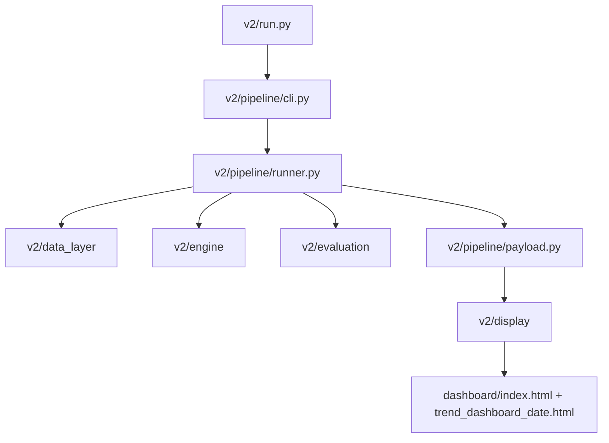

# TFS v2 第一阶段实施计划

> **执行方式建议**：新开会话后按本文档逐项实施。每个任务完成后先运行对应验收命令，再进入下一任务。不要一次性铺开全部模块。
>
> **目标**：把 v2 设计从文档落到一条可运行、可回归、可逐步替换旧系统的 MVP 主链路。
>
> **实施原则**：这是重构，不是重写。每一步先找旧系统可复用来源，再把职责迁移到 v2 明确目录中。除 `v2/run.py` 和 `v2/serve.py` 外，所有 `.py` 文件必须有明确目录归属。

---

## 0. 第一阶段 MVP 范围

第一阶段只做能支撑主链路闭环的最小集合：



本阶段必须完成：

1. `DataLayer` 能按日期读取/校验已有 v2 数据目录，先不追求全量重拉所有历史数据。
2. `Engine` 能对固定样本输出稳定 `StrategySignal`。
3. `Pipeline` 能串起 data / engine / evaluation / display_payload，并记录 manifest。
4. `Display` 能消费 `display_payload.json`，生成每日页和侧边栏入口。
5. 固定日期样本可与旧系统输出做回归对比。

本阶段暂不做：

1. 不做完整交易收益回测。
2. 不自动调参上线。
3. 不重做全新视觉体系。
4. 不把旧 `pipeline.py` 搬成 v2 根目录文件。
5. 不新建 `engine/core/`、`engine/strategies/`、`evaluation/projection/`、`evaluation/market/`。

---

## 1. 最终文件归属

### 1.1 根目录入口

| 文件 | 职责 |
|------|------|
| `v2/run.py` | 命令行入口，只解析参数并调用 `v2/pipeline/cli.py` |
| `v2/serve.py` | no-cache 静态服务入口，服务 `dashboard/` |

根目录只允许这两个 `.py` 文件。

### 1.2 DataLayer

| 文件 | 职责 |
|------|------|
| `v2/data_layer/__init__.py` | 暴露 DataLayer 门面 |
| `v2/data_layer/storage.py` | 行情 parquet 读写、日期切片、基础字段校验 |
| `v2/data_layer/relations.py` | 板块/题材/成分股/名称映射读取与查询 |
| `v2/data_layer/lifecycle.py` | market_health / relation_health / 数据完整性准出 |
| `v2/data_layer/fetcher.py` | update_market_daily / update_relations_weekly 编排 |
| `v2/data_layer/config.py` | 路径、日期、字段、阈值配置 |
| `v2/data_layer/fetch/*.py` | 限速、断路器、journal、executor、provider registry |
| `v2/data_layer/providers/*.py` | 纯 API 调用和响应解析，不写 sleep/backoff |

### 1.3 Engine

| 文件 | 职责 |
|------|------|
| `v2/engine/__init__.py` | 暴露 TrendEngine 门面 |
| `v2/engine/signal.py` | `StrategySignal` / `EngineContext` 数据结构 |
| `v2/engine/params.py` | 策略阈值、权重、开关 |
| `v2/engine/indicators.py` | MA / EMA / RSI / MACD / BOLL / MFI 等指标 |
| `v2/engine/classifier.py` | 6 态 classify / transition 封装 |
| `v2/engine/filters.py` | 三条件判断、MA20 过滤、趋势质量过滤 |
| `v2/engine/analyzers.py` | 回调、二波、阶段、风险 flags |
| `v2/engine/levels.py` | 支撑、压力、止损、关键位 |
| `v2/engine/scoring.py` | score / confidence / scenario_estimate / position_hint |
| `v2/engine/funnel.py` | 板块/题材/个股/ETF 漏斗和全扫编排 |

### 1.4 Evaluation

| 文件 | 职责 |
|------|------|
| `v2/evaluation/__init__.py` | 暴露 Evaluation 门面 |
| `v2/evaluation/projection.py` | ProjectionEngine，生成 A/B/C 推演场景 |
| `v2/evaluation/validation.py` | 历史推演验证 |
| `v2/evaluation/regression.py` | v2 输出与旧系统输出回归对比 |
| `v2/evaluation/reflection.py` | 错误分类、正误反思 |
| `v2/evaluation/evolution.py` | 自进化建议，不自动改主策略 |
| `v2/evaluation/weights.py` | 推演实验权重 |
| `v2/evaluation/market.py` | 市场宽度 / beta 等环境因子 |
| `v2/evaluation/comparison.py` | 跨日趋势变化对比 |
| `v2/evaluation/metrics.py` | AccuracyStats / ErrorPattern 等统计结构 |
| `v2/evaluation/runner.py` | evaluation 独立运行入口 |

### 1.5 Pipeline

| 文件 | 职责 |
|------|------|
| `v2/pipeline/__init__.py` | 暴露 PipelineRunner |
| `v2/pipeline/runner.py` | 主流程编排 |
| `v2/pipeline/stages.py` | Stage / StageResult / StageStatus |
| `v2/pipeline/manifest.py` | run_manifest 读写 |
| `v2/pipeline/modes.py` | daily / backfill / eval / display_only 模式 |
| `v2/pipeline/payload.py` | DisplayPayloadBuilder，只聚合展示数据，不算策略 |
| `v2/pipeline/cli.py` | CLI 参数解析，供 `v2/run.py` 调用 |

### 1.6 Display

| 文件 | 职责 |
|------|------|
| `v2/display/__init__.py` | 暴露 Display 门面 |
| `v2/display/adapter.py` | display_payload 到旧 dashboard/data 兼容 JSON |
| `v2/display/renderer.py` | 单一渲染入口 |
| `v2/display/nav.py` | 日期导航数据生成和校验 |
| `v2/display/schema.py` | DisplayPayload / ViewModel 校验 |
| `v2/display/compatibility.py` | 旧 build_final / build_nav_index 兼容隔离 |
| `v2/display/templates/index.html` | 侧边栏 iframe 壳模板 |
| `v2/display/templates/daily.html` | 每日报告主模板 |
| `v2/display/templates/partials/*.html` | overview / action_panel / funnel / signal_cards / evaluation / tables |
| `v2/display/assets/display.css` | 统一视觉规范 |
| `v2/display/assets/display.js` | 展开、筛选、跳转等轻交互 |

### 1.7 Tests

| 文件 | 职责 |
|------|------|
| `v2/tests/test_data_layer.py` | DataLayer 存储、关系、health 测试 |
| `v2/tests/test_engine.py` | 指标、状态分类、评分、StrategySignal 测试 |
| `v2/tests/test_evaluation.py` | 推演、验证、回归对比测试 |
| `v2/tests/test_pipeline.py` | stage、manifest、payload、CLI 测试 |
| `v2/tests/test_display.py` | payload schema、renderer、nav、兼容 JSON 测试 |

---

## 2. 执行顺序总览

建议按下面顺序提交，每个任务一个小提交：

1. **目录和入口骨架**：补齐所有标准目录、入口文件、空门面、测试目录。
2. **DataLayer 最小可读链路**：先读已有 v2/data，不急着拉新数据。
3. **Engine 单标的 MVP**：固定样本输出 `StrategySignal`。
4. **Engine 扫描 MVP**：输出 stock/ETF 的候选信号列表。
5. **Evaluation 最小报告**：推演场景 + 回归对比框架。
6. **Pipeline 编排 MVP**：串起 data / engine / evaluation / payload。
7. **DisplayPayloadBuilder**：生成 `display_payload.json`。
8. **Display 渲染 MVP**：生成每日页和 index 壳。
9. **固定日期回归**：拿旧系统固定日期输出做对照。
10. **收口准出**：命令、文档、目录、测试全部复查。

---

## 3. 任务清单

### Task 1: 建立 v2 标准骨架

**目标**：让实际目录和总手册一致，入口收敛。

**创建/补齐文件：**

- `v2/run.py`
- `v2/serve.py`
- `v2/data_layer/storage.py`
- `v2/data_layer/relations.py`
- `v2/data_layer/lifecycle.py`
- `v2/data_layer/fetcher.py`
- `v2/engine/signal.py`
- `v2/engine/params.py`
- `v2/engine/indicators.py`
- `v2/engine/classifier.py`
- `v2/engine/filters.py`
- `v2/engine/analyzers.py`
- `v2/engine/levels.py`
- `v2/engine/scoring.py`
- `v2/engine/funnel.py`
- `v2/evaluation/projection.py`
- `v2/evaluation/validation.py`
- `v2/evaluation/regression.py`
- `v2/evaluation/reflection.py`
- `v2/evaluation/evolution.py`
- `v2/evaluation/weights.py`
- `v2/evaluation/market.py`
- `v2/evaluation/comparison.py`
- `v2/evaluation/metrics.py`
- `v2/evaluation/runner.py`
- `v2/pipeline/__init__.py`
- `v2/pipeline/runner.py`
- `v2/pipeline/stages.py`
- `v2/pipeline/manifest.py`
- `v2/pipeline/modes.py`
- `v2/pipeline/payload.py`
- `v2/pipeline/cli.py`
- `v2/display/adapter.py`
- `v2/display/renderer.py`
- `v2/display/nav.py`
- `v2/display/schema.py`
- `v2/display/compatibility.py`
- `v2/display/templates/index.html`
- `v2/display/templates/daily.html`
- `v2/display/templates/partials/overview.html`
- `v2/display/templates/partials/action_panel.html`
- `v2/display/templates/partials/funnel.html`
- `v2/display/templates/partials/signal_cards.html`
- `v2/display/templates/partials/evaluation.html`
- `v2/display/templates/partials/tables.html`
- `v2/display/assets/display.css`
- `v2/display/assets/display.js`
- `v2/tests/test_structure.py`

**验收命令：**

```bash
python - <<'PY'
from pathlib import Path
root = Path('v2')
root_py = sorted(p.name for p in root.glob('*.py'))
assert root_py == ['run.py', 'serve.py'], root_py
for bad in [
    root / 'pipeline.py',
    root / 'engine' / 'core',
    root / 'engine' / 'strategies',
    root / 'evaluation' / 'projection',
    root / 'evaluation' / 'market',
    root / 'assets',
]:
    assert not bad.exists(), bad
print('v2 structure ok')
PY
```

**提交建议：**

```bash
git add v2
git commit -m "重构v2：建立标准目录骨架"
```

---

### Task 2: DataLayer 最小可读链路

**目标**：先让 v2 能从已有 `v2/data/` 读取行情和关系数据，输出 health，不在本任务做全量下载。

**重点文件：**

- `v2/data_layer/config.py`
- `v2/data_layer/storage.py`
- `v2/data_layer/relations.py`
- `v2/data_layer/lifecycle.py`
- `v2/data_layer/__init__.py`
- `v2/tests/test_data_layer.py`

**旧系统参考：**

- `src/data/`
- `src/data_mgr/`
- `dashboard/data/*.parquet`
- `dashboard/data/constituent_map.json` 如存在，仅作字段参考，不作为长期核心源。

**实现要求：**

1. `MarketDataStore.load_daily(dtype, code, end_date=None)` 返回按日期升序的 DataFrame。
2. `MarketDataStore.load_universe(dtype)` 返回可扫描标的列表。
3. `RelationStore.get_constituents(kind, code)` 返回成分股列表。
4. `LifecycleManager.check_market_health(date)` 返回结构化 dict，不静默吞错误。
5. DataLayer 不做策略判断，不拼展示字段。

**验收命令：**

```bash
pytest v2/tests/test_data_layer.py -v
python - <<'PY'
from v2.data_layer import DataLayer
layer = DataLayer()
print(layer.check_market_health())
PY
```

**提交建议：**

```bash
git add v2/data_layer v2/tests/test_data_layer.py
git commit -m "重构v2：实现DataLayer最小读取链路"
```

---

### Task 3: Engine 单标的 MVP

**目标**：固定一个 stock / ETF 样本，能输出稳定 `StrategySignal`。

**重点文件：**

- `v2/engine/signal.py`
- `v2/engine/params.py`
- `v2/engine/indicators.py`
- `v2/engine/classifier.py`
- `v2/engine/filters.py`
- `v2/engine/analyzers.py`
- `v2/engine/levels.py`
- `v2/engine/scoring.py`
- `v2/engine/__init__.py`
- `v2/tests/test_engine.py`

**旧系统参考：**

- `src/enhanced_actions.py::_ma/_ema/_rsi/_bbands/_macd/_mfi`
- `src/enhanced_actions.py::_calc_indicators`
- `src/engine/state_machine.py`
- `src/engine/conditions.py`
- `src/engine/pullback.py`
- `src/engine/second_wave.py`
- `src/engine/stage.py`
- `src/engine/pivots.py`

**实现要求：**

1. `StrategySignal` 是 dataclass，字段与 `v2/doc/engine_design.md` 保持一致。
2. 指标公式第一阶段尽量保持旧系统一致。
3. `classifier.py` 合并旧 `StateMachine.classify` 和 `_determine_state` 的后处理语义。
4. `score` 第一阶段统一到 0-100，保留旧分数作为回归参考时可放入 `signals` 或 `trend_context`。
5. 缺失市场环境时，仓位建议不得默认满风险。

**验收命令：**

```bash
pytest v2/tests/test_engine.py -v
python - <<'PY'
from v2.data_layer import DataLayer
from v2.engine import TrendEngine
layer = DataLayer()
engine = TrendEngine(layer)
# 选一个当前数据中存在的样本，实施时写入测试夹具或固定配置
print(engine)
PY
```

**提交建议：**

```bash
git add v2/engine v2/tests/test_engine.py
git commit -m "重构v2：实现Engine单标的分析MVP"
```

---

### Task 4: Engine 扫描 MVP

**目标**：把单标的能力接到候选池扫描，先输出可用列表，再做复杂排序增强。

**重点文件：**

- `v2/engine/funnel.py`
- `v2/engine/__init__.py`
- `v2/tests/test_engine.py`

**旧系统参考：**

- `src/funnel/*`
- `scripts/generate_all_data.py`
- `src/enhanced_actions.py::_scan_best_etfs`
- `src/enhanced_actions.py::_scan_best_stocks`

**实现要求：**

1. `scan_stock_funnel(date)` 返回板块、题材、个股三层结果。
2. `scan_stock_full(date)` 返回全市场个股候选池。
3. `scan_etf_direct(date)` 返回 ETF 直筛候选池。
4. `scan_etf_full(date)` 返回 ETF 全扫候选池。
5. 本文件只编排，不重新实现指标、状态和评分逻辑。

**验收命令：**

```bash
pytest v2/tests/test_engine.py -v
```

**提交建议：**

```bash
git add v2/engine/funnel.py v2/engine/__init__.py v2/tests/test_engine.py
git commit -m "重构v2：实现Engine候选池扫描MVP"
```

---

### Task 5: Evaluation 最小报告

**目标**：先让 evaluation 能消费 `StrategySignal`，输出推演场景和最小 `EvaluationReport`。

**重点文件：**

- `v2/evaluation/projection.py`
- `v2/evaluation/weights.py`
- `v2/evaluation/metrics.py`
- `v2/evaluation/validation.py`
- `v2/evaluation/regression.py`
- `v2/evaluation/runner.py`
- `v2/evaluation/__init__.py`
- `v2/tests/test_evaluation.py`

**旧系统参考：**

- `src/analysis/scenario.py`
- `src/analysis/projection_backtest.py`
- `src/analysis/projection_weights.py`
- `scripts/run_projection_backtest.py`

**实现要求：**

1. `ProjectionEngine.generate(signal)` 输出 A/B/C 场景。
2. `ProjectionWeights` 复用旧默认权重和归一化思想。
3. `ProjectionValidation` 先支持固定样本验证，不急着跑全量历史。
4. `RegressionComparator` 能对比旧输出和 v2 输出的关键字段。
5. 不做交易收益回测。

**验收命令：**

```bash
pytest v2/tests/test_evaluation.py -v
```

**提交建议：**

```bash
git add v2/evaluation v2/tests/test_evaluation.py
git commit -m "重构v2：实现Evaluation最小推演报告"
```

---

### Task 6: Pipeline 编排 MVP

**目标**：用 pipeline 串起 data / engine / evaluation，并写 run manifest。

**重点文件：**

- `v2/pipeline/stages.py`
- `v2/pipeline/manifest.py`
- `v2/pipeline/modes.py`
- `v2/pipeline/runner.py`
- `v2/pipeline/cli.py`
- `v2/pipeline/__init__.py`
- `v2/run.py`
- `v2/tests/test_pipeline.py`

**旧系统参考：**

- `pipeline.py::run_pipeline`
- `scripts/daily_run.py`

**实现要求：**

1. `PipelineRunner.run(date, mode)` 返回 `RunManifest` 或 manifest path。
2. 每个 stage 有 `status`、`started_at`、`finished_at`、`inputs`、`outputs`、`error`。
3. health gate 失败时中断，不生成假数据。
4. CLI 支持 `daily`、`engine`、`eval`、`display`、`backfill` 至少一种最小命令路径。
5. `v2/run.py` 只调用 `pipeline/cli.py`。

**验收命令：**

```bash
pytest v2/tests/test_pipeline.py -v
python v2/run.py daily --date 2026-06-12 --no-render
```

**提交建议：**

```bash
git add v2/pipeline v2/run.py v2/tests/test_pipeline.py
git commit -m "重构v2：实现Pipeline编排MVP"
```

---

### Task 7: DisplayPayloadBuilder

**目标**：把 Pipeline/Engine/Evaluation 产物聚合成展示唯一入口 `display_payload.json`。

**重点文件：**

- `v2/pipeline/payload.py`
- `v2/display/schema.py`
- `v2/tests/test_pipeline.py`
- `v2/tests/test_display.py`

**旧系统参考：**

- `dashboard/data/dashboard_data.json`
- `dashboard/data/enhanced_actions_*.json`
- `dashboard/data/date_nav.json`
- `src/enhanced_actions.py::_build_card`

**实现要求：**

1. `DisplayPayloadBuilder.build(...)` 只做字段归类、排序裁剪、空状态、链接、表格列定义和摘要聚合。
2. 不重新计算趋势指标、状态、分数、风险或仓位。
3. payload 写入 `v2/data/derived/dates/{date}/display_payload.json`。
4. schema 校验失败时必须返回明确错误，不生成半成品页面。

**验收命令：**

```bash
pytest v2/tests/test_pipeline.py::test_display_payload_builder -v
pytest v2/tests/test_display.py::test_display_payload_schema -v
```

**提交建议：**

```bash
git add v2/pipeline/payload.py v2/display/schema.py v2/tests/test_pipeline.py v2/tests/test_display.py
git commit -m "重构v2：实现DisplayPayload生成"
```

---

### Task 8: Display 渲染 MVP

**目标**：用统一 renderer 和 templates 生成每日 HTML 与侧边栏入口。

**重点文件：**

- `v2/display/renderer.py`
- `v2/display/nav.py`
- `v2/display/adapter.py`
- `v2/display/compatibility.py`
- `v2/display/templates/index.html`
- `v2/display/templates/daily.html`
- `v2/display/templates/partials/*.html`
- `v2/display/assets/display.css`
- `v2/display/assets/display.js`
- `v2/display/__init__.py`
- `v2/tests/test_display.py`

**旧系统参考：**

- `scripts/build_final.py`
- `scripts/build_nav_index.py`
- `scripts/render_action_panel.py`
- `scripts/build_all_dashboard.py`
- `dashboard/index.html`
- `dashboard/trend_dashboard_{date}.html`

**实现要求：**

1. `Display.render_daily(payload_path, output_path)` 生成 run 输出目录中的 `trend_dashboard_{date}.html`。
2. `Display.render_index(nav_payload_path, output_path)` 生成同一 run 输出目录中的 `index.html`。
3. 每日报告只由 `renderer.py` 生成，不再多脚本补丁注入。
4. 日期导航必须保留 iframe 壳、日期列表、默认最新日期。
5. CSS / JS 只归属 `v2/display/assets/`。

**验收命令：**

```bash
pytest v2/tests/test_display.py -v
python3 -m v2.run daily --date 2026-06-12 --render --output-dir v2/data/derived/display_runs/manual_check
python - <<'PY'
from pathlib import Path
run_dirs = sorted(Path('v2/data/derived/display_runs/manual_check').glob('2026-06-12_*'))
latest = run_dirs[-1]
assert (latest / 'index.html').exists()
assert (latest / 'trend_dashboard_2026-06-12.html').exists()
print('display output ok')
PY
```

**提交建议：**

```bash
git add v2/display v2/tests/test_display.py
git commit -m "重构v2：实现Display模板化渲染MVP"
```

---

### Task 9: 固定日期回归验收

**目标**：证明 v2 主链路不是凭空重写，而是在旧系统基础上的行为迁移。

**重点文件：**

- `v2/evaluation/regression.py`
- `v2/tests/test_regression_fixed_dates.py`
- `v2/doc/implementation_regression_notes.md`

**固定样本建议：**

- `2026-06-12`：已有 enhanced actions 数据，可作为展示与候选池参考。
- 再选一个近期完整交易日，要求旧 dashboard/data 和 v2/data 都有对应数据。

**对比维度：**

1. market health 是否通过。
2. 候选池数量是否同量级。
3. 关键标的 state 是否一致或有明确差异原因。
4. score 排序是否大体稳定。
5. action_hint / position_hint 是否不比旧系统更激进。
6. dashboard 入口是否仍为 `dashboard/index.html`。
7. 侧边栏默认最新日期是否正常。

**验收命令：**

```bash
pytest v2/tests/test_regression_fixed_dates.py -v
python v2/run.py daily --date 2026-06-12 --render-display
```

**提交建议：**

```bash
git add v2/evaluation/regression.py v2/tests/test_regression_fixed_dates.py v2/doc/implementation_regression_notes.md
git commit -m "重构v2：补齐固定日期回归验收"
```

---

### Task 10: 第一阶段准出检查

**目标**：确认目录、文档、测试、命令全部能支撑新会话继续迭代。

**检查项：**

1. 根目录只存在 `v2/run.py`、`v2/serve.py` 两个 `.py`。
2. 不存在旧设计目录：
   - `v2/pipeline.py`
   - `v2/engine/core/`
   - `v2/engine/strategies/`
   - `v2/evaluation/projection/`
   - `v2/evaluation/market/`
   - `v2/assets/`
3. `pytest v2/tests -v` 通过。
4. `python v2/run.py daily --date 2026-06-12 --render-display` 能生成输出。
5. `dashboard/index.html` 能加载每日页面。
6. `v2/REFACTOR_MANUAL.md` 与 `v2/doc/*.md` 没有目录冲突。

**验收命令：**

```bash
python - <<'PY'
from pathlib import Path
root = Path('v2')
assert sorted(p.name for p in root.glob('*.py')) == ['run.py', 'serve.py']
for bad in [
    root / 'pipeline.py',
    root / 'engine' / 'core',
    root / 'engine' / 'strategies',
    root / 'evaluation' / 'projection',
    root / 'evaluation' / 'market',
    root / 'assets',
]:
    assert not bad.exists(), bad
print('directory gate ok')
PY
pytest v2/tests -v
python v2/run.py daily --date 2026-06-12 --render-display
```

**提交建议：**

```bash
git add v2 dashboard/index.html dashboard/trend_dashboard_2026-06-12.html
git commit -m "重构v2：第一阶段MVP准出"
```

---

## 4. 新会话启动提示词

新开会话后建议直接发：

```text
我们现在进入 TFS v2 第一阶段实施。请先读取 v2/REFACTOR_MANUAL.md、v2/doc/implementation_plan.md 和 v2/doc/*.md，然后按 implementation_plan.md 从 Task 1 开始执行。注意：这是重构不是重写；根目录只允许 run.py 和 serve.py；不要新建 engine/core、engine/strategies、evaluation/projection、evaluation/market；每个任务完成后运行对应验收命令再继续。
```

如果想更稳，可以先让新会话只执行 Task 1：

```text
先只执行 v2/doc/implementation_plan.md 的 Task 1，完成后停下来汇报目录、文件和验收结果。
```

---

## 5. 风险和防呆

1. **不要从 Display 开始**：展示最容易诱发重写页面，必须等 payload 契约稳定。
2. **不要一开始全量拉数据**：先读已有样本跑通链路，再补 fetcher。
3. **不要把 Evaluation 做成第二套策略引擎**：它只验证和建议，不生成候选池。
4. **不要让 Pipeline 偷做业务逻辑**：它只编排、记录、准出。
5. **不要删除旧系统**：旧系统是回归基线，v2 验证完成前必须保留。
6. **不要用模拟数据伪造 dashboard**：health gate 失败就失败，不能生成假结果。

---

## 6. 第一阶段完成定义

第一阶段完成必须同时满足：

1. `python v2/run.py daily --date 2026-06-12 --render-display` 能跑完。
2. 生成 `v2/data/derived/dates/2026-06-12/display_payload.json`。
3. 生成 `dashboard/trend_dashboard_2026-06-12.html`。
4. 生成或更新 `dashboard/index.html`，侧边栏仍能加载每日页。
5. 固定日期回归报告能解释 v2 与旧系统关键差异。
6. 所有 v2 实现文件都有明确目录归属。
7. `pytest v2/tests -v` 通过。
