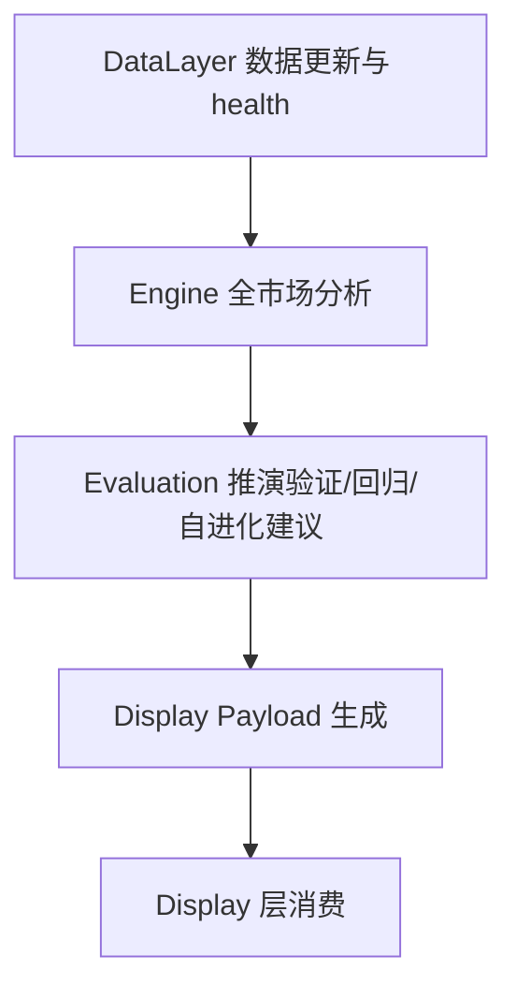
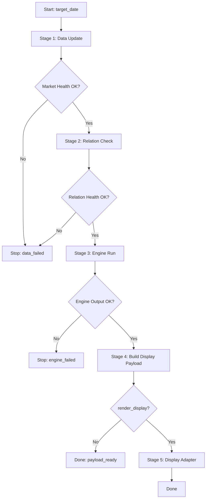

# TFS v2 Pipeline 编排层设计

> 本文档是 v2 pipeline 编排层的模块设计。总设计见 `v2/REFACTOR_MANUAL.md`。
>
> 上游模块文档：
> - `v2/doc/data_management_design.md`
> - `v2/doc/engine_design.md`
> - `v2/doc/evaluation_evolution_design.md`
>
> 设计原则：Pipeline 只负责“按顺序调用、检查准出、记录产物、处理中断”。它不是数据层，不是策略层，不是推演层，也不是展示层。旧系统 `pipeline.py` 和 `scripts/` 里的可用编排经验必须复用，但其中混入的业务逻辑、展示操作、模拟数据 fallback、硬编码路径和静默失败必须拆出来或禁止。

---

## 1. 本层定位

Pipeline 层负责把已经设计好的底座串成一条可重复运行的主流程：



Pipeline 层负责：

1. 接收运行参数，例如日期、模式、范围、是否跳过某阶段。
2. 调用 DataLayer 完成每日行情更新和关系版本检查。
3. 检查 market health / relation health，决定继续或中断。
4. 调用 Engine 生成全市场 `StrategySignal`。
5. 调用 Evaluation 做回归验证、推演验证或自进化建议。
6. 生成 Display 可消费的中间产物。
7. 记录每个阶段的输入、输出、状态、耗时、错误。
8. 提供单阶段重跑能力。

Pipeline 层不负责：

- 不直接拉数据源 API。
- 不直接读写 parquet 细节。
- 不计算指标。
- 不判断趋势状态。
- 不拼 HTML。
- 不打开浏览器。
- 不修改 dashboard/index.html。
- 不做交易收益回测。
- 不用模拟数据伪造真实结果。

---

## 2. 旧系统编排能力调研

### 2.1 主入口 `pipeline.py`

旧主流程在 `pipeline.py:610` 的 `run_pipeline`。它当前承担过多职责：

1. `pipeline.py:619` 更新 ETF/个股 pkl 缓存。
2. `pipeline.py:623` 增量更新 sector 数据。
3. `pipeline.py:629` 调 `scripts/generate_all_data.py` 生成 Dashboard 核心数据。
4. `pipeline.py:644` 修正 `state_label`。
5. `pipeline.py:647` 同步侧边栏日期数据。
6. `pipeline.py:650` 加载缓存。
7. `pipeline.py:658` 评估市场环境。
8. `pipeline.py:666` 全市场扫描 ETF/个股。
9. `pipeline.py:679` 扫描关注列表。
10. `pipeline.py:688` 保存 `actions_{date}.json`。
11. `pipeline.py:692` 自动补齐历史缺失日期。
12. `pipeline.py:696` 调 `build_final.py` 生成 Dashboard。
13. `pipeline.py:715` 调 `render_action_panel.py` 注入操作面板。
14. `pipeline.py:730` 调 `build_nav_index.py` 生成侧边栏导航。
15. `pipeline.py:745` 自动打开浏览器。

可复用点：

- 每日一键入口的思路可复用。
- 按阶段输出日志的方式可复用。
- `actions_{date}.json` 这类日期产物思路可复用。
- 缺失日期补齐的需求可保留，但必须由明确模式控制。
- 调 display 脚本的经验可保留，但不能混在核心计算流程里。

不合理点：

- 编排层直接混入数据读取、状态修正、市场扫描、展示构建、浏览器打开。
- 失败处理不统一，有些失败继续，有些失败中断。
- 直接写 `dashboard/data/`，导致数据层、策略层、展示层产物混在一起。
- `_fix_state_labels`、`_sync_date_data` 这类展示兼容逻辑不应该在核心 pipeline 中。
- 自动打开浏览器属于用户体验辅助，不属于 pipeline 主链路。

### 2.2 每日脚本 `scripts/daily_run.py`

旧每日脚本职责是“拉取数据 -> 分析 -> 生成 Dashboard -> 输出概要”。

可复用点：

- 收盘后运行的时间意识可保留。
- 简单阶段包装函数 `run(cmd, desc)` 的思路可保留。
- 每日摘要输出可保留为 CLI summary。

不合理点：

- `scripts/daily_run.py:14` 硬编码旧项目路径 `/Users/liuliang19/Desktop/project/trend_following_system`。
- `scripts/daily_run.py:43` 数据拉取失败后继续运行，这在 v2 中必须受 health gate 控制。
- 输出概要直接读 `dashboard/data/dashboard_data.json`，耦合展示数据。

### 2.3 完整流水线 `scripts/run_full_pipeline.py`

旧完整流水线写着“拉取数据 -> 分析 -> Dashboard -> 回测优化”，但实际顺序从回测开始。

可复用点：

- 将复杂流程拆成 Step 的思路可复用。
- 运行结果写文件的思路可复用。

不合理点：

- `scripts/run_full_pipeline.py:20` 先跑交易收益回测，不符合 v2 第一阶段“暂不做交易收益回测”。
- `scripts/run_full_pipeline.py:63` 分析失败后生成模拟数据 Dashboard，这违反数据真实性原则。
- `scripts/run_full_pipeline.py:76` 的 `_generate_demo_snapshot` 生成模拟板块/题材/个股/ETF，只能作为测试夹具，不能进入真实 pipeline。

### 2.4 数据拉取脚本 `scripts/pull_all_data.py`

旧脚本有多源降级和重试思路，见 `Retry.run`。

可复用点：

- 多源降级、重试、不中断单个失败的思路可复用到 DataLayer fetcher。
- 数据源函数拆分清晰，可作为 DataLayer provider 的旧实现参考。

不合理点：

- 直接写 `dashboard/data/`。
- 部分异常被吞掉，缺少结构化失败报告。
- pipeline 不能直接调用这些底层拉取函数，应该通过 DataLayer 门面调用。

### 2.5 全量生成脚本 `scripts/generate_all_data.py`

旧脚本负责板块、题材、个股、ETF 四层分析并生成 dashboard 数据。

可复用点：

- 四层分析顺序和漏斗统计经验可参考。
- 输出 `dashboard_data.json` 的字段可作为 Display Payload 兼容参考。

不合理点：

- 文件顶部直接执行大量逻辑，没有清晰函数入口。
- 直接读 `dashboard/data` 下 parquet。
- 内部重新做 state、score、conditions、link、reasons，混合了 Engine 和 Display 职责。
- 个股名称存在硬编码映射。

### 2.6 推演评估脚本

旧推演脚本包括：

- `scripts/run_projection_backtest.py`
- `scripts/run_reflection_loop.py`

可复用点：

- 推演验证和反思闭环的阶段顺序可复用。
- 数据完整性检查思想可复用。
- 输出 `projection_log.json`、`reflection_report.json`、`discovered_rules.json` 的产物思想可复用。

不合理点：

- 直接读写 `dashboard/data/`。
- `run_reflection_loop.py` 会把规则应用到权重，v2 第一阶段必须降级为建议/实验权重。
- evaluation 不应该每天默认全量跑，应该由 pipeline 模式控制。

### 2.7 展示构建脚本

旧展示构建涉及：

- `scripts/build_final.py`
- `scripts/render_action_panel.py`
- `scripts/build_nav_index.py`
- `scripts/build_all_dashboard.py`

可复用点：

- `build_final.py` 和 `build_nav_index.py` 是现有 dashboard 的核心生成入口，Display 层设计时应优先复用。
- `render_action_panel.py` 的“模板提取 + 数据替换”思路与展示层红线一致。

不合理点：

- Pipeline 不应该直接修改 HTML。
- `render_action_panel.py` 通过字符串查找和替换注入 HTML，脆弱但现阶段不能贸然改，应放到 Display 层审查。
- 展示层脚本不应重新算策略。

---

## 3. 旧编排层主要问题

### 3.1 职责混杂

旧 `pipeline.py` 同时做了：

- 数据更新。
- 数据读取。
- 市场扫描。
- 操作建议生成。
- 历史补齐。
- Dashboard 生成。
- HTML 注入。
- 日期导航同步。
- 浏览器打开。

这导致任何一个环节出问题，都很难判断是数据问题、策略问题、展示问题还是编排问题。

### 3.2 准出标准不清

旧流程里有些失败只是警告，例如 sector 更新不完整；有些失败返回非零但继续；有些分析失败会生成模拟数据。v2 必须明确：哪些 stage 失败必须中断，哪些可以降级，哪些只能跳过。

### 3.3 产物目录混乱

旧系统大量产物都写到 `dashboard/data/`：

- 原始/中间 parquet。
- dashboard_data。
- actions。
- date_nav。
- projection_log。
- reflection_report。
- discovered_rules。

v2 必须区分：

- DataLayer 产物。
- Engine 产物。
- Evaluation 产物。
- Display payload。
- 旧 dashboard 兼容输出。

### 3.4 真实数据和模拟数据混用风险

`run_full_pipeline.py` 中分析失败后生成 demo snapshot。这个只能用于开发测试，不能进入真实 pipeline。v2 pipeline 的真实模式必须禁止模拟数据 fallback。

### 3.5 Pipeline 直接触碰展示层

旧 pipeline 会调 `build_final.py`、`render_action_panel.py`、`build_nav_index.py`，甚至打开浏览器。v2 第一阶段可以保留一个 display adapter stage，但核心 pipeline 必须把“生成 display payload”和“渲染 HTML”分开。

---

## 4. v2 Pipeline 设计目标

第一阶段目标不是做复杂调度系统，而是把旧每日流程收敛成可验证的阶段机。

v2 Pipeline 必须做到：

1. 每个 stage 有明确输入、输出、准出条件。
2. 每个 stage 只调用对应层门面，不越层实现业务逻辑。
3. 每次运行生成 `run_manifest`，记录阶段状态和产物路径。
4. 数据 health 不通过时，不允许继续跑 Engine。
5. Engine 失败时，不允许生成新的展示结果。
6. Evaluation 默认不做交易回测，只按模式运行推演验证或回归。
7. Display 阶段只消费 display payload，不重新计算策略。
8. 支持单阶段重跑，避免每天只能全量跑。

---

## 5. 第一阶段目录设计

```text
v2/pipeline/
├── __init__.py          # Pipeline 门面
├── runner.py            # PipelineRunner 主流程
├── stages.py            # StageResult / StageStatus / Stage 定义
├── manifest.py          # run_manifest 读写
├── modes.py             # daily / backfill / eval / display_only 模式
├── payload.py           # display_payload 生成编排
└── cli.py               # 命令行入口逻辑，供 v2/run.py 调用
```

第一阶段不引入 Airflow、任务队列、数据库调度器，也不做并发编排平台。

---

## 6. 核心数据结构

### 6.1 `StageResult`

```python
@dataclass
class StageResult:
    name: str
    status: str          # success / skipped / failed / warning
    started_at: str
    finished_at: str
    inputs: dict
    outputs: dict
    health: dict
    errors: list[str]
    warnings: list[str]
```

### 6.2 `RunManifest`

```python
@dataclass
class RunManifest:
    run_id: str
    mode: str
    target_date: str
    started_at: str
    finished_at: str | None
    status: str
    stages: list[StageResult]
    artifacts: dict
```

### 6.3 `PipelineOptions`

```python
@dataclass
class PipelineOptions:
    target_date: str
    mode: str = "daily"
    scope: str = "all"
    run_evaluation: bool = False
    render_display: bool = False
    open_browser: bool = False
    allow_partial_data: bool = False
    allow_demo_data: bool = False
```

第一阶段默认：

- `run_evaluation=False`，每日主流程不默认跑全量推演验证。
- `render_display=False`，核心 pipeline 只产出 display payload；是否渲染由 display 阶段或旧兼容命令控制。
- `allow_demo_data=False`，真实模式禁止模拟数据。

---

## 7. 主流程设计

### 7.1 Daily 模式



Daily 模式阶段：

1. `data_update`：调用 `DataLayer.update_market_daily(target_date)`。
2. `relation_check`：读取当前 relation version，并校验 relation health。
3. `engine_run`：调用 `Engine.run_universe(date, data_layer)`。
4. `display_payload`：把 signals/evaluation summary 转成展示层可消费 JSON。
5. `display_adapter`：可选，调用 Display 层或旧展示兼容脚本。

### 7.2 Evaluation 模式

Evaluation 不默认每天全量跑。需要显式模式：

```bash
python v2/run.py eval --start 2026-01-01 --end 2026-06-27 --scope sector
```

流程：

1. 检查历史数据 health。
2. 调用 Engine 生成历史信号或读取已有信号。
3. 调用 Evaluation 验证推演。
4. 输出 evaluation report。
5. 不渲染 dashboard。

### 7.3 Display Only 模式

Display only 用于已有 payload 时重建展示：

```bash
python v2/run.py display --date 2026-06-27
```

它只能消费已有产物，不允许重新计算 Engine。

---

## 8. Stage 准出规则

| Stage | 成功条件 | 失败处理 | 是否允许继续 |
|-------|----------|----------|--------------|
| `data_update` | market_health 完整、日期覆盖达到要求 | 记录失败并中断 | 默认不允许 |
| `relation_check` | relation_health 通过、version 可追踪 | 记录失败并中断 | 默认不允许 |
| `engine_run` | 生成 signals，样本数达到 scope 要求 | 中断，不生成新展示 | 不允许 |
| `evaluation_run` | 生成 report，样本数达到最低要求 | 标记 warning 或 failed | daily 可跳过，eval 不允许 |
| `display_payload` | payload JSON 生成且 schema 合法 | 中断 display | 不允许 |
| `display_adapter` | 展示产物生成成功 | 标记 failed，但不影响底座产物 | 允许核心结果保留 |

关键原则：

- 数据失败不能靠旧数据悄悄继续，除非 `allow_partial_data=True` 且 manifest 记录。
- 分析失败不能生成模拟数据。
- 展示失败不能反向影响 DataLayer / Engine / Evaluation 产物。

---

## 9. 产物与中间层数据管理

到 Pipeline 阶段，系统已经有两类数据，必须分开管理：

1. **基础数据**：从接口或数据源来的原始/准原始行情、名称、映射关系，由 DataLayer 管理。
2. **判定层产出数据**：由 Engine / Evaluation 对基础数据进行判断后产生的中间层数据，由 Pipeline 负责登记、归档和交付给 Display。

Pipeline 不拥有基础数据，也不重新计算判定数据；Pipeline 只负责把判定数据按日期、运行批次、参数版本管理好。

### 9.1 两类数据边界

| 数据类型 | 来源 | 管理方 | 是否可重算 | 典型产物 |
|----------|------|--------|------------|----------|
| 基础数据 | TickFlow / Eastmoney / Tushare 等接口 | DataLayer | 不应随意重写，只能按数据更新规则修复 | K线 parquet、名称、板块/题材/个股映射、health |
| 判定层产出数据 | Engine / Evaluation | Pipeline 归档，Engine/Evaluation 生成 | 可由同一基础数据 + 同一参数重算 | signals、screening、risk_flags、position_hint、projection_report |
| 展示消费数据 | Pipeline payload / Display adapter | Pipeline + Display | 可由判定层产物重建 | display_payload、旧 dashboard 兼容 JSON |

关键原则：

- 基础数据是“事实层”，判定层产出是“解释层”。
- 判定层产出必须能追溯到基础数据版本、关系版本、策略参数版本和运行批次。
- Display 只能消费判定层产出或 display payload，不能直接重新计算策略。
- 判定层产出可以重算，但不能无痕覆盖；每次重算必须留下 run manifest。

### 9.2 判定层产出目录

第一阶段判定层产出按日期组织，按 run 追踪：

```text
v2/data/derived/
├── dates/
│   └── {date}/
│       ├── signals.json              # Engine 输出的 StrategySignal 列表
│       ├── screening.json            # 排序、筛选、候选池结果
│       ├── risk_flags.json           # 风险信号聚合，可由 signals 派生
│       ├── position_hints.json       # 仓位建议聚合，可由 signals 派生
│       ├── evaluation_summary.json   # 当日轻量 evaluation 摘要，可选
│       └── display_payload.json      # 展示层消费数据
├── runs/
│   └── {run_id}/
│       ├── run_manifest.json
│       ├── signals_{date}.json
│       ├── screening_{date}.json
│       ├── display_payload_{date}.json
│       └── logs/
└── latest/
    ├── latest_date.json
    ├── latest_signals.json
    ├── latest_screening.json
    └── latest_display_payload.json
```

说明：

- `dates/{date}/` 是稳定日期视图，给 Display 和人工查看使用。
- `runs/{run_id}/` 是运行批次视图，给排查、回归、追溯使用。
- `latest/` 只放指针或复制轻量结果，方便每日入口读取。
- 同一日期多次运行时，`runs/{run_id}/` 全部保留；`dates/{date}/` 只指向或覆盖为当前确认版本。

### 9.3 判定层产出元数据

每个判定层产物必须带元数据，不能只存结果数组。

```json
{
  "meta": {
    "date": "2026-06-27",
    "run_id": "20260627_180500_daily",
    "source_market_date": "2026-06-27",
    "relation_version": "2026-W26",
    "engine_version": "v2-stage1",
    "strategy_params_hash": "...",
    "data_health_id": "...",
    "created_at": "2026-06-27T18:05:00",
    "producer": "engine_run"
  },
  "data": []
}
```

必须记录：

1. `date`：判定结果对应的交易日期。
2. `run_id`：哪一次 pipeline 运行产生。
3. `relation_version`：使用哪一版映射关系。
4. `engine_version` / `strategy_params_hash`：使用哪一版策略和参数。
5. `data_health_id`：基础数据 health 依据。
6. `producer`：由哪个 stage 产生。

### 9.4 主要中间产物定义

| 产物 | 生成 stage | 消费方 | 内容 |
|------|------------|--------|------|
| `signals.json` | `engine_run` | evaluation / display_payload | 每个标的的 `StrategySignal` |
| `screening.json` | `engine_run` 或 `display_payload` | display / 人工复盘 | Top N、候选池、排序解释 |
| `risk_flags.json` | `engine_run` 派生 | display / evaluation | 按标的和风险类型聚合 |
| `position_hints.json` | `engine_run` 派生 | display / 人工复盘 | 仓位建议聚合，不是交易指令 |
| `evaluation_summary.json` | `evaluation_run` | display_payload | 推演验证、自进化建议摘要 |
| `display_payload.json` | `display_payload` | Display | 展示层唯一推荐入口 |

第一阶段最小必需产物：

1. `signals.json`
2. `screening.json`
3. `display_payload.json`
4. `run_manifest.json`

`risk_flags.json` 和 `position_hints.json` 可以先由 `signals.json` 派生，不一定第一阶段独立落盘；如果 Display 层需要高频读取，再拆成独立文件。

### 9.5 覆盖与重算规则

判定层产出是可重算数据，但不能无痕覆盖。

规则：

1. 每次运行必须生成新的 `run_id`。
2. `runs/{run_id}/` 下的产物不可被后续运行覆盖。
3. `dates/{date}/` 可以更新为当前确认版本，但必须记录指向哪个 `run_id`。
4. 如果只是重建展示，不能改写 `signals.json`。
5. 如果策略参数变了，必须生成新的 `strategy_params_hash` 和新 run。
6. 如果基础数据 health 变化，旧判定层产物必须视为可能过期。

### 9.6 过期与准出规则

判定层产物是否可用，由以下条件决定：

1. 基础数据 health 通过。
2. relation version 可追踪。
3. Engine 参数 hash 与产物 meta 一致。
4. `signals.json` 标的数量达到 scope 要求。
5. `display_payload.json` 的来源 run 与 `signals.json` 一致。

如果任一条件不满足：

- Display 不能消费该产物作为最新结果。
- Pipeline 必须在 manifest 中标记 `stale` 或 `invalid`。
- 只能人工指定读取旧产物，不能默认使用。

### 9.7 与旧 `dashboard/data` 的关系

旧系统把基础数据、判定数据、展示数据都混在 `dashboard/data/`。v2 不继续这样做。

迁移策略：

- `dashboard/data/` 第一阶段只作为旧展示兼容输出目录。
- v2 的标准判定层产物放在 `v2/data/derived/`。
- 如果旧 `build_final.py` 仍需要 `dashboard/data/dashboard_data.json` 或 `actions_{date}.json`，由 Display adapter 从 `display_payload.json` 转换生成。
- 核心 Pipeline 不直接把 Engine 产物写入 `dashboard/data/`。

---

## 10. 旧能力复用策略

| 旧能力 | v2 归属 | 复用方式 |
|--------|---------|----------|
| `pipeline.py::run_pipeline` 阶段顺序 | `v2/pipeline/runner.py` | 复用每日一键流程思想，拆成 stage |
| `pipeline.py::save_actions` | `v2/pipeline/payload.py` / Display | 复用 action 产物思想，改成 StrategySignal payload |
| `pipeline.py::_fill_history_gaps` | backfill 模式 | 保留需求，但禁止 daily 默认悄悄补历史 |
| `scripts/daily_run.py` | `v2/run.py daily` | 复用收盘后运行体验，去掉硬编码路径 |
| `scripts/pull_all_data.py` | DataLayer | 复用重试/降级思想，不由 Pipeline 直接调用 |
| `scripts/generate_all_data.py` | Engine/Display payload 参考 | 复用字段经验，不复用混合执行方式 |
| `scripts/run_projection_backtest.py` | Evaluation 模式 | 复用完整性检查和运行入口思路 |
| `scripts/run_reflection_loop.py` | Evaluation 模式 | 复用闭环顺序，禁用自动改主策略 |
| `scripts/build_final.py` | Display 层 | 后续展示层设计复用，不在核心 pipeline 内硬编码 |
| `scripts/build_nav_index.py` | Display 层 | 作为侧边栏壳保护对象，不由核心 pipeline 修改 |
| `scripts/render_action_panel.py` | Display 层 | 复用模板替换思想，放到展示层审查 |

---

## 11. 不合理点的 v2 修正

### 11.1 去掉硬编码项目路径

旧 `scripts/daily_run.py` 硬编码项目路径。v2 统一通过当前文件位置计算 project root。

### 11.2 禁止模拟数据 fallback

旧 `run_full_pipeline.py` 分析失败后生成 demo snapshot。v2 真实 pipeline 中禁止该行为。

测试或 demo 如需要模拟数据，必须放到 tests 或 explicit demo mode，且产物不能写入真实 output 目录。

### 11.3 失败策略显性化

所有 stage 必须返回 `StageResult`。不能只 print warning 后继续。

### 11.4 展示从主链路解耦

核心 daily pipeline 默认产出 `display_payload`。HTML 渲染是可选 stage，并且属于 Display 层职责。

### 11.5 补历史变成显式 backfill 模式

旧 `_fill_history_gaps` 自动补近期缺失日期。v2 保留 backfill 能力，但 daily 模式不默认悄悄补历史。

---

## 12. 命令入口设计

### 12.1 每日主流程

```bash
python v2/run.py daily --date 2026-06-27
```

默认只跑：

1. data update
2. relation check
3. engine run
4. display payload

### 12.2 带展示渲染

```bash
python v2/run.py daily --date 2026-06-27 --render-display
```

### 12.3 只跑 Engine

```bash
python v2/run.py engine --date 2026-06-27 --scope stock
```

### 12.4 跑推演评估

```bash
python v2/run.py eval --start 2026-01-01 --end 2026-06-27 --scope sector
```

### 12.5 补历史

```bash
python v2/run.py backfill --start 2026-06-01 --end 2026-06-27
```

---

## 13. 实施顺序

1. 建立 `StageResult`、`RunManifest`、`PipelineOptions`。
2. 建立 `manifest.py`，能写入和读取 run manifest。
3. 建立 `PipelineRunner`，先串起空 stage。
4. 接入 DataLayer：`data_update`、`relation_check`。
5. 接入 Engine：`engine_run` 输出 `signals_{date}.json`。
6. 接入 payload：生成 `display_payload_{date}.json`。
7. 接入 Evaluation：仅在 eval 模式或显式参数下运行。
8. 增加 display adapter：调用 Display 层接口或旧兼容脚本。
9. 增加 CLI：`v2/run.py` 调用 pipeline。
10. 用旧 `pipeline.py` 固定日期输出做回归对比。

---

## 14. 验证标准

Pipeline 第一阶段完成时必须满足：

1. 能对固定日期生成 run manifest。
2. 每个 stage 都有 status、inputs、outputs、errors、warnings。
3. data health 不通过时 Engine 不运行。
4. Engine 失败时不生成新的 display payload。
5. daily 模式不默认跑交易收益回测。
6. daily 模式不默认跑全量推演验证。
7. daily 模式不生成模拟数据。
8. display 渲染失败不破坏底座产物。
9. 单阶段重跑不会重跑无关阶段。
10. 旧 dashboard 兼容输出必须通过 Display adapter，而不是核心 pipeline 直接写 HTML。

---

## 15. 实施准入规则

本章是 Pipeline 层进入编码前的硬约束。Pipeline 是系统主链路，一旦边界松动，前面 DataLayer、Engine、Evaluation 的分层都会被重新搅在一起。

### 15.1 旧能力先行规则

每实现一个 v2 pipeline 能力，必须先对齐旧系统来源：

| v2 能力 | 必须先对齐的旧来源 | 对齐重点 |
|---------|--------------------|----------|
| `daily` 主流程 | `pipeline.py::run_pipeline`、`scripts/daily_run.py` | 每日一键运行体验、阶段顺序、日志输出 |
| `data_update` stage | `pipeline.py::update_sector_data`、`scripts/pull_all_data.py` | 数据更新触发点、失败处理、重试/降级经验 |
| `engine_run` stage | `pipeline.py` 中 scanner 扫描流程、`scripts/generate_all_data.py` | 全市场扫描、候选池输出、旧 dashboard 字段经验 |
| `evaluation` stage | `scripts/run_projection_backtest.py`、`scripts/run_reflection_loop.py` | 推演验证、反思闭环、完整性检查 |
| `display_payload` | `pipeline.py::save_actions`、`scripts/generate_all_data.py` | 日期产物、actions/dashboard_data 字段兼容 |
| `display_adapter` | `scripts/build_final.py`、`scripts/render_action_panel.py`、`scripts/build_nav_index.py` | 旧展示生成入口、侧边栏保护、模板替换红线 |
| `backfill` | `pipeline.py::_fill_history_gaps` | 补齐缺失日期需求，但必须显式运行 |

禁止事项：

- 禁止未读旧流程就重新设计每日链路。
- 禁止把 DataLayer、Engine、Evaluation 的内部逻辑搬进 Pipeline。
- 禁止用 v2 新命名掩盖行为重写。
- 禁止在 Pipeline 中直接拼 HTML 或修改 `dashboard/index.html`。
- 禁止在真实模式下写入模拟数据。

### 15.2 Stage 实现规则

每个 stage 必须满足：

1. 只有一个明确职责。
2. 只调用对应层门面。
3. 输入来自 `PipelineOptions`、上游 stage 输出或稳定产物索引。
4. 输出必须登记到 `StageResult.outputs` 和 `RunManifest.artifacts`。
5. 失败必须写入 `StageResult.errors`，不能只打印日志。
6. 是否允许继续必须由 stage 准出规则决定，不能在代码中临时 `try/except pass`。

Stage 函数不得返回裸 `dict` 或裸 `bool`，必须返回 `StageResult` 或抛出可被 runner 捕获的结构化异常。

### 15.3 实现顺序准入

第一阶段必须按以下顺序实现：

1. 先实现 `StageResult`、`RunManifest`、`PipelineOptions`，并能独立序列化为 JSON。
2. 再实现 `manifest.py`，保证每次运行都有 `run_manifest.json`。
3. 再实现空的 `PipelineRunner`，只跑 mock stage 验证 stage 状态流转。
4. 再接入 DataLayer 的 `data_update` 和 `relation_check`。
5. 再接入 Engine 的 `engine_run`。
6. 再接入 `display_payload`，但不渲染 HTML。
7. 再接入 Evaluation 的显式 eval 模式。
8. 最后接入 Display adapter，且 adapter 只能调用 Display 层或旧兼容脚本。

禁止一开始就实现完整 daily + display + eval 全链路。

### 15.4 回归验证规则

Pipeline 层验证不关心某个指标是否更优，主要关心流程是否稳定、产物是否完整、边界是否正确。

必须验证：

1. 固定日期 daily 能生成 `run_manifest.json`。
2. data health 失败时，Engine 不运行。
3. relation health 失败时，Engine 不运行。
4. Engine 失败时，不生成新的 display payload。
5. display adapter 失败时，不删除或覆盖底座产物。
6. daily 默认不跑交易收益回测。
7. daily 默认不跑全量推演验证。
8. daily 默认不打开浏览器。
9. backfill 必须显式触发，daily 不悄悄补历史。
10. display_only 只能消费已有 payload，不能重新跑 Engine。

允许差异：

- 输出目录从 `dashboard/data/` 改到 `v2/data/runs/`。
- 旧 dashboard 兼容输出延后到 Display adapter。
- 旧自动打开浏览器变成显式 `open_browser=True`。
- 旧自动补历史变成显式 backfill。

不允许差异：

- 每日主流程缺少数据 health gate。
- Engine 输出未完成却生成新展示产物。
- 分析失败后生成模拟数据。
- Pipeline 重新计算策略指标或趋势状态。

### 15.5 文档反写规则

实现过程中发现以下情况，必须先更新本文档，再继续编码：

1. 旧 `pipeline.py` 还有本文档未覆盖的关键 stage。
2. 旧脚本里存在必须保留的产物格式。
3. DataLayer / Engine / Evaluation 的实际门面和本文档假设不一致。
4. Display 层红线要求改变 display adapter 设计。
5. 某个失败场景需要从 warning 升级为 failed，或从 failed 降级为 warning。
6. 为了兼容旧 dashboard，需要新增临时 adapter 产物。

---

## 16. 整体审查结论

### 16.1 复杂度审查

当前 Pipeline 设计没有过度平台化。它不是 Airflow、不是任务队列、不是调度服务，而是一个本地阶段机。第一阶段只做：

- stage 顺序。
- stage 准出。
- run manifest。
- 产物登记。
- 显式模式。
- 旧流程兼容 adapter。

这些能力都是为了把旧每日脚本从“能跑”改成“可追踪、可中断、可重跑”。

### 16.2 边界审查

当前边界成立：

1. DataLayer 负责数据更新和 health，Pipeline 只调用。
2. Engine 负责信号生成，Pipeline 不计算策略。
3. Evaluation 负责推演验证，Pipeline 只按模式触发。
4. Display 负责 HTML 和侧边栏，Pipeline 只生成 payload 或调用 adapter。
5. Pipeline 负责 manifest 和 stage 状态，不拥有业务规则。

### 16.3 第一阶段收缩决策

为了可落地，第一阶段明确不做：

1. 不做并发任务调度。
2. 不做后台常驻服务。
3. 不做复杂缓存失效系统。
4. 不做交易收益回测。
5. 不做自动打开浏览器的默认行为。
6. 不直接重构 `build_final.py` 和 `build_nav_index.py`。
7. 不把所有旧脚本一次性迁移完。

### 16.4 当前阶段结论

Pipeline 编排层设计当前已经达到第一阶段施工标准：

1. 旧能力来源已识别。
2. 不合理点已明确。
3. v2 stage 边界已明确。
4. 产物目录和 manifest 已明确。
5. 失败中断规则已明确。
6. 实施准入规则已明确。
7. 与 DataLayer / Engine / Evaluation / Display 的边界已明确。

下一步不需要继续扩展 Pipeline 设计。后续进入实现前，只需要按第 15 章准入规则再做一次旧代码对齐即可。

---

## 17. 当前设计决策

- 下一层为 Pipeline 编排层，设计文档为 `v2/doc/pipeline_design.md`。
- Pipeline 是阶段机，不是业务逻辑层。
- Pipeline 调用 DataLayer / Engine / Evaluation / Display 的门面，不越层实现。
- 旧 `pipeline.py` 的一键运行经验复用，但职责必须拆开。
- 旧 `scripts/daily_run.py` 的硬编码路径不能进入 v2。
- 旧 `run_full_pipeline.py` 的模拟数据 fallback 不能进入真实 pipeline。
- 旧 `_fill_history_gaps` 需求保留，但改为显式 backfill 模式。
- Display 渲染是可选 stage，不是核心计算链路的一部分。
